# PawRes - Animal Rescue and Adoption Management System

## Documentation Overview

Welcome to the comprehensive documentation for **PawRes**, a desktop/web application designed to streamline animal rescue operations and adoption management for animal shelters. This documentation suite covers all aspects of the system from architecture to deployment.

---

## 📋 Table of Contents

1. **[Project Overview](#project-overview)** - Problem statement, vision, and objectives
2. **[Architecture](docs/ARCHITECTURE.md)** - System design, component diagrams, and patterns
3. **[Database Schema](docs/DATABASE.md)** - ERD, table definitions, and relationships
4. **[Security Implementation](docs/SECURITY.md)** - Authentication, authorization, and audit logging
5. **[Project Report](docs/PROJECT_REPORT.md)** - Information assurance and security report
6. **[Emerging Technologies](docs/EMERGING_TECH.md)** - AI, maps, charts, and integration details
7. **[Setup & Installation](docs/SETUP.md)** - Environment setup and deployment instructions
8. **[Testing Documentation](docs/TESTING.md)** - Test plan, coverage, and execution guide
9. **[User Manual](docs/USER_MANUAL.md)** - Feature guides for admins and regular users
10. **[API Reference](docs/API_REFERENCE.md)** - Service interfaces and code documentation
11. **[Team & Contributions](docs/TEAM.md)** - Roles, responsibilities, and individual reflections
12. **[AI Usage](docs/AI_USAGE.md)** - AI model usage, classification flow, and model handling


---

## 🎯 Project Overview

### Problem Statement

Animal shelters face significant challenges in managing rescue missions, animal records, and adoption processes:

- **Fragmented Communication**: Rescue reports come through multiple untracked channels (phone, social media, walk-ins)
- **Manual Record Keeping**: Paper-based or spreadsheet systems prone to data loss and inconsistency
- **Inefficient Adoption Workflow**: No centralized system to track applications and approvals
- **Limited Visibility**: Lack of real-time dashboards for decision-making and resource allocation
- **Data Integrity Issues**: Difficulty maintaining accurate, up-to-date information across departments
- **Security Concerns**: Insufficient access controls and audit trails for sensitive operations

### Solution: PawRes

PawRes is an integrated management system that provides:

✅ **Centralized Rescue Reporting** - Structured data collection with location tracking and photo uploads  
✅ **Comprehensive Animal Database** - Full lifecycle tracking from rescue to adoption  
✅ **Streamlined Adoption Workflow** - Online applications with automated status management  
✅ **Role-Based Access Control** - Secure separation between admin and public user functions  
✅ **Real-Time Analytics** - Interactive dashboards with trends and insights  
✅ **AI-Powered Classification** - Automated breed detection for faster intake processing  
✅ **Audit Logging** - Complete security trail for compliance and accountability  

---

## 🚀 Core Features

### For Regular Users

| Feature | Description | Status |
|---------|-------------|--------|
| **Emergency Rescue Reporting** | Submit rescue requests without login for urgent cases | ✅ Implemented |
| **Rescue Mission Tracking** | Create, view, and track personal rescue submissions | ✅ Implemented |
| **Animal Browsing** | View available animals ready for adoption | ✅ Implemented |
| **Adoption Applications** | Submit and manage adoption requests online | ✅ Implemented |
| **Status Monitoring** | Check real-time status of rescue missions and adoption requests | ✅ Implemented |
| **Profile Management** | Update personal information, change password, link Google account | ✅ Implemented |
| **Personal Analytics** | View personal rescue and adoption history with charts | ✅ Implemented |

### For Administrators

| Feature | Description | Status |
|---------|-------------|--------|
| **Dashboard Analytics** | Comprehensive overview with charts and metrics | ✅ Implemented |
| **Rescue Management** | Review, approve, and update rescue mission statuses | ✅ Implemented |
| **Animal Records** | Full CRUD operations with photo management and AI classification | ✅ Implemented |
| **Adoption Review** | Approve/deny applications with messaging and auto-status updates | ✅ Implemented |
| **User Management** | Enable/disable accounts, reset passwords, view activity | ✅ Implemented |
| **Data Import/Export** | Bulk animal import from CSV/Excel files | ✅ Implemented |
| **Audit Log Viewer** | Security event monitoring and compliance reporting | ✅ Implemented |
| **Archive Management** | View and restore archived/removed records | ✅ Implemented |

---

## 🔧 Technology Stack

### Frontend
- **Flet 0.28.3** - Python to Flutter UI framework for cross-platform desktop/web applications

### Backend
- **Python 3.x** - Modern Python with type hints and async support
- **SQLite** - Embedded relational database with foreign key enforcement

### AI & Machine Learning
- **PyTorch 2.9.1** - Deep learning framework
- **Transformers 4.57.3** - HuggingFace model library
- **Vision Transformer (ViT)** - Species classification
- **Custom Models** - Breed detection (120 dog breeds, 48 cat breeds)

### Data Visualization
- **Matplotlib 3.10.7** - Statistical charts and graphs
- **Plotly 6.5.0** - Interactive visualizations
- **Flet Native Charts** - Built-in chart components

### Geolocation & Mapping
- **flet-map 0.1.0** - Interactive map component
- **geopy 2.4.1** - Geocoding and reverse geocoding (Nominatim)

### Authentication
- **PBKDF2-HMAC-SHA256** - Password hashing (100,000 iterations)
- **OAuth 2.0** - Google Sign-In with PKCE flow

### Testing
- **pytest 9.0.1** - Unit and integration testing framework
- **pytest-cov 7.0.0** - Code coverage reporting

---

## 📊 Feature Scope Table

### In Scope ✅

| Category | Features |
|----------|----------|
| **Core Operations** | Rescue mission CRUD, Animal records CRUD, Adoption request CRUD, User account management |
| **Workflows** | Rescue → Animal → Adoption pipeline, Status transitions with validation, Archive/restore operations |
| **Security** | Role-based access control (Admin/User), Password hashing with salt, Login lockout mechanism, Session timeout, Audit logging |
| **Emerging Tech** | AI breed classification (3 models), Interactive maps with geocoding, Real-time charts and analytics, CSV/Excel data import |
| **User Experience** | Form validation and error handling, Confirmation dialogs, Success/error notifications |
| **Data Integrity** | Foreign key constraints, Cascading deletes, Status normalization, Duplicate prevention (email/phone) |

### Out of Scope ❌

| Feature | Reason |
|---------|--------|
| **Email/SMS Notifications** | Requires external service integration and costs |
| **Cloud Storage** | Current phase uses local file system for simplicity |
| **Multi-language Support** | Single language (English) for initial release |
| **Mobile Native Apps** | Web version accessible on mobile browsers |
| **Real-time Chat** | Not required for current workflows |
| **Payment Integration** | Adoption fees handled offline |
| **Social Media Integration** | Out of scope for core functionality |
| **Multi-tenancy** | Single shelter per deployment |

### Future Enhancements 🔮

- Email/SMS notification system for status updates
- Cloud storage integration (AWS S3, Azure Blob)
- PDF report generation for records and analytics
- Mobile app development (iOS/Android native)
- Volunteer management and task assignment
- Foster care tracking module
- Medical records and vaccination schedules
- Donation tracking and receipt generation

---

## 🏗️ System Architecture (High-Level)

```mermaid

flowchart LR
  %% Client / Presentation
  subgraph Client["Client / Presentation"]
    UI["Flet UI\n(Desktop / Web)"]
    Components["Components Library\n(create_form_*, charts, dialogs)"]
    Views["Views / Pages"]
    State["App State\n(observable singleton)"]
  end

  %% Routing & Middleware
  subgraph Routing["Routing & Middleware"]
    Routes["Routes Registry\n(route -> view)"]
    Middleware["Middleware\n(auth, RBAC, session)"]
  end

  %% Services
  subgraph Services["Application Services"]
    AuthSvc["Auth Service"]
    AnimalSvc["Animal Service"]
    RescueSvc["Rescue Service"]
    AdoptionSvc["Adoption Service"]
    PhotoSvc["Photo Service"]
    AIClassSvc["AI Classification Service"]
    MapSvc["Map / Geocoding Service"]
    AnalyticsSvc["Analytics Service"]
    ImportSvc["Import / CSV Service"]
  end

  %% Storage
  subgraph Storage["Storage & Persistence"]
    DB[(SQLite Database)]
    FileStore[(File Store / uploads/)]
    Logs[(Rotating Log Files)]
    Models[(Local Model Files)]
  end

  %% External
  subgraph External["External Systems"]
    GoogleOAuth["Google OAuth / PKCE"]
    Nominatim["Nominatim / Geocoding API"]
    ModelHost["Model Hosting / CDN"]
  end

  %% edges: Presentation
  UI --> Views
  UI --> Components
  Views --> State
  Views --> Routes
  Routes --> Middleware
  Middleware --> Views
  Middleware --> Services

  %% edges: Views -> Services
  Views -->|calls| AuthSvc
  Views -->|calls| AnimalSvc
  Views -->|calls| RescueSvc
  Views -->|calls| AdoptionSvc
  Views -->|calls| PhotoSvc
  Views -->|calls| AnalyticsSvc
  Views -->|calls| ImportSvc

  %% Services -> Storage
  AuthSvc -->|auth data| DB
  AnimalSvc -->|CRUD| DB
  RescueSvc -->|missions| DB
  AdoptionSvc -->|requests| DB
  PhotoSvc -->|store photos| FileStore
  PhotoSvc -->|logs| Logs
  ImportSvc -->|bulk writes| DB

  %% AI & Models
  PhotoSvc -->|image -> classify| AIClassSvc
  AIClassSvc --> Models
  AIClassSvc -->|download/update| ModelHost
  AIClassSvc -->|writes metadata| DB

  %% Map & Geocoding
  MapSvc --> Nominatim
  MapSvc -->|writes coords| DB

  %% Auth external
  AuthSvc --> GoogleOAuth

  %% Observability
  Services --> Logs
  DB --> Logs

  %% State two-way
  State <--> Views
  State <--> UI

  %% Optional edges: Analytics reads DB
  AnalyticsSvc --> DB
```



For detailed architecture diagrams, see **[ARCHITECTURE.md](docs/ARCHITECTURE.md)**.

---

## 🔒 Security Highlights

### Authentication
- **PBKDF2-HMAC-SHA256** password hashing with 100,000 iterations
- **16-byte random salt** per user
- **OAuth 2.0** Google Sign-In with PKCE flow
- **Login lockout** after 5 failed attempts (15-minute duration)

### Authorization
- **Role-Based Access Control (RBAC)**: Admin and User roles
- **Route-level protection** with middleware enforcement
- **Session timeout** with automatic logout (default: 30 minutes)

### Audit Logging
- **Three log streams**: Authentication, Admin Actions, Security Events
- **Rotating file handlers**: 5MB max size, 5 backup files
- **Compliance-ready**: Timestamped entries with user tracking

See **[SECURITY.md](docs/SECURITY.md)** for complete security documentation.

---

## 🤖 Emerging Technology Integration

### AI Classification Service
- **Purpose**: Automate species and breed detection for faster animal intake
- **Models**: 
  - Google Vision Transformer (species detection)
  - Dog breed classifier (120 breeds, 86.8% accuracy)
  - Cat breed classifier (48 breeds, 77% accuracy)
- **Features**: Philippine breed support (Aspin/Puspin), resumable model downloads, confidence scoring

### Interactive Maps
- **Purpose**: Visualize rescue locations and improve response coordination
- **Technology**: flet-map + OpenStreetMap (Nominatim geocoding)
- **Features**: Address ↔ coordinates conversion, marker placement, offline fallback

### Data Visualization
- **Purpose**: Provide actionable insights through real-time charts
- **Charts**: Line charts (trends), pie charts (distribution), bar charts (comparisons)
- **Features**: Interactive tooltips, click handlers, empty state handling

See **[EMERGING_TECH.md](docs/EMERGING_TECH.md)** for detailed integration documentation.

---

## 📦 Quick Start

### Prerequisites
- Python 3.9 or higher
- pip (Python package manager)
- 1GB free disk space (for AI models)

### Installation

```powershell
# Clone repository
git clone https://github.com/clepord34/PawRes.git
cd PawRes

# Create virtual environment
python -m venv venv
.\venv\Scripts\Activate.ps1

# Install dependencies
pip install -r requirements.txt

# Configure environment
cp .env.example .env
# Edit .env with your settings

# Run application
cd app
flet run
```

For detailed setup instructions, see **[SETUP.md](docs/SETUP.md)**.

---

## 🧪 Testing

### Run All Tests
```powershell
python -m pytest app/tests -v
```

### Run with Coverage
```powershell
python -m pytest app/tests --cov=app --cov-report=html
```

### Test Coverage Summary
- **14 test modules** covering core services
- **51.80% overall project coverage** (verified December 8, 2025)
- **37% overall services coverage** (verified December 8, 2025)
- **331 total tests**
- **Fixture-based** temporary databases for isolation
- **Integration tests** for end-to-end workflows

See **[TESTING.md](docs/TESTING.md)** for complete testing documentation.

---

## 👥 Development Team

| Name | Role | Responsibilities | Contact |
|------|------|------------------|---------|
| **Nhel Adam S. Benosa** | Product Lead / Vision & Feature Prioritization | Requirements gathering, feature roadmap, stakeholder communication | nhbenosa (nhbenosa@my.cspc.edu.ph) |
| **Nhel Adam S. Benosa** | UI/UX & Accessibility Designer | Interface design, component library, user experience | nhbenosa (nhbenosa@my.cspc.edu.ph) |
| **Vince Clifford C. Aguilar** | Lead Developer (Flet Architecture) | Core architecture, routing, state management | clepord34 (viaguilar@my.cspc.edu.ph) |
| **Vince Clifford C. Aguilar** | Data & Integration Engineer | Database design, AI integration, storage systems | clepord34 (viaguilar@my.cspc.edu.ph) |
| **Francisco S. Verga** | QA / Test Coordinator | Test strategy, coverage monitoring, bug tracking | Francisvrg (frverga@my.cspc.edu.ph) |
| **John Kenneth M. Bañares** | Documentation & Release Manager | Documentation, release notes, deployment | kennethb28 (jobanares@my.cspc.edu.ph) |

See **[TEAM.md](docs/TEAM.md)** for detailed contribution matrix and individual reflections.

---

## 📝 Documentation Standards

All documentation follows these principles:

- **Accuracy**: Information verified against actual codebase implementation
- **Clarity**: Technical details explained for both developers and non-technical users
- **Completeness**: All features, components, and workflows documented
- **Maintainability**: Documentation updated with each feature change
- **Traceability**: Links between requirements, code, and tests

---

## 📄 License

This project is developed as an academic project for Application Development, Information Assurance, and Software Engineering courses at Camarines Sur Polytechnic Colleges.

---

## 🔗 Related Documentation

- **[ARCHITECTURE.md](docs/ARCHITECTURE.md)** - Detailed system architecture and component diagrams
- **[DATABASE.md](docs/DATABASE.md)** - Complete database schema with ERD
- **[SECURITY.md](docs/SECURITY.md)** - Security implementation and best practices
- **[PROJECT_REPORT.md](docs/PROJECT_REPORT.md)** - Project report (Information Assurance & Security)
- **[EMERGING_TECH.md](docs/EMERGING_TECH.md)** - AI, maps, and visualization integration
- **[AI_USAGE.md](docs/AI_USAGE.md)** - AI model usage, classification flow, and model handling
- **[SETUP.md](docs/SETUP.md)** - Installation and configuration guide
- **[TESTING.md](docs/TESTING.md)** - Test plan and execution instructions
- **[USER_MANUAL.md](docs/USER_MANUAL.md)** - End-user feature documentation
- **[API_REFERENCE.md](docs/API_REFERENCE.md)** - Developer API documentation
- **[TEAM.md](docs/TEAM.md)** - Team roles and contribution details

---

**Last Updated**: December 8, 2025  
**Version**: 1.0.0  
**Documentation Manager**: kennethb28 (jobanares@my.cspc.edu.ph)
