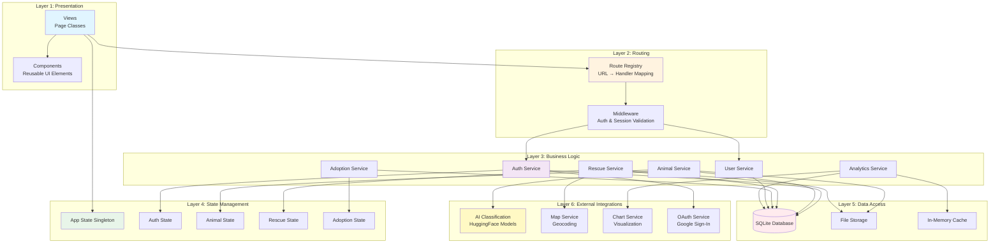
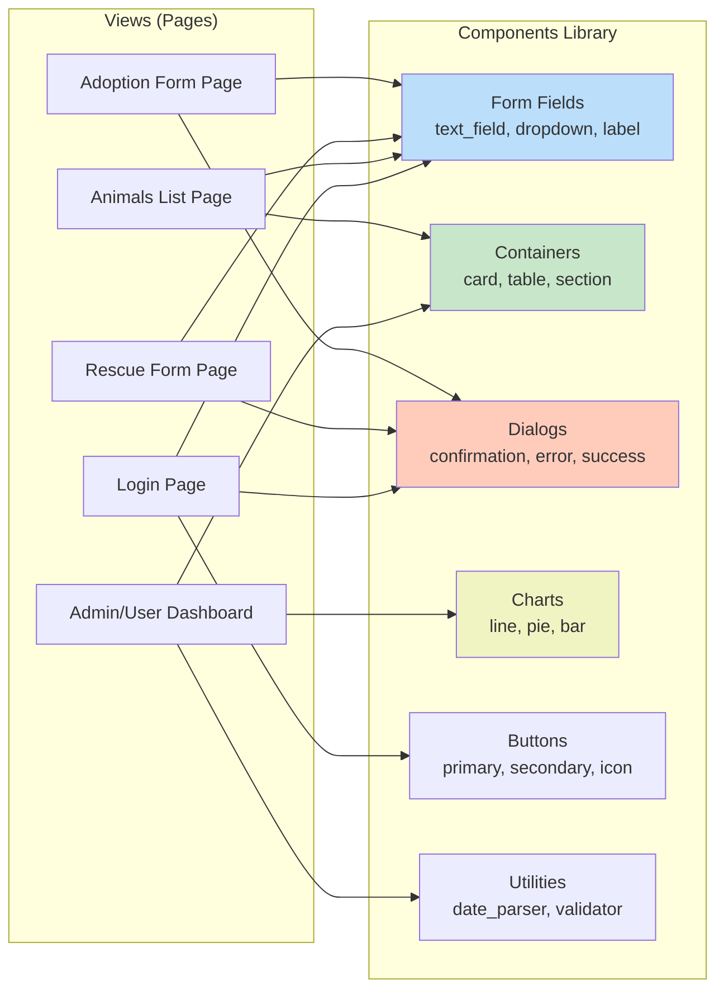
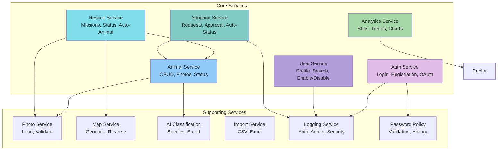
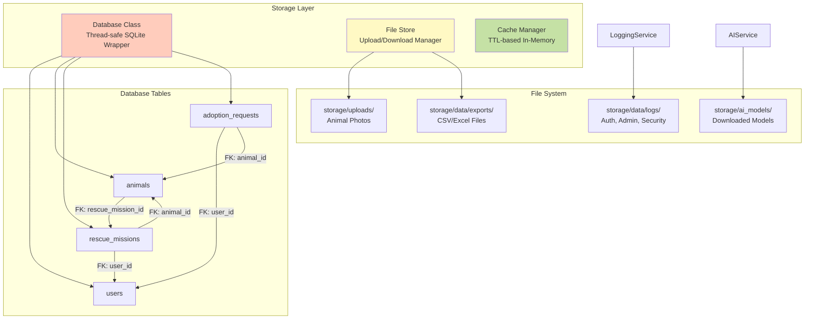
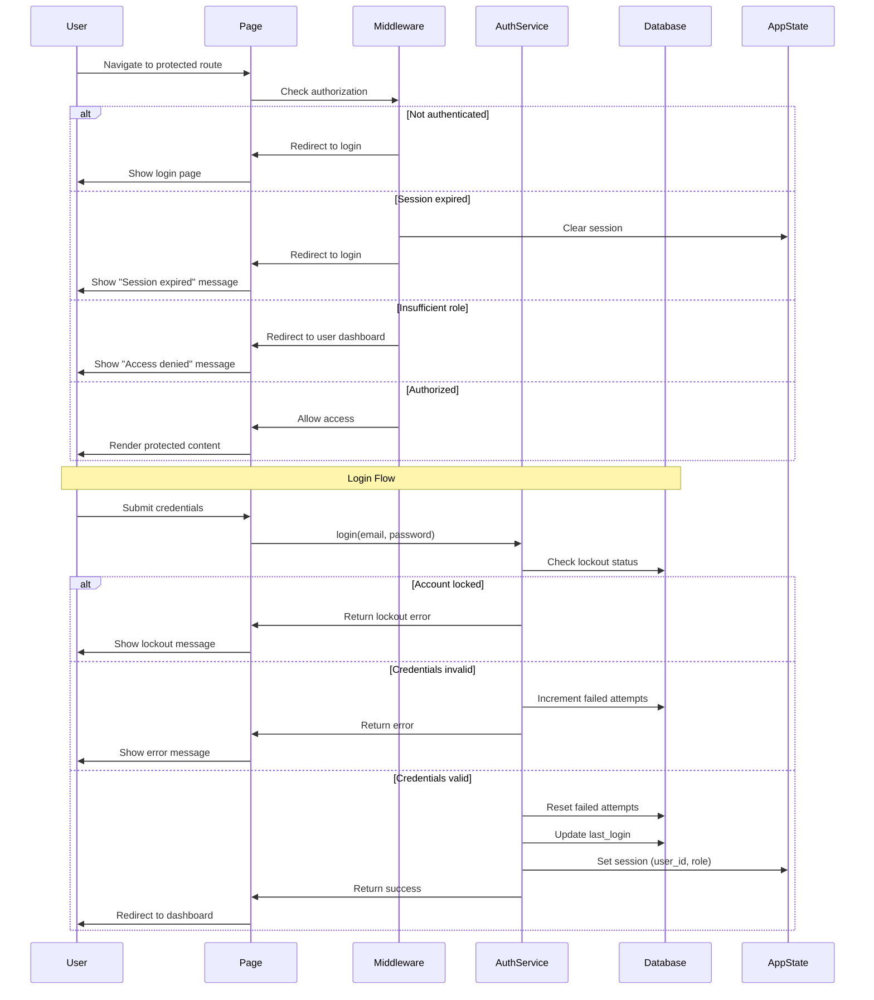
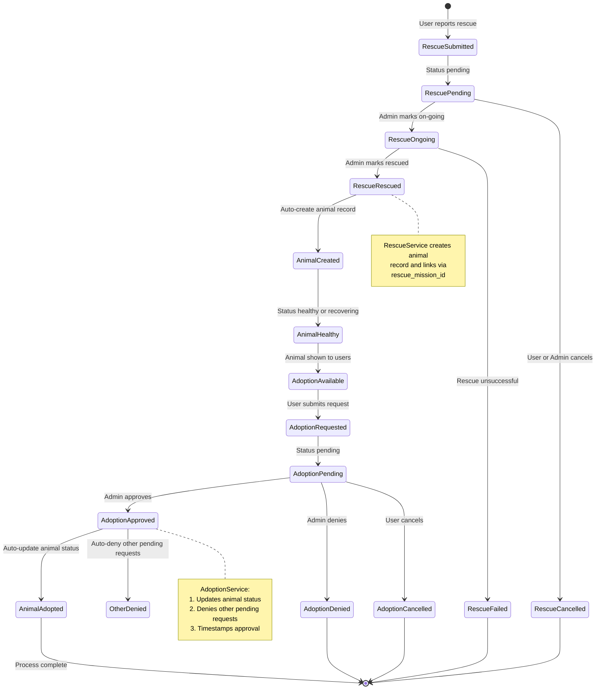
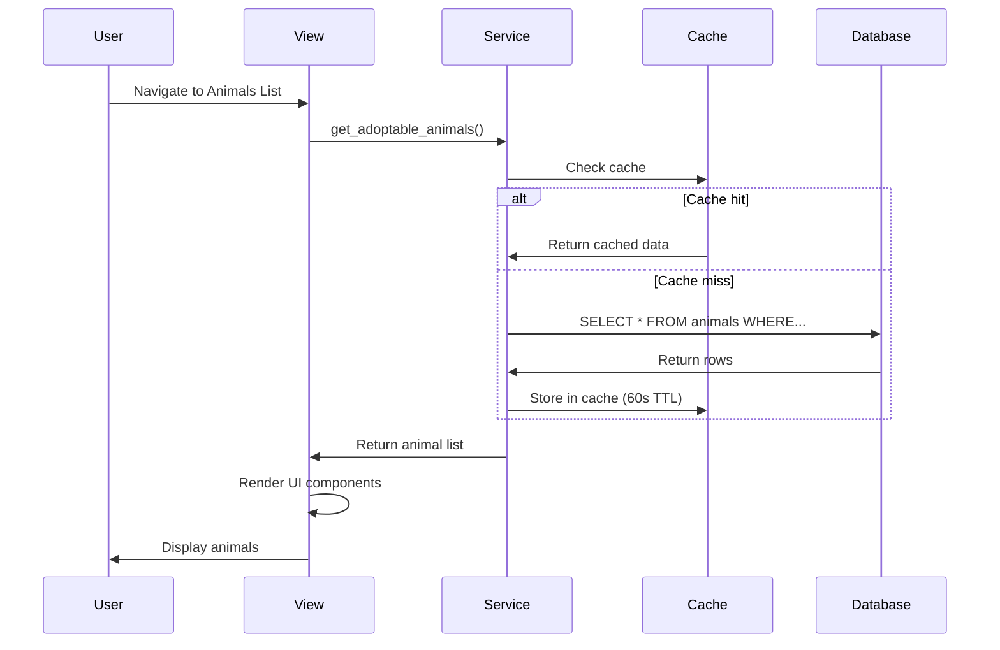
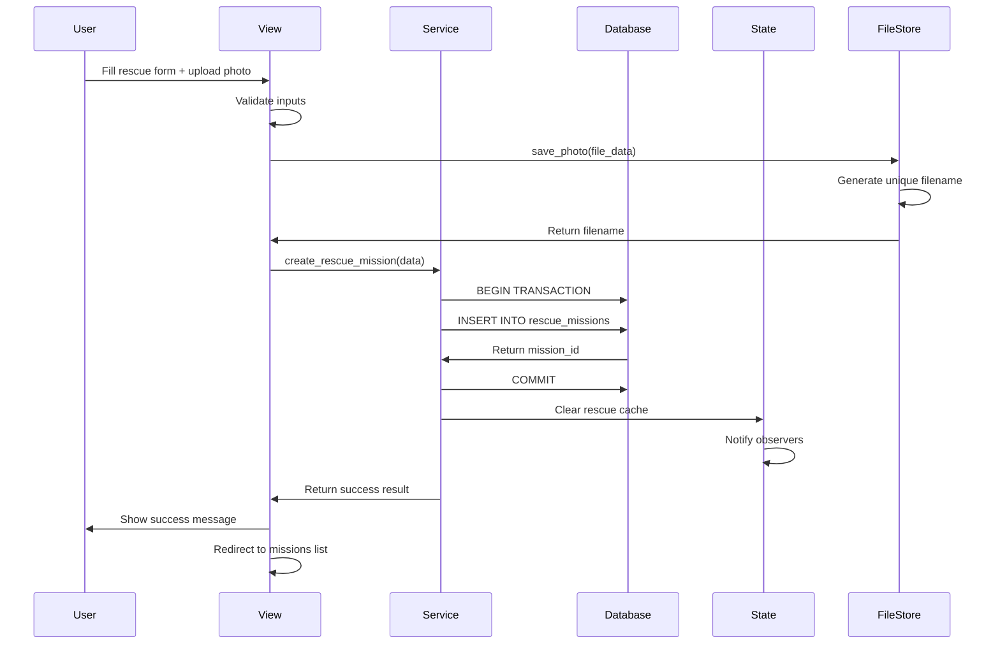
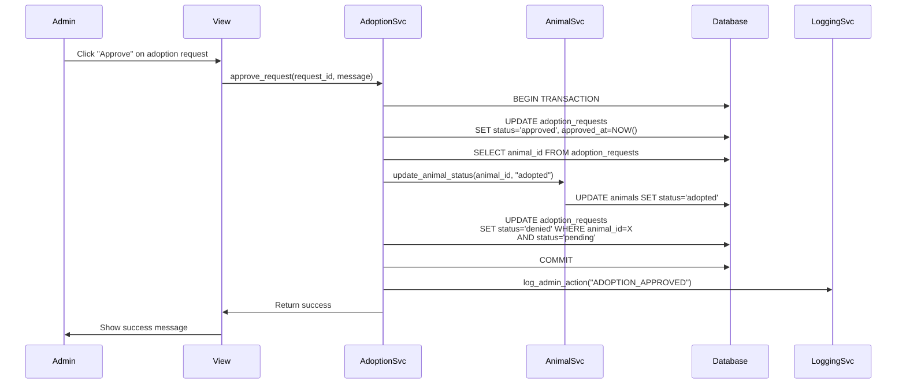
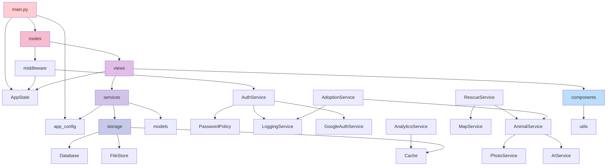

# System Architecture Documentation

## Table of Contents
1. [Overview](#overview)
2. [Architectural Layers](#architectural-layers)
3. [Component Diagrams](#component-diagrams)
4. [Design Patterns](#design-patterns)
5. [Data Flow](#data-flow)
6. [Module Dependencies](#module-dependencies)
7. [Configuration Management](#configuration-management)

---

## Diagram Rendering Note

If the Mermaid diagrams in this document do not render in your editor or preview, here are quick options to view or generate them:

- Quick view (no install): Open the Mermaid Live Editor at https://mermaid.live/, paste the Mermaid code block, preview, and export PNG/SVG.
- VS Code preview: Install a Markdown preview extension that supports Mermaid such as **"Markdown Preview Mermaid Support"** (`vstirbu.vscode-mermaid-preview`) or **"Markdown Preview Enhanced"** (`yzhang.markdown-preview-enhanced`), then open the Markdown preview (`Ctrl+Shift+V`).

## Overview

PawRes follows a **layered architecture pattern** with clear separation of concerns across six main layers. The architecture emphasizes modularity, testability, and maintainability through well-defined interfaces and dependency injection.

### Architecture Principles

- **Separation of Concerns**: Each layer has a distinct responsibility
- **Dependency Inversion**: Services depend on abstractions (Database interface), not concrete implementations
- **Single Responsibility**: Components handle one aspect of functionality
- **Observable State**: Reactive state management for UI updates
- **Component-Based UI**: Reusable, styled components for consistency

---

## Architectural Layers



---

## Component Diagrams

### 1. Presentation Layer Architecture



### 2. Service Layer Architecture



### 3. Data Storage Architecture



### 4. Authentication & Authorization Flow



### 5. Rescue → Animal → Adoption Workflow



---

## Design Patterns

### 1. Service Layer Pattern

All business logic is encapsulated in service classes that accept a `Database` instance or path:

```python
class AnimalService:
    def __init__(self, db: Optional[Database | str] = None, *, ensure_tables: bool = True):
        """
        Accept either Database instance or path string for flexibility.
        Tests can pass in-memory/temp databases; production uses configured path.
        """
        if isinstance(db, Database):
            self.db = db
        else:
            self.db = Database(db if isinstance(db, str) else app_config.DB_PATH)
        
        if ensure_tables:
            self.db.create_tables()
```

**Benefits**:
- Dependency injection for testability
- Reusable services across views
- Clear separation of concerns

---

### 2. Observable State Pattern

State management uses a reactive observer pattern with a singleton coordinator:

```python
class AppState:
    """Singleton coordinating all state managers."""
    _instance = None
    
    def __new__(cls):
        if cls._instance is None:
            cls._instance = super().__new__(cls)
            cls._instance._init_state()
        return cls._instance
    
    def _init_state(self):
        self.auth = AuthState()      # Authentication state
        self.animals = AnimalState()  # Animal cache
        self.rescues = RescueState()  # Rescue cache
        # ... other state managers
```

**State Managers** inherit from `ObservableBase`:

```python
class ObservableBase:
    def __init__(self):
        self._observers = []
    
    def subscribe(self, callback: Callable):
        """Register observer for state changes."""
        self._observers.append(callback)
    
    def _notify(self):
        """Notify all observers of state change."""
        for callback in self._observers:
            callback()
```

**Benefits**:
- Reactive UI updates
- Decoupled components
- Centralized state management

---

### 3. Component-Based UI Pattern

All UI elements use standardized components from `components/` module:

```python
# Correct usage
from components import create_form_text_field, create_form_dropdown, show_snackbar

name_field = create_form_text_field(
    hint_text="Animal Name",
    value=animal.get("name", ""),
    required=True
)

status_dropdown = create_form_dropdown(
    options=["Healthy", "Recovering", "Injured"],
    value=animal.get("status"),
    label="Health Status"
)

show_snackbar(page, "Animal saved successfully!", color="success")
```

**Component Categories**:
- **Form Components**: Text fields, dropdowns, labels, date pickers
- **Layout Components**: Cards, sections, tables, stat cards
- **Interactive Components**: Buttons, dialogs, photo uploads
- **Visual Components**: Charts, badges, status indicators

**Benefits**:
- Consistent styling across app
- Reduced code duplication
- Easy theme changes

---

### 4. Status Constants Pattern

Centralized status management with normalization and helper methods:

```python
class RescueStatus:
    PENDING = "pending"
    ON_GOING = "on-going"
    RESCUED = "rescued"
    FAILED = "failed"
    CANCELLED = "cancelled"
    REMOVED = "removed"
    
    @staticmethod
    def normalize(status: str) -> str:
        """Normalize status variants (case-insensitive, handles archived)."""
        if not status:
            return RescueStatus.PENDING
        
        base_status = status.split("|")[0].strip().lower().replace(" ", "-")
        
        # Map variants to canonical form
        if base_status in ["pending", "submitted"]:
            return RescueStatus.PENDING
        elif base_status in ["on-going", "ongoing", "in-progress"]:
            return RescueStatus.ON_GOING
        # ... etc
    
    @staticmethod
    def is_archived(status: str) -> bool:
        """Check if status has archived suffix."""
        return "|archived" in status.lower()
    
    @staticmethod
    is_active(status: str) -> bool:
        """Check if rescue is active (pending or on-going)."""
        base = RescueStatus.normalize(status)
        return base in [RescueStatus.PENDING, RescueStatus.ON_GOING]
```

**Benefits**:
- Single source of truth for statuses
- Handles legacy data variants
- Type-safe constants

---

### 5. Lazy Import Pattern (Views)

Views import Flet lazily inside `build()` method to avoid import conflicts during testing:

```python
class MyPage:
    def __init__(self, db_path: Optional[str] = None):
        self.service = MyService(db_path or app_config.DB_PATH)
    
    def build(self, page) -> None:
        import flet as ft  # Lazy import here, not at module level
        
        # Build UI components
        container = ft.Container(...)
        page.add(container)
        page.update()
```

**Benefits**:
- Test isolation (pytest doesn't need Flet UI)
- Faster test startup
- Cleaner test output

---

## Data Flow

### 1. Read Operation (Display Animals)



### 2. Write Operation (Create Rescue Mission)



### 3. Complex Operation (Approve Adoption)



---

## Module Dependencies

### Dependency Graph



### Module Import Rules

1. **No circular imports**: Services don't import views; views import services
2. **Lazy imports**: Flet imported inside `build()` methods in views
3. **Configuration first**: `app_config.py` has no dependencies (except stdlib + dotenv)
4. **Services as boundaries**: Views never directly access Database or FileStore

---

## Configuration Management

### Centralized Configuration (app_config.py)

All environment-dependent settings are centralized:

```python
# Database
DB_PATH = os.getenv("PAWRES_DB_PATH", "storage/data/app.db")

# Security
MAX_FAILED_LOGIN_ATTEMPTS = int(os.getenv("MAX_FAILED_LOGIN_ATTEMPTS", "5"))
LOCKOUT_DURATION_MINUTES = int(os.getenv("LOCKOUT_DURATION_MINUTES", "15"))
SESSION_TIMEOUT_MINUTES = int(os.getenv("SESSION_TIMEOUT_MINUTES", "30"))

# Password Policy
PASSWORD_MIN_LENGTH = int(os.getenv("PASSWORD_MIN_LENGTH", "8"))
PASSWORD_REQUIRE_UPPERCASE = os.getenv("PASSWORD_REQUIRE_UPPERCASE", "true").lower() == "true"
PASSWORD_REQUIRE_DIGIT = os.getenv("PASSWORD_REQUIRE_DIGIT", "true").lower() == "true"
# ... etc

# AI Classification
AI_MODEL_CACHE_DIR = "storage/ai_models"
MIN_SPECIES_CONFIDENCE = 0.60
MIN_BREED_CONFIDENCE = 0.58

# Maps
DEFAULT_MAP_CENTER = (13.5250, 123.3486)  # Camarines Sur, Philippines
GEOCODE_RATE_LIMIT = 1.5  # seconds between requests
```

**Benefits**:
- Single source of truth for configuration
- Easy environment-specific overrides
- Type conversion handled once
- Default values for development

---

## Architecture Decision Records

### ADR-001: Why Flet Framework?

**Context**: Need cross-platform UI framework for Python backend.

**Decision**: Use Flet (Python to Flutter) instead of traditional web frameworks.

**Rationale**:
- Single codebase for desktop and web
- Python expertise on team (no JavaScript required)
- Fast development with hot-reload
- Native-like performance and UI

**Trade-offs**:
- Smaller community than React/Vue
- Limited third-party component library
- Web version requires Flet server

---

### ADR-002: Why SQLite Instead of PostgreSQL?

**Context**: Need database for animal shelter operations.

**Decision**: Use SQLite embedded database.

**Rationale**:
- Zero configuration (no database server)
- Perfect for single-shelter deployments
- ACID compliance with foreign keys
- Easy backup (single file)
- Sufficient for expected load (<10,000 records)

**Trade-offs**:
- No built-in replication
- Limited concurrent writes
- Not suitable for multi-tenant SaaS

---

### ADR-003: Why Observable State Pattern?

**Context**: Need reactive UI updates across multiple pages.

**Decision**: Implement custom observable state managers.

**Rationale**:
- Lightweight (no external state library)
- Fine-grained control over reactivity
- Clear separation between state and business logic
- Easy to test

**Trade-offs**:
- Manual observer management
- No time-travel debugging
- Less sophisticated than Redux/MobX

---

### ADR-004: Why Service Layer Pattern?

**Context**: Business logic scattered across views and database code.

**Decision**: Introduce service layer between views and data access.

**Rationale**:
- Reusable business logic
- Testable without UI
- Clear API boundaries
- Easier to swap data sources

**Trade-offs**:
- Additional abstraction layer
- More files to maintain

---

## Performance Considerations

### Caching Strategy

```python
# Cache frequently accessed data with TTL
cache = Cache()

# Cache adoptable animals (60-second TTL)
adoptable_animals = cache.get("adoptable_animals")
if adoptable_animals is None:
    adoptable_animals = db.execute("SELECT * FROM animals WHERE ...").fetchall()
    cache.set("adoptable_animals", adoptable_animals, ttl=60)
```

### Database Optimization

```python
# Use connection pooling for concurrent requests (not needed with SQLite)
# Use indexes on frequently queried columns
db.execute("CREATE INDEX IF NOT EXISTS idx_animals_status ON animals(status)")
db.execute("CREATE INDEX IF NOT EXISTS idx_users_email ON users(email)")

# Use parameterized queries to prevent SQL injection and enable query caching
db.execute("SELECT * FROM animals WHERE species = ?", (species,))
```

### File Storage Optimization

```python
# Store only filenames in database, not base64 (reduces DB size)
# Lazy load photos (load when displayed, not when fetching records)
# Use thumbnails for list views (future enhancement)
```

---

## Security Architecture

See **[SECURITY.md](SECURITY.md)** for detailed security implementation.

**Key Security Layers**:

1. **Authentication Layer**: Password hashing, OAuth, lockout
2. **Authorization Layer**: RBAC, route protection, session validation
3. **Data Layer**: Foreign keys, input validation, SQL injection prevention
4. **Audit Layer**: Comprehensive logging of security events

---

## Scalability Considerations

### Current Limits

- **Database**: SQLite suitable for <10,000 records and <10 concurrent users
- **File Storage**: Local filesystem suitable for <10GB of photos
- **AI Models**: Models loaded into memory (~2GB RAM when active)

### Future Migration Paths

1. **Database**: Migrate to PostgreSQL for higher concurrency
2. **File Storage**: Migrate to S3/Azure Blob for cloud storage
3. **AI**: Deploy models as separate microservice with GPU acceleration
4. **Caching**: Migrate to Redis for distributed caching

---

## Deployment Architecture

### Single-Server Deployment (Current)

```
┌─────────────────────────────────────┐
│         Physical Server             │
│  ┌─────────────────────────────┐   │
│  │   Flet Application          │   │
│  │   - Web Server (port 8080)  │   │
│  │   - SQLite Database         │   │
│  │   - File Storage            │   │
│  │   - AI Models (in-memory)   │   │
│  └─────────────────────────────┘   │
└─────────────────────────────────────┘
```

### Microservices Deployment (Future)

```
┌──────────────┐      ┌──────────────┐      ┌──────────────┐
│  Flet Web    │──────│  API Gateway │──────│   Database   │
│   Server     │      │   (FastAPI)  │      │ (PostgreSQL) │
└──────────────┘      └──────────────┘      └──────────────┘
                             │
                    ┌────────┴────────┐
                    │                 │
            ┌───────▼──────┐  ┌──────▼──────┐
            │ AI Service   │  │File Service │
            │  (GPU)       │  │   (S3)      │
            └──────────────┘  └─────────────┘
```

---

**Last Updated**: December 8, 2025  
**Maintained by**: clepord34 (viaguilar@my.cspc.edu.ph) - Lead Developer
