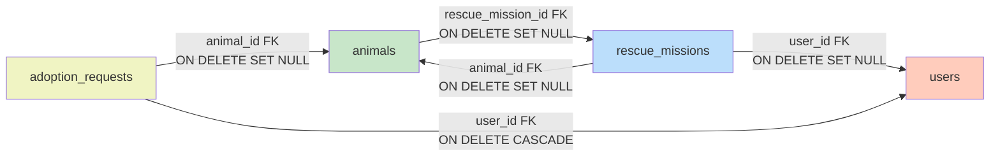

# Database Schema Documentation

## Table of Contents
1. [Overview](#overview)
2. [Entity Relationship Diagram](#entity-relationship-diagram)
3. [Table Definitions](#table-definitions)
4. [Relationships](#relationships)
5. [Indexes](#indexes)
6. [Constraints](#constraints)
7. [Schema Migrations](#schema-migrations)
8. [Data Integrity](#data-integrity)

---

## Overview

PawRes uses **SQLite 3** as the embedded relational database. The schema is designed to support the complete lifecycle of animal rescue and adoption operations with the following characteristics:

- **4 core tables** created directly by `Database.create_tables()`: `users`, `animals`, `rescue_missions`, `adoption_requests`
- **Foreign key enforcement**: Enabled via `PRAGMA foreign_keys = ON`
- **Soft deletes**: Archive/removal columns preserve data history
- **Cascading deletes**: User deletion cascades to dependent records
- **Thread-safe access**: Fresh connection per operation
- **Schema migrations**: Automatic via `Database.create_tables()`

---

## Entity Relationship Diagram

```mermaid
erDiagram
    users ||--o{ rescue_missions : "reports"
    users ||--o{ adoption_requests : "submits"
    
    animals ||--o{ adoption_requests : "subject of"
    animals }o--|| rescue_missions : "created from"
    
    rescue_missions ||--o| animals : "creates"
    rescue_missions }o--|| users : "reported by"
    
    adoption_requests }o--|| users : "submitted by"
    adoption_requests }o--o| animals : "for"
    
    users {
        INTEGER id PK
        TEXT name "NOT NULL"
        TEXT email "UNIQUE NOT NULL"
        TEXT phone "UNIQUE"
        TEXT password_hash
        TEXT password_salt
        TEXT oauth_provider "google or NULL"
        TEXT profile_picture
        TEXT role "admin or user"
        INTEGER is_disabled "DEFAULT 0"
        INTEGER failed_login_attempts "DEFAULT 0"
        TEXT locked_until "ISO timestamp"
        TEXT last_login "ISO timestamp"
        TEXT last_password_change "ISO timestamp"
        TIMESTAMP created_at
        TIMESTAMP updated_at
    }
    
    animals {
        INTEGER id PK
        TEXT name
        TEXT species "Dog, Cat, Other"
        TEXT breed
        INTEGER age
        TEXT status "healthy, recovering, injured, adopted, etc."
        TIMESTAMP intake_date
        TIMESTAMP updated_at
        TEXT photo "filename or base64"
        INTEGER rescue_mission_id FK "NULLABLE"
        TIMESTAMP archived_at
        INTEGER archived_by "user_id who archived"
        TEXT archive_note
        TIMESTAMP removed_at
        INTEGER removed_by "user_id who removed"
        TEXT removal_reason
        TEXT previous_status "before archive/remove"
    }
    
    rescue_missions {
        INTEGER id PK
        INTEGER user_id FK "NULLABLE - can be emergency"
        INTEGER animal_id FK "NULLABLE - set when rescued"
        TEXT location
        REAL latitude
        REAL longitude
        TIMESTAMP mission_date
        TIMESTAMP updated_at
        TEXT notes
        TEXT status "pending, on-going, rescued, failed, cancelled"
        INTEGER is_closed "DEFAULT 0"
        TEXT admin_message
        TEXT animal_type "Dog, Cat, Other"
        TEXT animal_name
        TEXT animal_photo "filename"
        TEXT breed
        TEXT reporter_name
        TEXT reporter_phone
        TEXT urgency "Low, Medium, High"
        TIMESTAMP archived_at
        INTEGER archived_by
        TEXT archive_note
        TIMESTAMP removed_at
        INTEGER removed_by
        TEXT removal_reason
        TEXT previous_status
        TIMESTAMP rescued_at "when status changed to rescued"
    }
    
    adoption_requests {
        INTEGER id PK
        INTEGER user_id FK "NOT NULL"
        INTEGER animal_id FK "NULLABLE"
        TEXT contact "email or phone"
        TEXT reason
        TEXT status "pending, approved, denied, cancelled"
        TIMESTAMP request_date
        TIMESTAMP updated_at
        TEXT notes "admin notes"
        TEXT animal_name "cached"
        TEXT animal_species "cached"
        TEXT admin_message
        INTEGER was_approved "DEFAULT 0"
        TIMESTAMP archived_at
        INTEGER archived_by
        TEXT archive_note
        TIMESTAMP removed_at
        INTEGER removed_by
        TEXT removal_reason
        TEXT previous_status
        TEXT denial_reason
        TIMESTAMP approved_at "when status changed to approved"
    }
```



---

## Table Definitions

### 1. users

Stores user accounts for both administrators and regular users.

```sql
CREATE TABLE users (
    id INTEGER PRIMARY KEY AUTOINCREMENT,
    name TEXT NOT NULL,
    email TEXT UNIQUE NOT NULL,
    phone TEXT,
    password_hash TEXT,
    password_salt TEXT,
    oauth_provider TEXT,                    -- 'google' or NULL
    profile_picture TEXT,                   -- filename or URL
    role TEXT DEFAULT 'user',               -- 'admin' or 'user'
    is_disabled INTEGER DEFAULT 0,          -- 0=enabled, 1=disabled
    failed_login_attempts INTEGER DEFAULT 0,
    locked_until TEXT,                      -- ISO 8601 timestamp
    last_login TEXT,                        -- ISO 8601 timestamp
    last_password_change TEXT,              -- ISO 8601 timestamp
    created_at TIMESTAMP DEFAULT CURRENT_TIMESTAMP,
    updated_at TIMESTAMP DEFAULT CURRENT_TIMESTAMP
);
```

**Key Fields**:
- **email**: Primary login identifier (unique, required)
- **phone**: Optional contact number (unique when provided)
- **password_hash**: PBKDF2-HMAC-SHA256 hash (NULL for OAuth users)
- **oauth_provider**: 'google' for OAuth users, NULL for password users
- **role**: 'admin' for administrators, 'user' for regular users
- **is_disabled**: Admin can disable accounts (prevents login)
- **failed_login_attempts**: Incremented on failed login, reset on success
- **locked_until**: Account locked until this timestamp (lockout mechanism)

**Business Rules**:
- Email must be unique across all users
- Phone must be unique when provided (allows NULL)
- OAuth users have NULL password_hash/password_salt
- Password users must have password_hash and password_salt
- Default role is 'user' unless explicitly set to 'admin'

---

### 2. animals

Stores animal records (dogs, cats, and other species).

```sql
CREATE TABLE animals (
    id INTEGER PRIMARY KEY AUTOINCREMENT,
    name TEXT,
    species TEXT,                           -- 'Dog', 'Cat', 'Other'
    breed TEXT,
    age INTEGER,
    status TEXT,                            -- 'healthy', 'recovering', 'injured', 'adopted', 'processing', 'removed'
    intake_date TIMESTAMP DEFAULT CURRENT_TIMESTAMP,
    updated_at TIMESTAMP DEFAULT CURRENT_TIMESTAMP,
    photo TEXT,                             -- filename (preferred) or base64 (legacy)
    rescue_mission_id INTEGER,              -- links to rescue that created this animal
    archived_at TIMESTAMP,
    archived_by INTEGER,                    -- user_id who archived
    archive_note TEXT,
    removed_at TIMESTAMP,
    removed_by INTEGER,                     -- user_id who removed
    removal_reason TEXT,
    previous_status TEXT,                   -- status before archive/remove
    FOREIGN KEY(rescue_mission_id) REFERENCES rescue_missions(id) ON DELETE SET NULL
);
```

**Key Fields**:
- **species**: Dog, Cat, or Other
- **breed**: Specific breed (e.g., Labrador, Siamese, Aspin, Puspin)
- **status**: healthy, recovering, injured, adopted, processing, removed
- **photo**: Filename in `storage/uploads/` (new) or base64 string (legacy)
- **rescue_mission_id**: Links animal to the rescue mission that created it

**Business Rules**:
- Only animals with status='healthy' are shown to users for adoption
- Admin can view all animals regardless of status
- Animals can be soft-deleted via archive or removal
- Archived animals retain previous_status for restoration

---

### 3. rescue_missions

Stores rescue mission reports from users or emergency submissions.

```sql
CREATE TABLE rescue_missions (
    id INTEGER PRIMARY KEY AUTOINCREMENT,
    user_id INTEGER,                        -- NULL for emergency rescues (no login)
    animal_id INTEGER,                      -- Auto-linked when status changes to 'rescued'
    location TEXT,
    latitude REAL,
    longitude REAL,
    mission_date TIMESTAMP DEFAULT CURRENT_TIMESTAMP,
    updated_at TIMESTAMP DEFAULT CURRENT_TIMESTAMP,
    notes TEXT,
    status TEXT,                            -- 'pending', 'on-going', 'rescued', 'failed', 'cancelled', 'removed'
    is_closed INTEGER DEFAULT 0,
    admin_message TEXT,
    animal_type TEXT,                       -- 'Dog', 'Cat', 'Other'
    animal_name TEXT,
    animal_photo TEXT,                      -- filename for uploaded photo
    breed TEXT,
    reporter_name TEXT,
    reporter_phone TEXT,
    urgency TEXT DEFAULT 'Medium',          -- 'Low', 'Medium', 'High'
    archived_at TIMESTAMP,
    archived_by INTEGER,
    archive_note TEXT,
    removed_at TIMESTAMP,
    removed_by INTEGER,
    removal_reason TEXT,
    previous_status TEXT,
    rescued_at TIMESTAMP,                   -- timestamp when status changed to 'rescued'
    FOREIGN KEY(user_id) REFERENCES users(id) ON DELETE SET NULL,
    FOREIGN KEY(animal_id) REFERENCES animals(id) ON DELETE SET NULL
);
```

**Key Fields**:
- **user_id**: NULL for emergency rescues (public can report without login)
- **animal_id**: NULL initially, set when RescueService auto-creates animal on 'rescued' status
- **latitude/longitude**: GPS coordinates from map picker
- **status**: pending → on-going → rescued/failed/cancelled
- **urgency**: Low, Medium, High (prioritization)
- **rescued_at**: Timestamp when status changed to 'rescued'

**Business Rules**:
- Emergency rescues have user_id=NULL but require reporter_name and reporter_phone
- When admin marks status as 'rescued', RescueService creates animal record and links it
- Only active statuses (pending, on-going) are editable
- Archived missions retain previous_status for reporting

---

### 4. adoption_requests

Stores adoption applications from users for specific animals.

```sql
CREATE TABLE adoption_requests (
    id INTEGER PRIMARY KEY AUTOINCREMENT,
    user_id INTEGER NOT NULL,
    animal_id INTEGER,                      -- NULL if animal was deleted
    contact TEXT,                           -- email or phone
    reason TEXT,
    status TEXT,                            -- 'pending', 'approved', 'denied', 'cancelled', 'removed'
    request_date TIMESTAMP DEFAULT CURRENT_TIMESTAMP,
    updated_at TIMESTAMP DEFAULT CURRENT_TIMESTAMP,
    notes TEXT,                             -- admin notes
    animal_name TEXT,                       -- cached from animal record
    animal_species TEXT,                    -- cached from animal record
    admin_message TEXT,
    was_approved INTEGER DEFAULT 0,         -- historical flag (1 if ever approved)
    archived_at TIMESTAMP,
    archived_by INTEGER,
    archive_note TEXT,
    removed_at TIMESTAMP,
    removed_by INTEGER,
    removal_reason TEXT,
    previous_status TEXT,
    denial_reason TEXT,
    approved_at TIMESTAMP,                  -- timestamp when status changed to 'approved'
    FOREIGN KEY(user_id) REFERENCES users(id) ON DELETE CASCADE,
    FOREIGN KEY(animal_id) REFERENCES animals(id) ON DELETE SET NULL
);
```

**Key Fields**:
- **user_id**: Required (user must be logged in to adopt)
- **animal_id**: NULL if animal was deleted (preserves history)
- **animal_name/animal_species**: Cached to show in history even if animal deleted
- **status**: pending → approved/denied/cancelled
- **was_approved**: Set to 1 when approved (historical tracking)
- **approved_at**: Timestamp when status changed to 'approved'

**Business Rules**:
- User can only edit/cancel requests with status='pending'
- When admin approves request, AdoptionService:
  1. Updates animal status to 'adopted'
  2. Auto-denies all other pending requests for same animal
  3. Sets approved_at timestamp
- User deletion cascades to adoption_requests (CASCADE)
- Animal deletion sets animal_id to NULL (preserves request history)

---

**Note**: Password history tracking is planned but not yet implemented.

---

## Relationships

### Foreign Key Relationships



### Relationship Types

| Relationship | Type | Cardinality | Delete Rule |
|--------------|------|-------------|-------------|
| users → rescue_missions | One-to-Many | 1:N | SET NULL (emergency rescues can exist without user) |
| users → adoption_requests | One-to-Many | 1:N | CASCADE (user deletion removes requests) |
| rescue_missions → animals | One-to-One | 1:1 | SET NULL (animal can exist without rescue) |
| animals → rescue_missions | Many-to-One | N:1 | SET NULL (rescue deletion keeps animal) |
| animals → adoption_requests | One-to-Many | 1:N | SET NULL (animal deletion preserves request history) |

---

## Indexes

### Performance Indexes

The database relies primarily on SQLite's automatic indexing of PRIMARY KEY and FOREIGN KEY columns. One explicit index is created:

```sql
-- User phone uniqueness (added via migration)
CREATE UNIQUE INDEX IF NOT EXISTS idx_users_phone_unique ON users(phone) WHERE phone IS NOT NULL;
```

**Note**: The `users.email` column has a UNIQUE constraint enforced at the table level, not via an explicit index. SQLite automatically creates an index for UNIQUE constraints.

### Index Usage Patterns

| Query Pattern | Index Used |
|--------------|-----------|
| `SELECT * FROM users WHERE email = ?` | Automatic index on UNIQUE email |
| `SELECT * FROM users WHERE phone = ?` | idx_users_phone_unique |
| `SELECT * FROM animals WHERE status = 'healthy'` | Table scan (no explicit index) |
| `SELECT * FROM rescue_missions WHERE user_id = ?` | Automatic index on FK |
| `SELECT * FROM adoption_requests WHERE animal_id = ?` | Automatic index on FK |

---

## Constraints

### Primary Keys

All tables use auto-incrementing integer primary keys:
- `users(id)`
- `animals(id)`
- `rescue_missions(id)`
- `adoption_requests(id)`

### Unique Constraints

- `users.email` - UNIQUE NOT NULL
- `users.phone` - UNIQUE (partial index: WHERE phone IS NOT NULL)

### Foreign Key Constraints

Foreign keys are enforced via `PRAGMA foreign_keys = ON`:

```sql
-- rescue_missions table
FOREIGN KEY(user_id) REFERENCES users(id) ON DELETE SET NULL
FOREIGN KEY(animal_id) REFERENCES animals(id) ON DELETE SET NULL

-- animals table
FOREIGN KEY(rescue_mission_id) REFERENCES rescue_missions(id) ON DELETE SET NULL

-- adoption_requests table
FOREIGN KEY(user_id) REFERENCES users(id) ON DELETE CASCADE
FOREIGN KEY(animal_id) REFERENCES animals(id) ON DELETE SET NULL
```

### Check Constraints (Application-Level)

The following constraints are enforced in the service layer:

- **users.role**: Must be 'admin' or 'user'
- **animals.status**: Must be valid AnimalStatus constant
- **rescue_missions.status**: Must be valid RescueStatus constant
- **rescue_missions.urgency**: Must be 'Low', 'Medium', or 'High'
- **adoption_requests.status**: Must be valid AdoptionStatus constant
- **animals.age**: Must be >= 0
- **users.failed_login_attempts**: Must be >= 0

---

## Schema Migrations

### Migration Strategy

PawRes uses an **automatic migration system** in `Database.create_tables()`:

1. **Create tables if not exist**: Initial schema creation
2. **Check existing columns**: Use `PRAGMA table_info(table_name)`
3. **Add missing columns**: `ALTER TABLE ... ADD COLUMN ...`
4. **Recreate tables**: For complex schema changes (e.g., changing column constraints)

### Migration History

#### Migration 1: OAuth Support (v1.1.0)
```sql
ALTER TABLE users ADD COLUMN oauth_provider TEXT;
ALTER TABLE users ADD COLUMN profile_picture TEXT;
```

#### Migration 2: Security Features (v1.2.0)
```sql
ALTER TABLE users ADD COLUMN is_disabled INTEGER DEFAULT 0;
ALTER TABLE users ADD COLUMN failed_login_attempts INTEGER DEFAULT 0;
ALTER TABLE users ADD COLUMN locked_until TEXT;
ALTER TABLE users ADD COLUMN last_login TEXT;
ALTER TABLE users ADD COLUMN last_password_change TEXT;
```

#### Migration 3: Structured Rescue Fields (v1.3.0)
```sql
ALTER TABLE rescue_missions ADD COLUMN animal_type TEXT;
ALTER TABLE rescue_missions ADD COLUMN animal_name TEXT;
ALTER TABLE rescue_missions ADD COLUMN reporter_name TEXT;
ALTER TABLE rescue_missions ADD COLUMN reporter_phone TEXT;
ALTER TABLE rescue_missions ADD COLUMN urgency TEXT DEFAULT 'Medium';
ALTER TABLE rescue_missions ADD COLUMN breed TEXT;
ALTER TABLE rescue_missions ADD COLUMN animal_photo TEXT;
```

#### Migration 4: Archive/Removal Metadata (v1.4.0)
```sql
-- For all entity tables (animals, rescue_missions, adoption_requests)
ALTER TABLE {table} ADD COLUMN archived_at TIMESTAMP;
ALTER TABLE {table} ADD COLUMN archived_by INTEGER;
ALTER TABLE {table} ADD COLUMN archive_note TEXT;
ALTER TABLE {table} ADD COLUMN removed_at TIMESTAMP;
ALTER TABLE {table} ADD COLUMN removed_by INTEGER;
ALTER TABLE {table} ADD COLUMN removal_reason TEXT;
ALTER TABLE {table} ADD COLUMN previous_status TEXT;
```

#### Migration 5: Timestamps (v1.4.1)
```sql
ALTER TABLE rescue_missions ADD COLUMN rescued_at TIMESTAMP;
ALTER TABLE adoption_requests ADD COLUMN approved_at TIMESTAMP;
ALTER TABLE adoption_requests ADD COLUMN was_approved INTEGER DEFAULT 0;
```

#### Migration 6: Nullable animal_id in adoption_requests (v1.5.0)
Recreated `adoption_requests` table to change `animal_id` from NOT NULL to nullable:

```sql
-- Create new table with corrected schema
CREATE TABLE adoption_requests_new (...);

-- Copy data
INSERT INTO adoption_requests_new SELECT * FROM adoption_requests;

-- Swap tables
DROP TABLE adoption_requests;
ALTER TABLE adoption_requests_new RENAME TO adoption_requests;
```

### Running Migrations

Migrations run automatically on application startup:

```python
from storage.database import Database

db = Database()
db.create_tables()  # Runs all pending migrations
```

---

## Data Integrity

### Transaction Management

All write operations use transactions:

```python
conn = db._get_connection()
try:
    cursor = conn.cursor()
    cursor.execute("BEGIN TRANSACTION")
    
    # Multiple operations
    cursor.execute("UPDATE animals SET status = ?", ("adopted",))
    cursor.execute("UPDATE adoption_requests SET status = ?", ("denied",))
    
    conn.commit()
except Exception as e:
    conn.rollback()
    raise
finally:
    conn.close()
```

### Referential Integrity

**Foreign Keys Enabled**:
```sql
PRAGMA foreign_keys = ON;
```

**Cascading Deletes**:
- User deletion → Cascades to `adoption_requests`
- Animal/Rescue deletion → Sets foreign keys to NULL (preserves history)

### Data Validation (Service Layer)

- **Email format**: Regex validation for valid email addresses
- **Phone format**: International phone number validation via `phonenumbers` library
- **Duplicate prevention**: Check unique constraints before INSERT
- **Status normalization**: Convert variants to canonical form (e.g., "on-going" → "on-going")
- **Age range**: Animals must have age >= 0
- **Required fields**: Enforced in service methods

### Soft Deletes (Archive/Removal)

Instead of hard deletes, records are marked as archived or removed:

```python
# Archive (admin can restore)
UPDATE animals SET 
    archived_at = CURRENT_TIMESTAMP,
    archived_by = ?,
    archive_note = ?,
    previous_status = status,
    status = status || '|archived'
WHERE id = ?;

# Remove (permanent, admin only)
UPDATE animals SET
    removed_at = CURRENT_TIMESTAMP,
    removed_by = ?,
    removal_reason = ?,
    previous_status = status,
    status = 'removed'
WHERE id = ?;
```

**Benefits**:
- Data preservation for auditing
- Restore capability for accidental archives
- Clear differentiation between archived (reversible) and removed (permanent)

---

## Database Statistics

### Expected Data Volumes

| Table | Estimated Records (1 year) |
|-------|---------------------------|
| users | 500-1,000 |
| animals | 2,000-5,000 |
| rescue_missions | 1,000-3,000 |
| adoption_requests | 5,000-10,000 |

### Storage Estimates

- **users**: ~1 KB per record
- **animals**: ~2 KB per record (including metadata)
- **rescue_missions**: ~2 KB per record
- **adoption_requests**: ~1.5 KB per record

**Total Database Size (1 year)**: ~25-40 MB

**Photos (stored separately)**: 500 KB average × 3,000 animals = ~1.5 GB

---

## Backup and Maintenance

### Backup Strategy

```powershell
# Manual backup (SQLite single-file database)
cp storage/data/app.db storage/data/backups/app_$(date +%Y%m%d_%H%M%S).db
```

### Vacuum (Optimize)

```powershell
# Reclaim unused space and defragment
sqlite3 storage/data/app.db "VACUUM;"
```

### Integrity Check

```powershell
# Check database integrity
sqlite3 storage/data/app.db "PRAGMA integrity_check;"
```

---

## Query Examples

### Common Queries

#### Get adoptable animals
```sql
SELECT * FROM animals
WHERE status = 'healthy'
  AND archived_at IS NULL
  AND removed_at IS NULL
ORDER BY intake_date DESC;
```

#### Get pending adoption requests for an animal
```sql
SELECT ar.*, u.name as user_name, u.email as user_email
FROM adoption_requests ar
JOIN users u ON ar.user_id = u.id
WHERE ar.animal_id = ?
  AND ar.status = 'pending'
  AND ar.archived_at IS NULL
ORDER BY ar.request_date ASC;
```

#### Get active rescue missions
```sql
SELECT * FROM rescue_missions
WHERE status IN ('pending', 'on-going')
  AND archived_at IS NULL
  AND removed_at IS NULL
ORDER BY urgency DESC, mission_date ASC;
```

#### Get user's adoption history
```sql
SELECT ar.*, a.name as animal_name, a.species
FROM adoption_requests ar
LEFT JOIN animals a ON ar.animal_id = a.id
WHERE ar.user_id = ?
ORDER BY ar.request_date DESC;
```

---

**Last Updated**: December 8, 2025  
**Maintained by**: clepord34 (viaguilar@my.cspc.edu.ph) - Data & Integration Engineer
