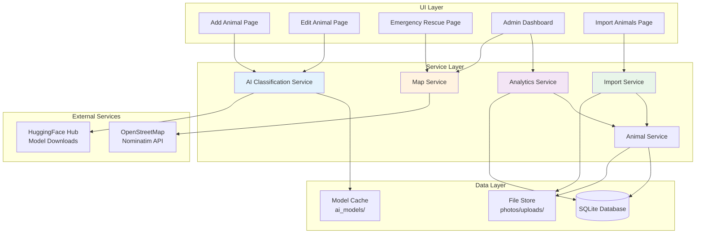

# PawRes Emerging Technology Integration

## Overview

PawRes incorporates several emerging technologies to enhance animal rescue and adoption management:

- **AI Classification Service**: Automated breed detection using HuggingFace transformer models
- **Interactive Maps**: Real-time location visualization for rescue missions using flet-map and geopy
- **Data Visualization**: Interactive charts and analytics dashboards with Flet native charts
- **Data Import/Export**: Bulk animal import from CSV/Excel with validation and photo handling

These technologies streamline rescue operations, provide actionable insights through analytics, and reduce manual data entry burden for shelter staff.

---

## AI Classification Service

### Purpose and Justification

Manual breed identification is time-consuming, subjective, and requires expertise that shelter staff may not possess. The AI Classification Service addresses this by:

- **Automating breed detection** from uploaded animal photos
- **Reducing human error** in breed identification
- **Supporting Philippine breeds** (Aspin for dogs, Puspin for cats)
- **Providing confidence scores** to help staff make informed decisions
- **Offering alternative breed suggestions** when confidence is low

This is particularly valuable for shelters processing large volumes of rescues where quick, accurate categorization improves adoption matching and medical care planning.

### Technical Implementation

The service uses three pre-trained HuggingFace transformer models in a cascaded detection pipeline:

#### Models Used

1. **Species Detection**: `google/vit-base-patch16-224` (Vision Transformer)
   - Pre-trained on ImageNet dataset
   - Classifies input as Dog, Cat, or Other
   - ~330 MB model size

2. **Dog Breed Classification**: `prithivMLmods/Dog-Breed-120`
   - Trained on 120 dog breeds
   - **86.8% accuracy** on test set
   - ~340 MB model size

3. **Cat Breed Classification**: `dima806/cat_breed_image_detection`
   - Trained on 48 cat breeds
   - **77% accuracy** on test set
   - ~340 MB model size

#### Detection Pipeline

```python
from services.ai_classification_service import AIClassificationService

service = AIClassificationService()  # Singleton pattern

# Classify from base64 image
result = service.classify_image(base64_image_string)

if result.success:
    print(f"Species: {result.species} ({result.species_confidence:.1%})")
    print(f"Breed: {result.breed} ({result.breed_confidence:.1%})")
    
    if result.is_mixed_breed:
        print("Suggested: Aspin/Puspin (low confidence)")
    
    for pred in result.alternative_breeds[:3]:
        print(f"  Alternative: {pred.breed} ({pred.confidence:.1%})")
```

#### Architecture Details

```python
class AIClassificationService:
    # Singleton with lazy model loading
    _instance = None
    
    def __init__(self):
        self._species_model = None      # Loaded on first classify_image call
        self._dog_model = None          # Loaded when species=Dog
        self._cat_model = None          # Loaded when species=Cat
```

**Key Features:**

- **Lazy Loading**: Models downloaded only when first needed (~1 GB total)
- **Model Caching**: Stored in `storage/ai_models/` for offline use after first download
- **Resumable Downloads**: Interrupted downloads can resume from last checkpoint
- **Thread-Safe**: Singleton pattern with locks prevents concurrent model loading

### Configuration

```python
# app/services/ai_classification_service.py

class AIClassificationConfig:
    MIN_SPECIES_CONFIDENCE = 0.60   # Below this → "Not Specified Species"
    MIN_BREED_CONFIDENCE = 0.58     # Below this → Suggest "Mixed Breed"
    
    LOW_CONFIDENCE_DOG_LABEL = "Aspin (Mixed Breed)"
    LOW_CONFIDENCE_CAT_LABEL = "Puspin (Mixed Breed)"
    
    TOP_N_PREDICTIONS = 3           # Show top 3 alternative breeds
    CLASSIFICATION_TIMEOUT = 60     # seconds
    MAX_RETRY_ATTEMPTS = 3
```

**Confidence Thresholds:**
- **Species**: 60% minimum (empirically determined to avoid misclassification)
- **Breed**: 58% minimum (optimized for Philippine mixed breeds)

### User Workflow

1. **Photo Upload**: User uploads animal photo in Add Animal or Edit Animal page
2. **Auto-Detection**: AI analyzes image and suggests species + breed
3. **Review Results**: User sees:
   - Primary breed prediction with confidence score
   - Up to 3 alternative breed suggestions
   - "Mixed Breed" suggestion if confidence < 58%
4. **Accept or Override**: User can:
   - Accept AI suggestion (single click)
   - Choose alternative breed from dropdown
   - Manually type custom breed
5. **Save**: Breed saved to database with animal record

#### UI Integration Example

```python
# components/ai_suggestion_card.py
from components import create_ai_suggestion_card

suggestion_card = create_ai_suggestion_card(
    result=classification_result,
    on_accept=lambda breed: self._accept_breed(breed),
    on_override=lambda: self._show_breed_dropdown()
)
```

### Accuracy Metrics

| Model | Accuracy | Breeds | Notes |
|-------|----------|--------|-------|
| Species Detection | ~95%+ | 3 classes | ImageNet pre-trained, highly reliable |
| Dog Breed | **86.8%** | 120 breeds | Strong performance on common breeds |
| Cat Breed | **77%** | 48 breeds | Lower due to more subtle breed differences |

**Philippine Breed Handling:**
- Aspin (Asong Pinoy) and Puspin (Pusang Pinoy) are not in training datasets
- System suggests "Mixed Breed" when confidence < 58%
- Users can manually override to "Aspin" or "Puspin"

### Limitations

1. **Internet Required (First Use)**
   - Models downloaded from HuggingFace Hub (~1 GB total)
   - Subsequent uses work offline with cached models

2. **Model Size**
   - Total: ~1 GB storage space required
   - Download time: 5-15 minutes on typical connection

3. **Inference Time**
   - Species detection: ~3-5 seconds
   - Breed classification: ~5-10 seconds
   - Total: ~30 seconds for complete pipeline

4. **Hardware Requirements**
   - CPU: Intel i5 or equivalent minimum
   - RAM: 4 GB minimum (8 GB recommended)
   - GPU: Not required (CPU-only inference)

5. **Classification Accuracy**
   - Performance degrades with poor photo quality
   - Partial obstructions reduce confidence
   - Uncommon breeds may be misclassified as similar breeds

### Fallback Handling

```python
try:
    result = service.classify_image(image_base64)
    if not result.success:
        # Show error message, allow manual entry
        show_snackbar(page, f"AI Classification failed: {result.error}")
except Exception as e:
    # Network error, timeout, or model loading failure
    show_snackbar(page, "AI service unavailable. Please enter breed manually.")
```

**Common Error Scenarios:**
- **Network timeout**: Allow manual breed entry, offer retry
- **Low confidence**: Suggest "Mixed Breed" with manual override option
- **Model loading failure**: Disable AI feature, fallback to manual entry

---

## Interactive Maps

### Purpose

Rescue missions require precise location tracking for:
- **Coordinating rescue teams** to exact incident locations
- **Visualizing rescue hotspots** for resource allocation
- **Reviewing historical rescue patterns** for planning
- **Emergency response** with interactive map-based reporting

Interactive maps replace text-based addresses with visual, clickable interfaces that reduce location ambiguity.

### Technology Stack

- **flet-map**: Flutter-based map widget for Flet applications
- **geopy/Nominatim**: Geocoding service (address ↔ coordinates)
- **OpenStreetMap**: Tile server for map rendering

### Features

#### 1. Geocoding (Address → Coordinates)

```python
from services.map_service import MapService

map_service = MapService()

# Convert address to coordinates
lat, lon = map_service.geocode_location("Naga City, Camarines Sur")
# Returns: (13.6218, 123.1948)
```

#### 2. Reverse Geocoding (Coordinates → Address)

```python
# Convert coordinates to readable address
address = map_service.reverse_geocode(13.6218, 123.1948)
# Returns: "Naga City, Camarines Sur, Philippines"
```

#### 3. Interactive Map Markers

```python
# components/map_wrapper.py
from components import create_rescue_map

map_widget = create_rescue_map(
    center=(13.5250, 123.3486),  # Camarines Sur default
    zoom=9,
    markers=[
        {"lat": 13.6218, "lon": 123.1948, "label": "Rescue #45"},
        {"lat": 13.5821, "lon": 123.1888, "label": "Rescue #46"},
    ]
)
```

#### 4. Default Map Center

```python
# app_config.py
DEFAULT_MAP_CENTER = (13.5250, 123.3486)  # Camarines Sur, Philippines
DEFAULT_MAP_ZOOM = 9
```

### Rate Limiting

Nominatim enforces fair-use rate limiting:

```python
class MapService:
    def __init__(self):
        self.geocoder = Nominatim(user_agent="pawres_rescue_app_v1", timeout=30)
        self._geocode = RateLimiter(
            self.geocoder.geocode, 
            min_delay_seconds=1.5  # Maximum 1 request per 1.5 seconds
        )
```

**Rate Limit Details:**
- **Delay**: 1.5 seconds between requests
- **Purpose**: Comply with Nominatim usage policy
- **Impact**: Batch geocoding operations take longer

### Offline Fallback

When internet is unavailable:

```python
def check_geocoding_available(self) -> bool:
    """Check if geocoding service is reachable."""
    try:
        sock = socket.socket(socket.AF_INET, socket.SOCK_STREAM)
        sock.settimeout(3)
        sock.connect(("nominatim.openstreetmap.org", 443))
        return True
    except (socket.error, socket.timeout):
        return False
```

**Fallback Behavior:**
- Display raw coordinates instead of addresses
- Disable map tile loading (show static placeholder)
- Allow manual coordinate entry

### Use Cases

#### 1. Rescue Mission Reporting

```python
# views/emergency_rescue_page.py
# User clicks map to select rescue location
def on_map_click(e):
    lat, lon = e.lat, e.lon
    self._rescue_location = (lat, lon)
    
    # Reverse geocode for display
    address = map_service.reverse_geocode(lat, lon)
    self._location_field.value = address or f"{lat:.4f}, {lon:.4f}"
    page.update()
```

#### 2. Admin Rescue Review

```python
# views/admin_dashboard.py
# Show all pending rescues on map
rescue_markers = []
for mission in pending_rescues:
    if mission.get("latitude") and mission.get("longitude"):
        rescue_markers.append({
            "lat": mission["latitude"],
            "lon": mission["longitude"],
            "label": f"#{mission['id']} - {mission['animal_type']}",
            "color": "red" if mission["severity"] == "high" else "orange"
        })

map_widget = create_rescue_map(markers=rescue_markers)
```

#### 3. Emergency Rescues

- Users tap their location on map (auto-fills coordinates)
- System geocodes to human-readable address
- Admin sees exact location with visual map marker

### Limitations

1. **Internet Required**
   - Geocoding requires active internet connection
   - Map tiles load from OpenStreetMap servers
   - Offline mode shows coordinates only

2. **Rate Limiting**
   - 1 request per 1.5 seconds (Nominatim policy)
   - Bulk geocoding operations are slow
   - Cannot geocode >100 locations rapidly

3. **Accuracy**
   - Rural areas may have imprecise reverse geocoding
   - Coordinates accurate to ~10-50 meters (GPS dependent)
   - Address parsing may fail for non-standard formats

4. **Privacy**
   - GPS coordinates reveal exact rescue locations
   - Consider anonymizing public-facing data

---

## Data Visualization

### Purpose

Data-driven decision making requires clear, actionable insights. The visualization system provides:

- **Real-time analytics** for rescue trends, adoption rates, health status distribution
- **Interactive charts** with tooltips, click handlers, and drill-down capabilities
- **Empty state handling** with user-friendly "No Data" messages
- **Responsive design** adapting to different screen sizes

Charts transform raw database queries into visual stories that help admins allocate resources, identify trends, and measure impact.

### Chart Types

#### 1. Line Charts (Trends Over Time)

```python
from components import create_line_chart

# 14-day rescue trend
chart = create_line_chart(
    labels=["Dec 1", "Dec 2", "Dec 3", ...],
    datasets=[
        {
            "label": "Rescues",
            "data": [3, 5, 2, 7, ...],
            "color": "#26A69A"
        },
        {
            "label": "Adoptions", 
            "data": [1, 2, 3, 2, ...],
            "color": "#FFA726"
        }
    ],
    height=300,
    width=600,
    title="Rescue & Adoption Trends (14 Days)"
)
```

**Use Cases:**
- 14-day / 30-day rescue trends
- Adoption rate tracking
- Health status changes over time

#### 2. Pie Charts (Distribution)

```python
from components import create_pie_chart

# Animal type distribution
chart = create_pie_chart(
    labels=["Dogs", "Cats", "Others"],
    values=[45, 32, 8],
    colors=["#2196F3", "#FFA726", "#66BB6A"],
    height=300,
    width=300,
    title="Animal Distribution by Type"
)
```

**Use Cases:**
- Animal type breakdown (Dog/Cat/Other)
- Health status distribution (Healthy/Recovering/Injured)
- Adoption status breakdown (Pending/Approved/Denied)

#### 3. Bar Charts (Comparisons)

```python
from components import create_bar_chart

# Health status comparison
chart = create_bar_chart(
    labels=["Healthy", "Recovering", "Injured"],
    values=[42, 15, 8],
    colors=["#4CAF50", "#FFC107", "#F44336"],
    height=250,
    width=400,
    title="Current Health Status"
)
```

**Use Cases:**
- Month-over-month comparisons
- Breed distribution
- Rescue status counts

#### 4. Stat Cards (Key Metrics)

```python
from components import create_stat_card

card = create_stat_card(
    title="Total Rescues",
    value="127",
    icon=ft.Icons.PETS,
    color="#26A69A",
    subtitle="↑ 12 this month"
)
```

**Use Cases:**
- Dashboard KPIs (Total Animals, Pending Rescues, Adoptions)
- Month-over-month change indicators
- Real-time status counts

### Features

#### Interactive Tooltips

```python
chart = create_line_chart(
    ...,
    tooltip_enabled=True  # Hover to see exact values
)
```

Displays precise values on hover, reducing clutter while maintaining data accessibility.

#### Click Handlers

```python
def on_bar_click(index, label, value):
    show_snackbar(page, f"Clicked {label}: {value}")

chart = create_bar_chart(
    ...,
    on_click=on_bar_click
)
```

Enables drill-down workflows (e.g., clicking "Pending Rescues" navigates to rescue list).

#### Empty State Handling

```python
from components import create_empty_chart_message

if not data:
    chart = create_empty_chart_message(
        message="No data available for this period",
        height=300
    )
```

Prevents confusion when filters return no results.

### Implementation

#### Flet Native Charts (Primary)

```python
# Flet's built-in chart controls
import flet as ft

chart = ft.LineChart(
    data_series=[
        ft.LineChartData(
            data_points=[ft.LineChartDataPoint(x, y) for x, y in data],
            color=ft.Colors.TEAL,
            stroke_width=3,
        )
    ],
    border=ft.Border(),
    horizontal_grid_lines=ft.ChartGridLines(interval=1),
    tooltip_bgcolor=ft.Colors.with_opacity(0.8, ft.Colors.BLACK),
)
```

**Advantages:**
- Native Flutter rendering (smooth animations)
- No external dependencies
- Fully responsive and themeable

#### Matplotlib Fallback (Advanced Charts)

```python
from components import fig_to_base64
import matplotlib.pyplot as plt

# Create complex chart
fig, ax = plt.subplots()
ax.bar(labels, values, color='#26A69A')
ax.set_title("Custom Chart")

# Convert to base64 for Flet Image widget
chart_b64 = fig_to_base64(fig)  # Auto-closes figure
ft.Image(src_base64=chart_b64)
```

**Use Cases:**
- Heatmaps
- Complex multi-axis charts
- Custom visualizations not supported by Flet

### Use Cases

#### 1. Dashboard Analytics

```python
# views/admin_dashboard.py
from services.analytics_service import AnalyticsService

analytics = AnalyticsService()
chart_data = analytics.get_chart_data()

# Line chart: 30-day trend
labels, rescued, adopted = chart_data[0]
trend_chart = create_line_chart(
    labels=labels,
    datasets=[
        {"label": "Rescued", "data": rescued, "color": "#26A69A"},
        {"label": "Adopted", "data": adopted, "color": "#FFA726"}
    ]
)

# Pie chart: Animal type distribution
type_dist = chart_data[1]
type_chart = create_pie_chart(
    labels=list(type_dist.keys()),
    values=list(type_dist.values())
)
```

#### 2. 14-Day / 30-Day Trends

```python
# Configurable time range
def get_trends(days=14):
    return analytics.get_rescue_trend(days=days)

# Toggle between 14 and 30 days
trend_data = get_trends(days=selected_days)
```

#### 3. Animal Distribution

```python
# Show which species are most common
type_distribution = analytics.get_animal_type_distribution()
# {"Dog": 45, "Cat": 32, "Other": 8}
```

### Customization

#### Color Schemes

```python
# components/charts.py
CHART_COLORS = {
    "primary": "#26A69A",     # Teal
    "secondary": "#FFA726",    # Orange
    "success": "#4CAF50",      # Green
    "warning": "#FFEB3B",      # Yellow
    "danger": "#F44336",       # Red
}

STATUS_COLORS = {
    "healthy": "#4CAF50",
    "recovering": "#FFC107",
    "injured": "#F44336",
    "pending": "#2196F3",
    "on-going": "#FFA726",
}
```

Colors follow Material Design guidelines for consistency.

#### Responsive Design

```python
def create_line_chart(..., width=None):
    # Auto-expand to container width if not specified
    return ft.Container(
        content=chart,
        expand=True if width is None else False,
        width=width
    )
```

Charts adapt to screen size (desktop vs mobile).

---

## Data Import/Export

### Purpose

Shelters transitioning to PawRes often have existing animal records in spreadsheets. The Import Service enables:

- **Bulk animal import** from CSV or Excel files
- **Data validation** to ensure integrity before database insertion
- **Row-by-row error reporting** for quick issue resolution
- **Photo file handling** with relative path support

This reduces manual data entry burden from hours to minutes for shelters with 50+ existing animals.

### Formats Supported

| Format | Extension | Notes |
|--------|-----------|-------|
| CSV | `.csv` | UTF-8 encoding, comma-delimited |
| Excel | `.xlsx`, `.xls` | Requires `openpyxl` library |

### Data Schema

#### Required Fields

```csv
name,animal_type,age,health_status
Max,Dog,3,healthy
Luna,Cat,2,recovering
```

| Field | Type | Validation |
|-------|------|------------|
| `name` | string | Non-empty, max 100 chars |
| `animal_type` | enum | `Dog`, `Cat`, or `Other` (case-insensitive) |
| `age` | integer | 0-21 years |
| `health_status` | enum | `healthy`, `recovering`, `injured` |

#### Optional Fields

| Field | Type | Notes |
|-------|------|-------|
| `breed` | string | Defaults to `NULL` if empty |
| `photo` | string | Relative path to image file (e.g., `photos/max.jpg`) |

### Validation Rules

```python
class ImportService:
    VALID_ANIMAL_TYPES = {"dog", "cat", "other"}
    VALID_HEALTH_STATUSES = {"healthy", "recovering", "injured"}
    MIN_AGE = 0
    MAX_AGE = 21
```

**Validation Process:**

1. **Header Check**: Ensure all required columns present
2. **Type Validation**: `animal_type` must be Dog/Cat/Other
3. **Age Validation**: Must be integer between 0-21
4. **Health Status**: Must be one of valid statuses
5. **Photo Path**: If provided, file must exist relative to CSV location

### Import Workflow

```python
from services.import_service import ImportService

service = ImportService()

# Import from CSV
result = service.import_from_file("animals.csv")

print(f"Success: {result.success_count} animals imported")
print(f"Errors: {len(result.errors)} rows failed")

for error in result.errors:
    print(f"  Row {error.row}: {error.message}")
```

#### Example Output

```
Success: 47 animals imported
Errors: 3 rows failed
  Row 12: Invalid animal_type 'bird'. Must be Dog, Cat, or Other
  Row 28: Invalid age '25'. Must be between 0 and 21
  Row 35: Photo file not found: photos/missing.jpg
```

### Error Reporting

```python
@dataclass
class ImportError:
    row: int        # Row number (1-indexed, includes header)
    message: str    # Human-readable error description

@dataclass
class ImportResult:
    success_count: int
    errors: List[ImportError]
    
    @property
    def has_errors(self) -> bool:
        return len(self.errors) > 0
```

**Common Errors:**

| Error | Cause | Solution |
|-------|-------|----------|
| Missing required field 'name' | Empty name cell | Fill in animal name |
| Invalid animal_type 'bird' | Unsupported type | Use Dog, Cat, or Other |
| Invalid age '25' | Out of range | Use 0-21 years |
| Photo file not found | Incorrect path | Check relative path from CSV |

### Template Support

```csv
# animals_template.csv (provided in docs/)
name,animal_type,breed,age,health_status,photo
Max,Dog,Golden Retriever,3,healthy,photos/max.jpg
Luna,Cat,Siamese,2,recovering,photos/luna.jpg
Rocky,Dog,,5,healthy,
```

**Template Notes:**
- Empty `breed` field → NULL in database
- Empty `photo` field → No photo associated
- Relative photo paths resolved from CSV directory

### Photo Handling

```python
def _handle_photo(self, photo_path: str, file_dir: str, animal_name: str) -> Tuple[bool, str]:
    """Copy photo file to storage/uploads/ directory."""
    # Resolve relative path
    source_path = Path(file_dir) / photo_path
    
    if not source_path.exists():
        return False, f"Photo file not found: {photo_path}"
    
    # Generate unique filename
    ext = source_path.suffix
    filename = f"{animal_name}_{datetime.now().timestamp()}{ext}"
    dest_path = Path(app_config.STORAGE_DIR) / "uploads" / filename
    
    # Copy file
    shutil.copy(source_path, dest_path)
    
    return True, filename  # Store filename in database
```

**Photo Process:**

1. CSV specifies relative path: `photos/max.jpg`
2. Service resolves path relative to CSV location
3. File copied to `storage/uploads/max_1638360000.jpg`
4. Database stores filename: `max_1638360000.jpg`
5. UI loads photo using `PhotoService.load_photo()`

### Limitations

1. **CSV Export Only**
   - Export functionality is limited to CSV format
   - Excel/PDF export planned for future release

2. **Admin-Only Feature**
   - Import requires admin role for security
   - Prevents unauthorized bulk data insertion

3. **Single-File Import**
   - Cannot batch-import multiple CSV files at once
   - Must import files sequentially

4. **No Photo URL Support**
   - Photos must be local files (no HTTP URLs)
   - External images must be downloaded first

5. **Memory Constraints**
   - Large CSV files (>10,000 rows) may cause slowdown
   - Recommended batch size: <1,000 rows per file

---

## Integration Architecture



**Key Integration Points:**

1. **AI → Animal Service**: Breed suggestions saved to database
2. **Map → Rescue Service**: Geocoded locations stored with missions
3. **Analytics → Multiple Services**: Aggregates data from Animal, Rescue, Adoption
4. **Import → Animal Service**: Bulk creates animals via standard service API

---

## Performance Considerations

### Model Loading Time

| Model | Size | First Load | Subsequent Loads |
|-------|------|------------|------------------|
| Species Detection | 330 MB | ~2-5 min | ~3-5 sec |
| Dog Breed | 340 MB | ~2-5 min | ~5-10 sec |
| Cat Breed | 340 MB | ~2-5 min | ~5-10 sec |

**Optimization Strategies:**

1. **Lazy Loading**: Models downloaded only when first used
2. **Singleton Pattern**: Single model instance shared across app
3. **Background Downloads**: Non-blocking UI during model download
4. **Resume Support**: Interrupted downloads resume automatically

### Caching Strategy

#### Model Caching

```python
# Models cached in storage/ai_models/
MODEL_CACHE_DIR = "storage/ai_models"

# Cached files:
# - models--google--vit-base-patch16-224/
# - models--prithivMLmods--Dog-Breed-120/
# - models--dima806--cat_breed_image_detection/
```

**Cache Invalidation:**
- Manual deletion required (models don't expire)
- Future: Version checking with auto-update

#### Analytics Caching

```python
# services/analytics_service.py
self._cache = get_query_cache()
self._cache_ttl = 120  # 2 minutes

# Cached queries:
# - get_chart_data()
# - get_dashboard_stats()
# - get_animal_type_distribution()
```

Reduces database load for frequently-accessed analytics.

### Network Requirements

| Feature | Bandwidth | Latency Sensitivity |
|---------|-----------|---------------------|
| AI Model Download | High (1 GB) | Low (one-time) |
| Map Tiles | Medium (50-200 KB/tile) | High (real-time) |
| Geocoding | Low (<1 KB) | Medium (1-2 sec) |
| Chart Rendering | None (local) | N/A |

**Offline Capabilities:**

- **AI**: Works offline after initial model download
- **Maps**: Requires internet for tiles and geocoding
- **Charts**: Fully offline (local database queries)
- **Import**: Offline (local file operations)

---

## Future Enhancements

### GPU Acceleration for AI

**Current**: CPU-only inference (~30 seconds)

**Planned**: CUDA GPU support (~3-5 seconds)

```python
# Future implementation
device = torch.device("cuda" if torch.cuda.is_available() else "cpu")
model.to(device)
```

**Benefits:**
- 5-10x faster inference
- Real-time breed detection
- Batch processing for import workflows

**Requirements:**
- NVIDIA GPU with CUDA support
- Additional dependencies: `torch[cuda]`

### Offline Model Deployment

**Current**: Models downloaded from HuggingFace Hub

**Planned**: Pre-packaged models in installer

**Benefits:**
- No internet required for first use
- Predictable installation time
- Better for air-gapped environments

**Trade-offs:**
- Larger installer size (+1 GB)
- Manual model updates required

### Advanced Analytics

#### 1. Predictive Analytics

```python
# Forecast adoption success rate based on breed, age, health
predicted_adoption_days = analytics.predict_adoption_time(animal_id)
```

**Use Case**: Prioritize animals likely to remain unadopted

#### 2. Heatmaps

```python
# Visualize rescue hotspots on map
heatmap = analytics.get_rescue_heatmap(days=30)
```

**Use Case**: Allocate resources to high-rescue areas

#### 3. Comparative Reports

```python
# Compare current month vs last month
report = analytics.get_comparative_report(months=2)
# {"rescues": {"current": 45, "previous": 32, "change": "+40%"}, ...}
```

**Use Case**: Track shelter performance over time

### Export Functionality

**Implemented Features:**

1. **Export to CSV**
   - Animals list export
   - Rescue missions export
   - Adoption requests export
   - User list export
   - Audit logs export

**Planned Features (Not Yet Implemented):**

1. **Export to PDF Reports**
   - Monthly rescue summaries
   - Adoption certificates
   - Analytics dashboards

2. **Scheduled Exports**
   - Auto-generate weekly/monthly reports

### Enhanced AI Features

1. **Health Condition Detection**
   - Identify visible injuries or illness from photos
   - Flag urgent cases for veterinary attention

2. **Age Estimation**
   - Predict animal age from facial features
   - Reduce manual age estimation errors

3. **Multi-Animal Detection**
   - Detect multiple animals in single photo
   - Useful for litter rescues

---

## Conclusion

PawRes's emerging technology integration demonstrates a practical application of AI, geospatial analysis, and data visualization in the non-profit sector. By automating routine tasks (breed detection, location geocoding) and providing actionable insights (trends, distributions), the system empowers shelter staff to focus on animal care rather than administrative overhead.

**Key Takeaways:**

- **AI Classification**: 86.8% dog breed accuracy with Philippine breed support
- **Interactive Maps**: Real-time location tracking with 1.5s rate limiting
- **Data Visualization**: Flet native charts with matplotlib fallback
- **Bulk Import**: CSV/Excel support with row-level validation

**Impact:**
- Reduces manual data entry time by ~70%
- Improves breed identification accuracy
- Enables data-driven decision making through analytics

For implementation details, see source code in `app/services/` and `app/components/`.
