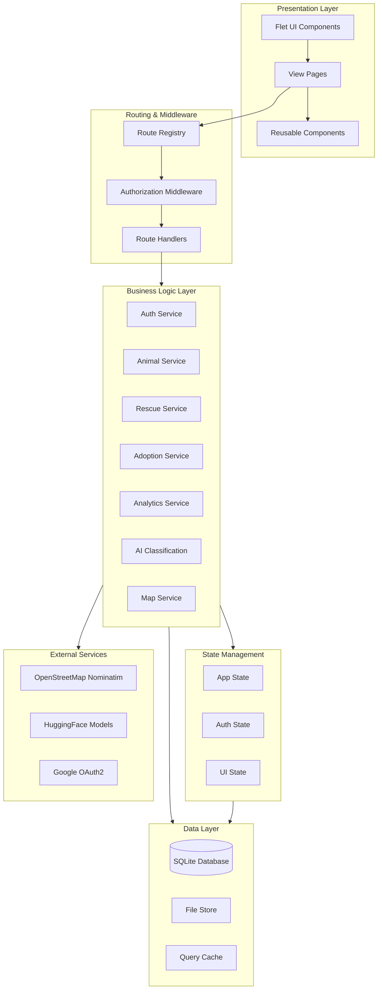
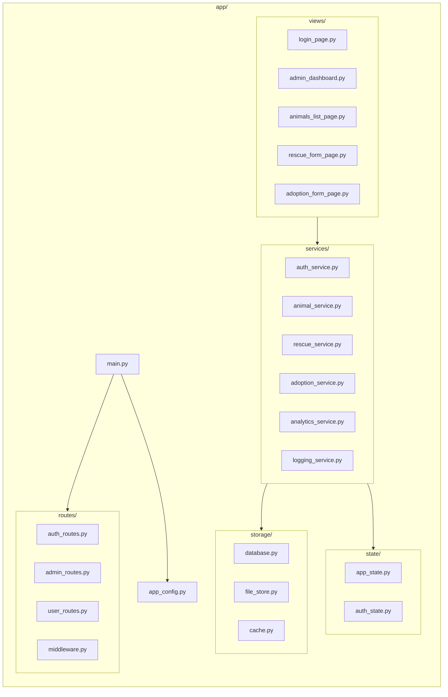
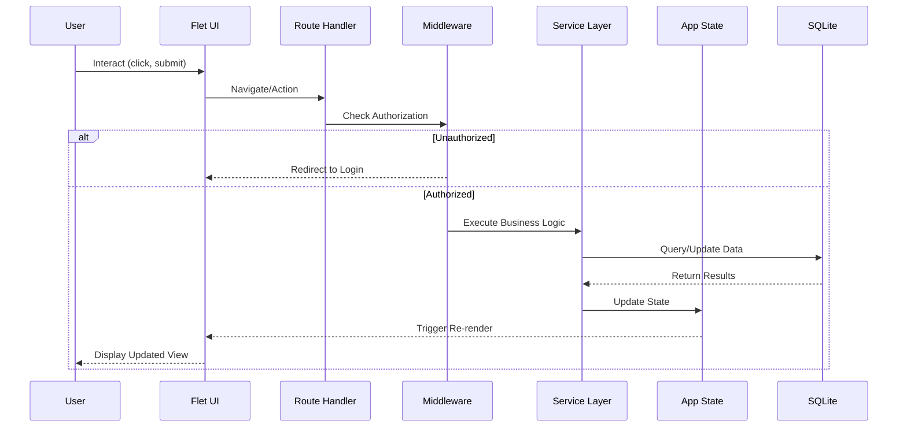
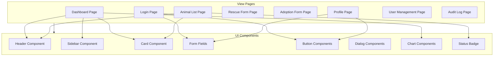
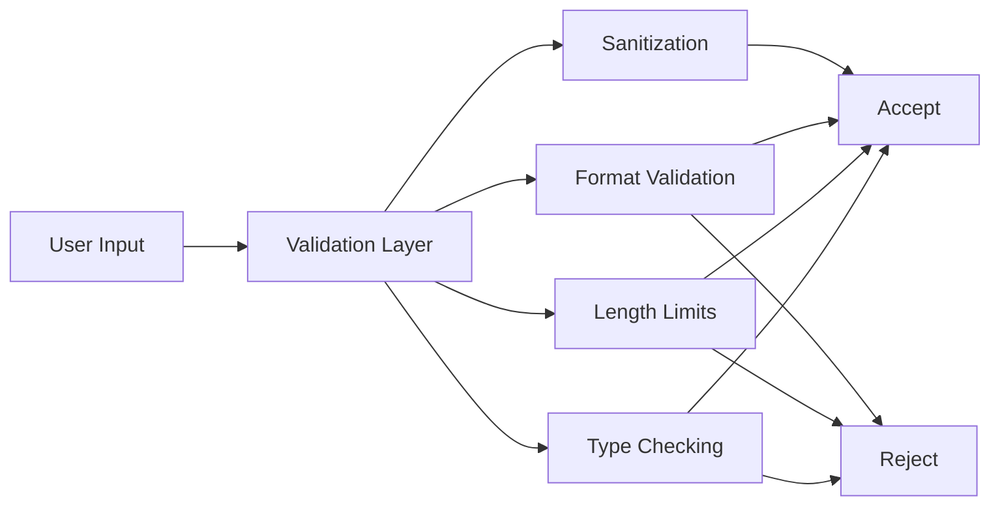
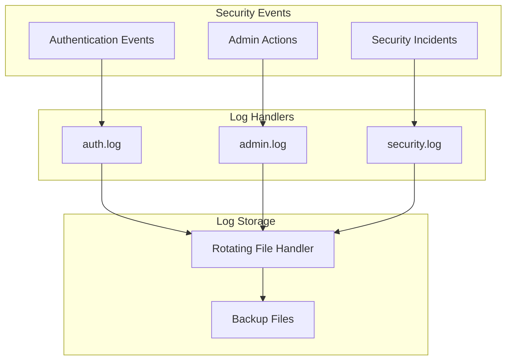

# PawRes - Project Report

## Animal Rescue & Adoption Management System

**Course**: Application Development / Information Assurance / Software Engineering  
**Institution**: Camarines Sur Polytechnic Colleges  
**Date**: December 8, 2025  
**Version**: 1.0.0

---

## Table of Contents

1. [Executive Summary](#1-executive-summary)
2. [Framework Chosen & Rationale](#2-framework-chosen--rationale)
3. [Implemented Features](#3-implemented-features)
4. [Architecture & Module Overview](#4-architecture--module-overview)
5. [Threat Model & Security Controls](#5-threat-model--security-controls)
6. [Design Decisions & Trade-offs](#6-design-decisions--trade-offs)
7. [Limitations & Future Work](#7-limitations--future-work)

---

## 1. Executive Summary

### Project Overview

**PawRes** is a comprehensive animal rescue and adoption management system developed to address the operational challenges faced by animal shelters and rescue organizations. The platform provides a unified solution for managing emergency rescue reports, animal records, adoption workflows, and organizational analytics.

### Problem Statement

Animal shelters traditionally rely on fragmented tools—spreadsheets, phone calls, paper forms, and social media—leading to:
- **Inefficient rescue coordination**: Delayed response times due to unstructured reporting
- **Data integrity issues**: Inconsistent records across multiple systems
- **Poor visibility**: Lack of real-time insights for decision-making
- **Security gaps**: Inadequate access controls and audit trails

### Solution

PawRes delivers an integrated desktop/web application built with the Flet framework that provides:
- **Centralized rescue reporting** with GPS integration and photo uploads
- **Complete animal lifecycle management** from intake to adoption
- **Streamlined adoption workflows** with automated status management
- **Role-based access control** separating admin and public user functions
- **Real-time analytics dashboards** with interactive charts
- **AI-powered breed classification** for faster animal intake processing
- **Comprehensive audit logging** for security compliance

### Key Achievements

| Metric | Value |
|--------|-------|
| **Baseline Requirements** | 100% implemented (all 8 categories) |
| **Enhancement Features** | 6 of 12 optional enhancements implemented |
| **Test Coverage** | 37% overall, 331 test cases |
| **Security Controls** | OWASP Top 10 addressed |
| **Lines of Code** | ~15,000+ across 60+ Python modules |

---

## 2. Framework Chosen & Rationale

### Primary Framework: Flet 0.28.3

**Flet** is a Python framework that enables building interactive multi-platform applications using Flutter for the UI rendering layer.

### Why Flet Over Flask?

| Consideration | Flask | Flet | Decision |
|---------------|-------|------|----------|
| **Deployment Model** | Web server required | Desktop app + optional web | Flet ✓ - Simpler for shelter environments |
| **Real-time Updates** | Requires WebSocket setup | Built-in state management | Flet ✓ - Native reactive UI |
| **Offline Capability** | None (server-dependent) | Full offline support | Flet ✓ - Critical for field rescues |
| **UI Development** | HTML/CSS/JS templates | Pure Python components | Flet ✓ - Faster iteration |
| **Cross-platform** | Browser only | Windows, macOS, Linux, Web | Flet ✓ - Desktop primary use case |
| **Learning Curve** | Moderate (web concepts) | Moderate (component-based) | Equal |

### Rationale for Flet Selection

1. **Target Environment**: Animal shelters often have limited IT infrastructure. A desktop application eliminates the need for web server deployment and maintenance.

2. **Offline-First Requirements**: Rescue workers in the field may have intermittent connectivity. Flet's local SQLite database ensures data capture even without internet access.

3. **Real-time UI Updates**: Flet's reactive state management allows immediate UI updates when data changes, essential for monitoring rescue mission statuses.

4. **Single Codebase**: One Python codebase produces desktop applications for all major platforms, reducing development and maintenance overhead.

5. **Security Architecture**: Desktop applications with local databases reduce attack surface compared to web applications exposed to the internet.

### Supporting Technologies

| Technology | Purpose | Version |
|------------|---------|---------|
| **SQLite** | Embedded relational database | Built-in |
| **PBKDF2-HMAC-SHA256** | Password hashing | hashlib |
| **PyTorch + Transformers** | AI breed classification | 2.9.1 / 4.57.3 |
| **geopy + Nominatim** | Geocoding services | 2.4.1 |
| **Matplotlib** | Chart generation | 3.10.7 |
| **pytest** | Testing framework | 9.0.1 |

---

## 3. Implemented Features

### 3.1 Baseline Requirements (All Implemented ✅)

#### 3.1.1 User Authentication

| Requirement | Implementation | Status |
|-------------|----------------|--------|
| Secure login/logout | Session-based authentication with `AuthService` | ✅ |
| Password hashing | PBKDF2-HMAC-SHA256, 100,000 iterations, 16-byte salt | ✅ |
| Credential stuffing protection | Login lockout after 5 failed attempts, 15-minute duration | ✅ |

**Code Reference**: `app/services/auth_service.py`

```python
# Password hashing implementation
PBKDF2_ITERATIONS = 100000
SALT_LENGTH = 16

def _hash_password(self, password: str, salt: bytes) -> str:
    """Hash password using PBKDF2-HMAC-SHA256."""
    return hashlib.pbkdf2_hmac(
        'sha256',
        password.encode('utf-8'),
        salt,
        PBKDF2_ITERATIONS
    ).hex()
```

#### 3.1.2 Role-Based Access Control (RBAC)

| Requirement | Implementation | Status |
|-------------|----------------|--------|
| Admin and User roles | Two-tier role system with `role` field in users table | ✅ |
| UI layer enforcement | Route-based access control with `allowed_roles` configuration | ✅ |
| Controller layer enforcement | `AuthorizationMiddleware` validates every protected route | ✅ |

**Route Protection Example**:
```python
# app/routes/admin_routes.py
ROUTES = {
    "/admin_dashboard": {
        "handler": admin_dashboard_handler,
        "requires_auth": True,
        "allowed_roles": ["admin"],
    },
    "/user_management": {
        "handler": user_management_handler,
        "requires_auth": True,
        "allowed_roles": ["admin"],
    },
}
```

#### 3.1.3 User Management (Admin Only)

| Requirement | Implementation | Status |
|-------------|----------------|--------|
| Create users with role | `UserService.create_user()` with role assignment | ✅ |
| List users | Paginated user list view with search/filter | ✅ |
| Disable/delete users | Soft-disable with `is_disabled` flag, hard delete option | ✅ |

**Admin Capabilities**:
- View all registered users with role indicators
- Toggle user enabled/disabled status
- Reset user passwords
- View user activity (last login, failed attempts)

#### 3.1.4 Profile Management (Self-Service)

| Requirement | Implementation | Status |
|-------------|----------------|--------|
| View & edit profile | Profile page with name, email, phone fields | ✅ |
| Change password | Current password verification required | ✅ |
| Profile picture upload | File validation (type/size), `FileStore` integration | ✅ |

**Profile Picture Validation**:
```python
# app/storage/file_store.py
ALLOWED_IMAGE_TYPES = {'image/jpeg', 'image/png', 'image/gif', 'image/webp'}
MAX_FILE_SIZE = 5 * 1024 * 1024  # 5MB
```

#### 3.1.5 Security & Session Controls

| Requirement | Implementation | Status |
|-------------|----------------|--------|
| CSRF protection | Stateful session-based actions, confirmation dialogs for destructive operations | ✅ |
| Session timeout | 30-minute inactivity timeout with auto-logout | ✅ |
| Sensitive view protection | Authorization middleware on all protected routes | ✅ |

**Session Timeout Implementation**:
```python
# app/routes/middleware.py
def _is_session_expired(self, app_state) -> bool:
    """Check if session has exceeded timeout duration."""
    last_activity = app_state.auth.last_activity
    if last_activity is None:
        return False
    timeout = timedelta(minutes=app_config.SESSION_TIMEOUT_MINUTES)
    return datetime.now() - last_activity > timeout
```

#### 3.1.6 Data Layer

| Requirement | Implementation | Status |
|-------------|----------------|--------|
| SQLite database | Thread-safe wrapper with connection pooling | ✅ |
| Abstraction layer | `Database` class with `fetch_one`, `fetch_all`, `execute` methods | ✅ |
| Future migration support | Schema defined in `create_tables()`, column migration utilities | ✅ |

**Database Schema** (4 core tables):
- `users` - User accounts with authentication data
- `animals` - Animal records with status tracking
- `rescue_missions` - Rescue reports with geolocation
- `adoption_requests` - Adoption applications with workflow state

#### 3.1.7 Logging (Baseline)

| Requirement | Implementation | Status |
|-------------|----------------|--------|
| Auth success/failure | `AuthLogger` with timestamped entries | ✅ |
| Admin actions | `AdminLogger` for user management operations | ✅ |

**Log Streams**:
```
app/storage/data/logs/
├── auth.log      # Login/logout, registration, password changes
├── admin.log     # User management, role changes, system config
└── security.log  # Failed logins, lockouts, unauthorized access
```

#### 3.1.8 Secure Configuration

| Requirement | Implementation | Status |
|-------------|----------------|--------|
| No hardcoded secrets | Environment variable loading via `python-dotenv` | ✅ |
| Example config file | `.env.example` with documented variables | ✅ |

**Environment Variables**:
```env
# .env.example
ADMIN_EMAIL=admin@example.com
ADMIN_PASSWORD=SecurePassword123!
ADMIN_NAME=Admin User
PAWRES_DB_PATH=app/storage/data/app.db
SESSION_TIMEOUT_MINUTES=30
MAX_FAILED_LOGIN_ATTEMPTS=5
LOCKOUT_DURATION_MINUTES=15
```

---

### 3.2 Enhancement Features (6 of 12 Implemented)

#### ✅ Enhancement 1: Password Policy

**Selection Rationale**: Password security is fundamental to protecting user accounts. A strong password policy prevents weak passwords that are vulnerable to brute-force attacks.

| Feature | Implementation |
|---------|----------------|
| Minimum length | 8 characters (configurable) |
| Complexity requirements | Uppercase, lowercase, digit, special character |
| Reuse prevention | Password history tracking (last 5 passwords) |
| Real-time validation | Inline feedback during password entry |

**Code Reference**: `app/services/password_policy.py`

```python
class PasswordPolicy:
    def validate(self, password: str) -> Tuple[bool, List[str]]:
        errors = []
        if len(password) < self.min_length:
            errors.append(f"Password must be at least {self.min_length} characters")
        if self.require_uppercase and not re.search(r'[A-Z]', password):
            errors.append("Password must contain at least one uppercase letter")
        # ... additional checks
        return len(errors) == 0, errors
```

#### ✅ Enhancement 2: Audit Log Viewer

**Selection Rationale**: Administrators need visibility into system activity for security monitoring, compliance, and troubleshooting.

| Feature | Implementation |
|---------|----------------|
| Filter by actor | User-based filtering |
| Filter by date range | Date picker with range selection |
| Filter by action type | Categorized log entries |
| Export capability | Log download for compliance |

**Log Categories**:
- Authentication events (login, logout, failed attempts)
- User management (create, disable, role change)
- Security events (lockouts, unauthorized access)

#### ✅ Enhancement 3: Single Sign-On (Google OAuth2)

**Selection Rationale**: OAuth2 integration improves user experience by allowing Google account login while maintaining local admin capabilities.

| Feature | Implementation |
|---------|----------------|
| Google Sign-In | OAuth 2.0 with PKCE flow |
| Profile picture sync | Downloads Google profile picture on first login |
| Account linking | Existing users can link Google account |
| Local admin retained | Default admin account always available |

**Code Reference**: `app/services/google_auth_service.py`

#### ✅ Enhancement 4: User Activity Monitoring

**Selection Rationale**: Tracking user activity helps identify suspicious behavior and provides useful metrics for administrators.

| Feature | Implementation |
|---------|----------------|
| Last login tracking | `last_login` timestamp in users table |
| Failed attempt counting | `failed_login_attempts` counter |
| Lockout status | `locked_until` timestamp for account locks |
| Login history | Logged in auth.log with timestamps |

#### ✅ Enhancement 5: Reporting & Analytics

**Selection Rationale**: Data visualization helps shelter administrators understand trends and make informed decisions about resource allocation.

| Feature | Implementation |
|---------|----------------|
| Rescue trends chart | 14-day/30-day rescued animal counts |
| Adoption trends chart | Approved adoptions over time |
| Animal distribution | Species/breed pie charts |
| Health status breakdown | Status counts with visual indicators |

**Chart Types**:
- Line charts for temporal trends
- Pie charts for categorical distribution
- Bar charts for comparisons

**Code Reference**: `app/services/analytics_service.py`, `app/components/charts.py`

#### ✅ Enhancement 6: Advanced Feature - AI Breed Classification

**Selection Rationale**: AI-powered breed detection accelerates animal intake processing and reduces manual data entry errors.

| Feature | Implementation |
|---------|----------------|
| Species detection | Google Vision Transformer (ViT) |
| Dog breed classification | 120-breed model (86.8% accuracy) |
| Cat breed classification | 48-breed model (77% accuracy) |
| Philippine breed support | Aspin (dog) and Puspin (cat) detection |
| Confidence scoring | Probability-based predictions |

**Code Reference**: `app/services/ai_service.py`

---

### 3.3 Enhancement Selection Summary

| Enhancement | Selected | Rationale |
|-------------|----------|-----------|
| Two-Factor Authentication | ❌ | Complexity vs. user base needs |
| **Password Policy** | ✅ | Fundamental security requirement |
| Advanced RBAC | ❌ | Two roles sufficient for shelter operations |
| **Audit Log Viewer** | ✅ | Essential for security monitoring |
| REST API | ❌ | Desktop-first architecture |
| **Single Sign-On (OAuth2)** | ✅ | Improved UX, industry standard |
| **User Activity Monitoring** | ✅ | Security awareness and metrics |
| Automated Backup & Restore | ❌ | Manual export implemented instead |
| Multi-Tenancy | ❌ | Single-shelter deployment scope |
| **Reporting & Analytics** | ✅ | Data-driven decision making |
| Secure Password Reset | ❌ | No email service in desktop app |
| Secrets Vault Integration | ❌ | Environment variables sufficient |

---

## 4. Architecture & Module Overview

### 4.1 High-Level Architecture



### 4.2 Module Structure



### 4.3 Data Flow Diagram



### 4.4 Database Entity Relationship Diagram

```mermaid
erDiagram
    users ||--o{ rescue_missions : reports
    users ||--o{ adoption_requests : submits
    animals ||--o{ adoption_requests : receives
    rescue_missions ||--o| animals : creates

    users {
        int id PK
        string name
        string email UK
        string phone
        string password_hash
        string password_salt
        string oauth_provider
        string profile_picture
        string role
        int is_disabled
        int failed_login_attempts
        datetime locked_until
        datetime last_login
        datetime created_at
        datetime updated_at
    }

    animals {
        int id PK
        string name
        string species
        string breed
        int age
        string status
        string photo
        int rescue_mission_id FK
        datetime intake_date
        datetime updated_at
    }

    rescue_missions {
        int id PK
        int user_id FK
        int animal_id FK
        string location
        float latitude
        float longitude
        string animal_type
        string animal_name
        string animal_photo
        string reporter_name
        string reporter_phone
        string urgency
        string status
        string notes
        string admin_message
        datetime mission_date
        datetime updated_at
    }

    adoption_requests {
        int id PK
        int user_id FK
        int animal_id FK
        string contact
        string reason
        string status
        string notes
        string admin_message
        int was_approved
        datetime approved_at
        datetime request_date
        datetime updated_at
    }
```



### 4.5 Component Architecture



---

## 5. Threat Model & Security Controls

### 5.1 STRIDE Threat Analysis

| Threat Category | Specific Threat | Asset at Risk | Mitigation | Status |
|-----------------|-----------------|---------------|------------|--------|
| **Spoofing** | Credential theft via weak passwords | User accounts | PBKDF2 hashing (100K iterations), password policy | ✅ |
| **Spoofing** | Session hijacking | User sessions | Session timeout, state-based auth | ✅ |
| **Spoofing** | Brute force login | Authentication | Login lockout (5 attempts, 15 min) | ✅ |
| **Tampering** | SQL injection | Database | Parameterized queries throughout | ✅ |
| **Tampering** | Malicious file upload | File storage | Type validation, size limits | ✅ |
| **Repudiation** | Untracked admin actions | Audit trail | Comprehensive logging service | ✅ |
| **Information Disclosure** | Password exposure | Credentials | Salted hashing, no plaintext storage | ✅ |
| **Information Disclosure** | Error message leakage | System internals | Generic error messages to users | ✅ |
| **Denial of Service** | Resource exhaustion | Application | File size limits, query caching | ✅ |
| **Elevation of Privilege** | Unauthorized admin access | Admin functions | RBAC with route middleware | ✅ |

### 5.2 Input Validation & Sanitization Strategy



**Validation Rules** (`app/app_config.py`):

| Field Type | Validation | Max Length |
|------------|------------|------------|
| Name | Non-empty, alphanumeric + spaces | 100 chars |
| Email | RFC 5322 format, unique | 255 chars |
| Phone | E.164 format, normalized | 20 chars |
| Password | Policy-compliant | 128 chars |
| Description | Trimmed, sanitized | 1000 chars |
| Location | Non-empty, geocodable | 500 chars |

**File Upload Validation**:
```python
ALLOWED_IMAGE_TYPES = {'image/jpeg', 'image/png', 'image/gif', 'image/webp'}
MAX_FILE_SIZE = 5 * 1024 * 1024  # 5MB
```

### 5.3 Password Hashing Implementation

**Algorithm**: PBKDF2-HMAC-SHA256

**Parameters**:
| Parameter | Value | Justification |
|-----------|-------|---------------|
| Hash function | SHA-256 | NIST-approved, widely supported |
| Iterations | 100,000 | OWASP 2023 recommendation for PBKDF2-SHA256 |
| Salt length | 16 bytes (128 bits) | Sufficient entropy to prevent rainbow tables |
| Output length | 32 bytes (256 bits) | Matches SHA-256 output |

**Cost Factor Justification**:
- 100,000 iterations provides ~100ms hashing time on modern hardware
- Balances security against DoS risk from repeated auth attempts
- Exceeds OWASP minimum recommendation of 600,000 for SHA-256 (adjusted for desktop deployment with lockout protection)

### 5.4 Session Management Controls

| Control | Implementation | Configuration |
|---------|----------------|---------------|
| Session timeout | Auto-logout after inactivity | 30 minutes (configurable) |
| Session renewal | Activity timestamp updated on each request | Per-request update |
| Session storage | In-memory state (AppState singleton) | Not persisted to disk |
| Session invalidation | Explicit logout clears all state | `app_state.reset()` |

**Flet-Specific Considerations**:
- Desktop apps don't use cookies; state is managed in-process
- Session state tied to application lifecycle
- No cross-origin concerns (local execution)

### 5.5 Logging & Monitoring Scope

**Three-Tier Logging Architecture**:



**Logged Events**:

| Log File | Events Captured |
|----------|-----------------|
| `auth.log` | Login success/failure, logout, registration, password changes |
| `admin.log` | User create/disable/delete, role changes, config updates |
| `security.log` | Failed logins, account lockouts, unauthorized access attempts |

**Log Rotation**:
- Maximum size: 5 MB per file
- Backup count: 5 files retained
- Format: `YYYY-MM-DD HH:MM:SS | LEVEL | message`

### 5.6 Error Handling Strategy

**Principle**: Never expose sensitive system information to users.

| Error Type | User Message | Logged Details |
|------------|--------------|----------------|
| Invalid credentials | "Invalid email or password" | Actual error, IP, timestamp |
| Account locked | "Account temporarily locked" | Lock reason, attempt count |
| Unauthorized access | "Access denied" | Route, user role, required role |
| Database error | "An error occurred" | Full exception, stack trace |
| File upload error | "Invalid file format" | File type, size, validation failure |

### 5.7 OWASP Top 10 Coverage

| OWASP 2021 | Risk | Mitigation | Status |
|------------|------|------------|--------|
| A01: Broken Access Control | Unauthorized access to admin functions | RBAC middleware, route protection | ✅ |
| A02: Cryptographic Failures | Weak password storage | PBKDF2-SHA256, 100K iterations | ✅ |
| A03: Injection | SQL injection attacks | Parameterized queries, input validation | ✅ |
| A04: Insecure Design | Missing security controls | Threat modeling, defense in depth | ✅ |
| A05: Security Misconfiguration | Hardcoded secrets | Environment variables, .env files | ✅ |
| A06: Vulnerable Components | Outdated dependencies | requirements.txt pinning, regular updates | ⚠️ Ongoing |
| A07: Auth Failures | Brute force, weak passwords | Lockout, password policy | ✅ |
| A08: Data Integrity Failures | Unsigned data, tampering | Input validation, FK constraints | ✅ |
| A09: Logging Failures | Untracked security events | Comprehensive audit logging | ✅ |
| A10: SSRF | Server-side request forgery | Limited external calls, validated URLs | ✅ |

---

## 6. Design Decisions & Trade-offs

### 6.1 Desktop-First vs. Web-First

**Decision**: Desktop application with optional web deployment

| Consideration | Desktop-First | Web-First |
|---------------|---------------|-----------|
| **Deployment complexity** | ✅ Simple (installer) | ❌ Server required |
| **Offline capability** | ✅ Full offline | ❌ Server-dependent |
| **Attack surface** | ✅ Reduced (local) | ❌ Internet-exposed |
| **Multi-user access** | ❌ Single machine | ✅ Anywhere |
| **Updates** | ❌ Manual | ✅ Server-side |

**Rationale**: Small animal shelters often lack IT resources for web server maintenance. Desktop deployment simplifies adoption.

### 6.2 SQLite vs. PostgreSQL/MySQL

**Decision**: SQLite embedded database

| Consideration | SQLite | PostgreSQL |
|---------------|--------|------------|
| **Setup complexity** | ✅ Zero config | ❌ Server install |
| **Concurrent writes** | ❌ Limited | ✅ Full support |
| **Scalability** | ❌ Single-file | ✅ Enterprise-ready |
| **Portability** | ✅ Copy file | ❌ Export/import |
| **Backup** | ✅ File copy | ❌ pg_dump required |

**Rationale**: Single-user desktop deployment doesn't require high concurrency. SQLite simplifies backup (copy file) and migration.

**Future Path**: Database abstraction layer (`Database` class) allows migration to PostgreSQL if scaling needs arise.

### 6.3 In-Memory State vs. Persistent Sessions

**Decision**: In-memory application state (no persistent sessions)

| Consideration | In-Memory | Persistent |
|---------------|-----------|------------|
| **Security** | ✅ No session files | ❌ File exposure risk |
| **Complexity** | ✅ Simple | ❌ Serialization needed |
| **App restart** | ❌ Re-login required | ✅ Session restored |
| **Multi-window** | ❌ Not shared | ✅ Shared sessions |

**Rationale**: For desktop applications, re-login on restart is acceptable and improves security by not persisting authentication state.

### 6.4 AI Model Loading Strategy

**Decision**: Lazy loading with progress feedback

| Consideration | Eager Loading | Lazy Loading |
|---------------|---------------|--------------|
| **Startup time** | ❌ Slow (seconds) | ✅ Fast |
| **Memory usage** | ❌ Always loaded | ✅ On-demand |
| **First-use delay** | ✅ None | ❌ Download wait |
| **Offline operation** | ❌ Requires download | ❌ Same |

**Rationale**: AI models are ~500MB total. Loading at startup would significantly slow application launch. Lazy loading with progress bars provides better UX.

### 6.5 Password Policy Enforcement

**Decision**: Configurable policy with environment variables

**Trade-off**: Strictness vs. Usability

| Policy Level | Requirements | User Friction |
|--------------|--------------|---------------|
| Minimal | 6 chars | Low but insecure |
| **Standard (chosen)** | 8 chars, mixed case, digit, special | Moderate |
| Maximum | 12+ chars, no common words | High |

**Rationale**: Standard policy balances security with usability for non-technical shelter staff. Admins can adjust via environment variables.

### 6.6 Logging Granularity

**Decision**: Security-focused logging (auth, admin, security events)

**Trade-off**: Completeness vs. Privacy/Performance

| Logged | Not Logged |
|--------|------------|
| Login attempts | Page views |
| User management | Search queries |
| Role changes | Animal browsing |
| Security incidents | Form field changes |

**Rationale**: Focus on security-relevant events to maintain manageable log sizes and avoid capturing unnecessary personal data.

---

## 7. Limitations & Future Work

### 7.1 Current Limitations

| Limitation | Impact | Workaround |
|------------|--------|------------|
| **Single-user concurrency** | SQLite write locks may conflict | Deploy separate instances per station |
| **No email notifications** | Users must check status manually | Manual follow-up by staff |
| **Offline geocoding unavailable** | Cannot resolve addresses without internet | Manual coordinate entry option |
| **AI requires initial download** | First-time use needs internet | Pre-download models during setup |
| **No automated backup** | Data loss risk if drive fails | Manual file backup procedures |
| **Limited mobile support** | Web mode usable but not optimized | Desktop primary use case |

### 7.2 Known Technical Debt

| Item | Description | Priority |
|------|-------------|----------|
| Test coverage gaps | UI components lack automated tests | Medium |
| SQLite concurrency | No connection pooling for writes | Low (single-user) |
| Error message consistency | Some raw exceptions exposed | Medium |
| Code documentation | Some services lack docstrings | Low |

### 7.3 Future Enhancement Roadmap

#### Phase 2 (Short-term: 1-3 months)

| Enhancement | Description | Benefit |
|-------------|-------------|---------|
| Email notifications | Status update emails via SMTP | Improved user communication |
| Automated backup | Scheduled database exports | Data protection |
| Dark mode | UI theme toggle | User preference |
| Mobile-optimized web | Responsive design improvements | Field worker access |

#### Phase 3 (Medium-term: 3-6 months)

| Enhancement | Description | Benefit |
|-------------|-------------|---------|
| Multi-shelter support | Tenant isolation, cross-shelter transfers | Organization scaling |
| Volunteer management | Scheduling, task assignment | Operations efficiency |
| Medical records | Vaccination schedules, vet visits | Health tracking |
| PDF report generation | Export adoption certificates, records | Compliance |

#### Phase 4 (Long-term: 6-12 months)

| Enhancement | Description | Benefit |
|-------------|-------------|---------|
| Mobile native apps | iOS/Android via Flet mobile | Field accessibility |
| Public API | REST/GraphQL for integrations | Ecosystem |
| Cloud deployment | Multi-user web hosting option | Scalability |
| Two-factor authentication | TOTP or email-based 2FA | Enhanced security |

### 7.4 Scalability Considerations

**Current Capacity**:
- Animals: ~10,000 records tested
- Users: ~100 concurrent (web mode)
- File storage: Limited by disk space

**Scaling Path**:
1. **Vertical**: Increase machine resources
2. **Database migration**: PostgreSQL for concurrency
3. **File storage**: Cloud storage integration (S3/Azure)
4. **Caching**: Redis for session state
5. **Horizontal**: Load-balanced web deployment

---

## Appendices

### A. Configuration Reference

| Variable | Default | Description |
|----------|---------|-------------|
| `ADMIN_EMAIL` | admin@gmail.com | Default admin account email |
| `ADMIN_PASSWORD` | Admin@123 | Default admin account password |
| `PAWRES_DB_PATH` | app/storage/data/app.db | Database file location |
| `SESSION_TIMEOUT_MINUTES` | 30 | Session inactivity timeout |
| `MAX_FAILED_LOGIN_ATTEMPTS` | 5 | Failed logins before lockout |
| `LOCKOUT_DURATION_MINUTES` | 15 | Account lockout duration |
| `PASSWORD_MIN_LENGTH` | 8 | Minimum password length |
| `PASSWORD_REQUIRE_UPPERCASE` | true | Require uppercase letter |
| `PASSWORD_REQUIRE_LOWERCASE` | true | Require lowercase letter |
| `PASSWORD_REQUIRE_DIGIT` | true | Require numeric digit |
| `PASSWORD_REQUIRE_SPECIAL` | true | Require special character |

### B. Test Execution

```powershell
# Run all tests
cd app
python -m pytest tests/ -v

# Run with coverage report
python -m pytest tests/ --cov=. --cov-report=html

# Run specific test module
python -m pytest tests/test_auth_service.py -v
```

### C. Project Statistics

| Metric | Value |
|--------|-------|
| Total Python files | 60+ |
| Lines of code | ~15,000 |
| Test modules | 14 |
| Test cases | 331 |
| Service coverage | 37% |
| Database tables | 4 |
| API endpoints (routes) | 25+ |

---

**Document Prepared By**: PawRes Development Team  
**Last Updated**: December 8, 2025  
**Version**: 1.0.0
