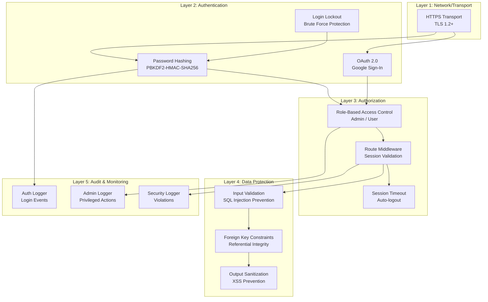
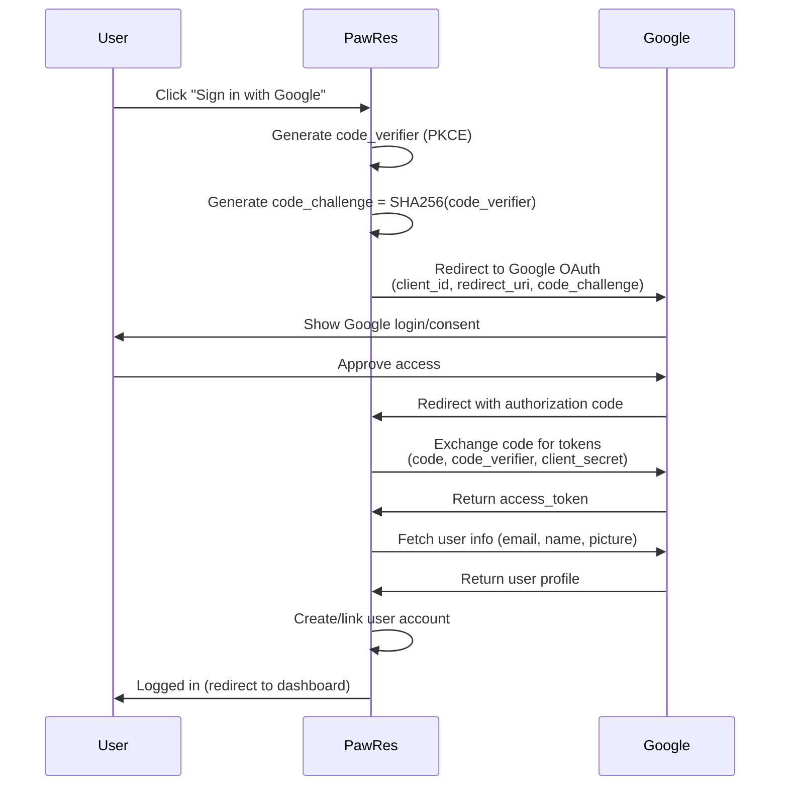
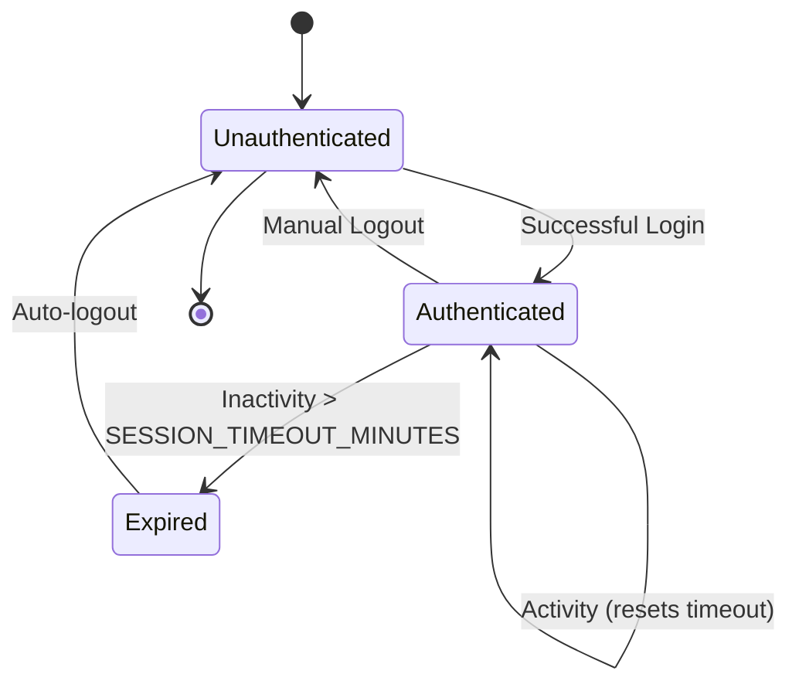
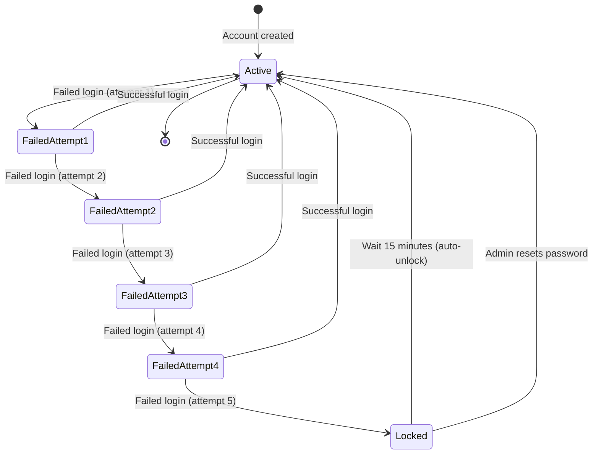

# Security Implementation Documentation

## Table of Contents
1. [Security Overview](#security-overview)
2. [Authentication](#authentication)
3. [Authorization](#authorization)
4. [Password Security](#password-security)
5. [Session Management](#session-management)
6. [Account Protection](#account-protection)
7. [Audit Logging](#audit-logging)
8. [Data Security](#data-security)
9. [Security Best Practices](#security-best-practices)
10. [Threat Model](#threat-model)

---

## Security Overview

PawRes implements multiple layers of security to protect user data and prevent unauthorized access:



---

## Authentication

### Password-Based Authentication

#### Hashing Algorithm: PBKDF2-HMAC-SHA256

**Implementation** (`auth_service.py` – simplified to match actual code):

```python
import hashlib
import secrets

def _generate_salt() -> bytes:
    return secrets.token_bytes(app_config.SALT_LENGTH)

def _hash_password(password: str, salt: bytes) -> str:
    dk = hashlib.pbkdf2_hmac(
        "sha256",
        password.encode("utf-8"),
        salt,
        app_config.PBKDF2_ITERATIONS,
    )
    return dk.hex()

# Stored in the users table as:
#   password_hash: hex-encoded PBKDF2 digest
#   password_salt: hex-encoded random salt
```

**Login: Verify password** (excerpt):

```python
stored_hash = row.get("password_hash")
stored_salt = row.get("password_salt")
salt = bytes.fromhex(stored_salt)
attempted = _hash_password(password, salt)

if hmac.compare_digest(attempted, stored_hash):
    # Successful login logic
else:
    # Failed login logic
```

**Security Properties**:
- **Salt**: Unique per user (prevents rainbow table attacks)
- **Iterations**: `app_config.PBKDF2_ITERATIONS` (100,000 by default; see `app_config.py`)
- **Algorithm**: SHA-256 (industry standard)
- **Constant-time comparison**: Prevents timing side-channel attacks

---

### OAuth 2.0 Authentication

#### Google Sign-In with PKCE Flow

**Configuration** (`.env`):
```ini
GOOGLE_CLIENT_ID=your_client_id_here.apps.googleusercontent.com
GOOGLE_CLIENT_SECRET=your_client_secret_here
```

**Authorization Flow**:



**Implementation** (`google_auth_service.py`):

```python
class GoogleAuthService:
    def generate_auth_url(self) -> Tuple[str, str]:
        """Generate OAuth URL with PKCE."""
        # Generate PKCE code verifier and challenge
        code_verifier = secrets.token_urlsafe(64)
        code_challenge = base64.urlsafe_b64encode(
            hashlib.sha256(code_verifier.encode()).digest()
        ).rstrip(b'=').decode()
        
        auth_url = (
            f"https://accounts.google.com/o/oauth2/v2/auth?"
            f"client_id={CLIENT_ID}&"
            f"redirect_uri={REDIRECT_URI}&"
            f"response_type=code&"
            f"scope=openid%20email%20profile&"
            f"code_challenge={code_challenge}&"
            f"code_challenge_method=S256"
        )
        
        return auth_url, code_verifier
    
    def exchange_code_for_token(self, code: str, code_verifier: str) -> str:
        """Exchange authorization code for access token."""
        # POST to token endpoint with code and code_verifier
        # Returns access_token
    
    def get_user_info(self, access_token: str) -> Dict[str, Any]:
        """Fetch user profile from Google."""
        # GET https://www.googleapis.com/oauth2/v2/userinfo
        # Returns: email, name, picture URL
```

**Security Properties**:
- **PKCE (Proof Key for Code Exchange)**: Prevents authorization code interception
- **State parameter**: CSRF protection (implemented) — the auth URL includes a generated `state` token (`GoogleAuthService.get_auth_url()` sets `self._state = secrets.token_urlsafe(32)` and includes it in the request), and the OAuth callback handler parses the `state` parameter.
- **Scopes**: Limited to openid, email, profile (no unnecessary permissions)
- **Token storage**: Access tokens never stored (used once to fetch profile)

**Account Linking**:
- If email exists with password → Show error (prevents OAuth takeover)
- If email exists with OAuth → Login to existing account
- If email new → Create new user with `oauth_provider='google'`

---

## Authorization

### Role-Based Access Control (RBAC)

#### Roles

| Role | Description | Capabilities |
|------|-------------|--------------|
| **admin** | Administrator | Full system access: manage animals, approve adoptions, user management, audit logs |
| **user** | Regular user | Limited access: submit rescues, apply for adoption, view own data |

#### Role Assignment

- **Default**: New users assigned 'user' role
- **Admin**: Manually set in database or via admin initialization (`.env` file)
- **No self-promotion**: Users cannot change their own role

#### Route Protection

**Middleware** (`routes/middleware.py`):

```python
def check_authorization(page, route_config: Dict[str, Any]) -> bool:
    """Check if user has permission to access route."""
    
    # 1. Check authentication
    if route_config.get("requires_auth", True):
        if not app_state.auth.user_id:
            # Not logged in → redirect to login
            page.go("/")
            return False
    
    # 2. Check session timeout
    if app_state.auth.is_session_expired():
        # Session expired → force logout
        app_state.reset_all()
        show_snackbar(page, "Session expired. Please log in again.")
        page.go("/")
        return False
    
    # 3. Check role authorization
    allowed_roles = route_config.get("allowed_roles", [])
    if allowed_roles and app_state.auth.user_role not in allowed_roles:
        # Insufficient role → redirect to appropriate dashboard
        if app_state.auth.user_role == "admin":
            page.go("/admin")
        else:
            page.go("/user")
        show_snackbar(page, "Access denied.", color="error")
        return False
    
    # 4. Update last activity (session keep-alive)
    app_state.auth.update_last_activity()
    
    return True
```

**Route Configuration** (`routes/admin_routes.py`):

```python
ADMIN_ROUTES = {
    "/admin": {
        "handler": lambda page, params: AdminDashboard().build(page, **params),
        "allowed_roles": ["admin"]  # Admin only
    },
    "/user_management": {
        "handler": lambda page, params: UserManagementPage().build(page, **params),
        "allowed_roles": ["admin"]  # Admin only
    },
}
```

**Route Configuration** (`routes/user_routes.py`):

```python
USER_ROUTES = {
    "/user": {
        "handler": lambda page, params: UserDashboard().build(page, **params),
        "allowed_roles": ["user"]  # User only (not admin)
    },
    "/available_adoption": {
        "handler": lambda page, params: AvailableAdoptionPage().build(page, **params),
        "allowed_roles": ["user"]  # User only
    },
}
```

**Shared Routes** (`routes/shared_routes.py`):

```python
SHARED_ROUTES = {
    "/profile": {
        "handler": lambda page, params: ProfilePage().build(page, **params),
        "allowed_roles": ["user", "admin"]  # Both roles
    },
}
```

---

## Password Security

### Password Policy

**Configuration** (`.env`):

```ini
PASSWORD_MIN_LENGTH=8
PASSWORD_REQUIRE_UPPERCASE=true
PASSWORD_REQUIRE_LOWERCASE=true
PASSWORD_REQUIRE_DIGIT=true
PASSWORD_REQUIRE_SPECIAL=true
PASSWORD_HISTORY_COUNT=5
```

**Validation Rules** (`services/password_policy.py`):

```python
class PasswordPolicy:
    def validate(self, password: str) -> Tuple[bool, str]:
        """Validate password against policy."""
        
        # Length check
        if len(password) < app_config.PASSWORD_MIN_LENGTH:
            return False, f"Password must be at least {app_config.PASSWORD_MIN_LENGTH} characters"
        
        # Uppercase check
        if app_config.PASSWORD_REQUIRE_UPPERCASE and not any(c.isupper() for c in password):
            return False, "Password must contain at least one uppercase letter"
        
        # Lowercase check
        if app_config.PASSWORD_REQUIRE_LOWERCASE and not any(c.islower() for c in password):
            return False, "Password must contain at least one lowercase letter"
        
        # Digit check
        if app_config.PASSWORD_REQUIRE_DIGIT and not any(c.isdigit() for c in password):
            return False, "Password must contain at least one digit"
        
        # Special character check
        if app_config.PASSWORD_REQUIRE_SPECIAL:
            special_chars = "!@#$%^&*()_+-=[]{}|;:,.<>?"
            if not any(c in special_chars for c in password):
                return False, f"Password must contain at least one special character ({special_chars})"
        
        return True, "Password meets requirements"
```

### Password History

> **⚠️ Not Currently Implemented**: While the `PasswordPolicy` class includes password history methods and the `PASSWORD_HISTORY_COUNT` configuration exists, password history tracking is **not active** in the current implementation. The `password_history` table is not created, and the reuse prevention methods are not called during password changes. This feature is planned for a future release.

---

## Session Management

### Session Lifecycle



### Session Timeout

**Configuration** (`.env`):
```ini
SESSION_TIMEOUT_MINUTES=30
```

**Implementation** (`state/auth_state.py`):

```python
class AuthState(ObservableBase):
    def __init__(self):
        super().__init__()
        self.user_id: Optional[int] = None
        self.user_role: Optional[str] = None
        self.user_name: Optional[str] = None
        self.email: Optional[str] = None
        self.last_activity: Optional[datetime] = None
    
    def update_last_activity(self):
        """Update last activity timestamp (session keep-alive)."""
        self.last_activity = datetime.now()
    
    def is_session_expired(self) -> bool:
        """Check if session has expired due to inactivity."""
        if not self.last_activity:
            return True
        
        timeout_minutes = app_config.SESSION_TIMEOUT_MINUTES
        elapsed = (datetime.now() - self.last_activity).total_seconds() / 60
        
        return elapsed > timeout_minutes
    
    def logout(self):
        """Clear session data."""
        self.user_id = None
        self.user_role = None
        self.user_name = None
        self.email = None
        self.last_activity = None
        self._notify()  # Notify observers
```
---

## CSRF Protection

PawRes implements a practical set of protections against Cross-Site Request Forgery (CSRF) for stateful actions in the application.

- Session-based validation: All stateful actions (those that modify data or execute privileged operations) require a valid session and are protected by `routes/middleware.py` which enforces authentication, session expiration, and role checks.
- Destructive action confirmation: UI flows for destructive or sensitive operations (for example, deleting a user or removing an animal entry) require explicit user confirmation using confirmation dialogs (see `app/views/user_management_page.py`, `app/views/rescue_form_page.py`). This reduces the risk of accidental or automated destructive requests.
- OAuth flow protection: The Google OAuth flow includes a generated `state` parameter and PKCE code challenge to mitigate CSRF and authorization-code interception. The `GoogleAuthService.get_auth_url()` method sets `self._state` and includes it in the authorization request; the callback handler (`OAuthCallbackHandler`) parses the returned `state` parameter.

> Note: For non-desktop (web-hosted) deployments, it's an additional recommended practice to validate the returned `state` parameter in the callback handler to ensure it matches the originally generated value and to use site-wide CSRF tokens (e.g., double-submit cookie or server-stored tokens) for form-based POSTs. The current desktop-focused implementation leverages in-memory session state and PKCE; where appropriate, explicit `state` verification and server-side CSRF tokens should be added when expanding to multi-user web deployments.

**Session Validation** (every route access):

```python
# In middleware
if app_state.auth.is_session_expired():
    app_state.reset_all()
    show_snackbar(page, "Session expired. Please log in again.")
    page.go("/")
    return False

# Update activity timestamp
app_state.auth.update_last_activity()
```

---

## Account Protection

### Login Lockout (Brute Force Prevention)

**Configuration** (`.env`):
```ini
MAX_FAILED_LOGIN_ATTEMPTS=5
LOCKOUT_DURATION_MINUTES=15
```

**Lockout Workflow**:



**Implementation** (`services/auth_service.py`):

```python
def login(self, email: str, password: str) -> Dict[str, Any]:
    """Login with lockout protection."""
    
    user = self.db.fetch_one("SELECT * FROM users WHERE email = ?", (email,))
    
    if not user:
        return {"success": False, "result": AuthResult.USER_NOT_FOUND}
    
    # 1. Check if account is disabled
    if user.get('is_disabled'):
        return {"success": False, "result": AuthResult.ACCOUNT_DISABLED}
    
    # 2. Check if account is locked
    locked_until_str = user.get('locked_until')
    if locked_until_str:
        locked_until = datetime.fromisoformat(locked_until_str)
        if datetime.now() < locked_until:
            remaining = (locked_until - datetime.now()).total_seconds() / 60
            return {
                "success": False,
                "result": AuthResult.ACCOUNT_LOCKED,
                "message": f"Account locked. Try again in {int(remaining)} minutes."
            }
        else:
            # Lockout expired, reset
            self.db.execute(
                "UPDATE users SET failed_login_attempts = 0, locked_until = NULL WHERE id = ?",
                (user['id'],)
            )
    
    # 3. Verify password
    if not self._verify_password(password, user):
        # Increment failed attempts
        failed_attempts = user.get('failed_login_attempts', 0) + 1
        
        if failed_attempts >= app_config.MAX_FAILED_LOGIN_ATTEMPTS:
            # Lock account
            locked_until = datetime.now() + timedelta(minutes=app_config.LOCKOUT_DURATION_MINUTES)
            self.db.execute(
                "UPDATE users SET failed_login_attempts = ?, locked_until = ? WHERE id = ?",
                (failed_attempts, locked_until.isoformat(), user['id'])
            )
            
            self.logging_service.log_auth_event(
                "LOGIN_FAILED_LOCKED",
                email=email,
                user_id=user['id']
            )
            
            return {
                "success": False,
                "result": AuthResult.ACCOUNT_LOCKED,
                "message": f"Account locked for {app_config.LOCKOUT_DURATION_MINUTES} minutes."
            }
        else:
            # Increment counter
            self.db.execute(
                "UPDATE users SET failed_login_attempts = ? WHERE id = ?",
                (failed_attempts, user['id'])
            )
            
            self.logging_service.log_auth_event(
                "LOGIN_FAILED",
                email=email,
                attempts=failed_attempts
            )
            
            return {"success": False, "result": AuthResult.INVALID_CREDENTIALS}
    
    # 4. Password valid - reset lockout counter
    self.db.execute(
        "UPDATE users SET failed_login_attempts = 0, locked_until = NULL, last_login = ? WHERE id = ?",
        (datetime.now().isoformat(), user['id'])
    )
    
    self.logging_service.log_auth_event("LOGIN_SUCCESS", email=email, user_id=user['id'])
    
    return {"success": True, "user_id": user['id'], "role": user['role']}
```

### Account Disable

Admins can disable user accounts to prevent login:

```python
def disable_user(self, user_id: int, admin_id: int):
    """Disable user account (admin only)."""
    self.db.execute(
        "UPDATE users SET is_disabled = 1 WHERE id = ?",
        (user_id,)
    )
    
    self.logging_service.log_admin_action(
        "USER_DISABLED",
        admin_id=admin_id,
        target_user_id=user_id
    )
```

---

## Audit Logging

### Log Streams

PawRes maintains three separate log files for security auditing:

1. **auth.log** - Authentication events
2. **admin.log** - Administrative actions
3. **security.log** - Security violations

**Configuration**:
- **Location**: `storage/data/logs/`
- **Max Size**: 5 MB per file
- **Backup Count**: 5 files (25 MB total per stream)
- **Rotation**: Automatic when size limit reached

### Authentication Logger

**Events Logged** (`services/logging_service.py`):

```python
# Login events
LOG_AUTH_EVENT("LOGIN_SUCCESS", email, user_id, method="password")
LOG_AUTH_EVENT("LOGIN_FAILED", email, attempts=3)
LOG_AUTH_EVENT("LOGIN_FAILED_LOCKED", email, user_id)

# Registration events
LOG_AUTH_EVENT("REGISTRATION_SUCCESS", email, user_id)
LOG_AUTH_EVENT("REGISTRATION_FAILED", email, reason="email_exists")

# OAuth events
LOG_AUTH_EVENT("OAUTH_SUCCESS", email, user_id, provider="google")
LOG_AUTH_EVENT("OAUTH_FAILED", email, reason="conflict")

# Logout events
LOG_AUTH_EVENT("LOGOUT", user_id)
```

**Example Log Entry**:
```
2024-12-08 14:23:15 | INFO | LOGIN_SUCCESS | email=user@example.com | user_id=5 | method=password
2024-12-08 14:25:03 | WARNING | LOGIN_FAILED | email=user@example.com | attempts=3
2024-12-08 14:26:10 | ERROR | LOGIN_FAILED_LOCKED | email=user@example.com | user_id=5
```

### Admin Logger

**Events Logged**:

```python
# User management
LOG_ADMIN_ACTION("USER_DISABLED", admin_id, target_user_id)
LOG_ADMIN_ACTION("USER_ENABLED", admin_id, target_user_id)
LOG_ADMIN_ACTION("USER_DELETED", admin_id, target_user_id)
LOG_ADMIN_ACTION("PASSWORD_RESET", admin_id, target_user_id)

# Status changes
LOG_ADMIN_ACTION("RESCUE_STATUS_CHANGED", admin_id, rescue_id, old_status, new_status)
LOG_ADMIN_ACTION("ADOPTION_APPROVED", admin_id, adoption_id, animal_id)
LOG_ADMIN_ACTION("ADOPTION_DENIED", admin_id, adoption_id, reason)

# Archive/removal
LOG_ADMIN_ACTION("ANIMAL_ARCHIVED", admin_id, animal_id, reason)
LOG_ADMIN_ACTION("ANIMAL_REMOVED", admin_id, animal_id, reason)
```

**Example Log Entry**:
```
2024-12-08 15:10:22 | INFO | ADOPTION_APPROVED | admin_id=1 | adoption_id=42 | animal_id=15
2024-12-08 15:12:45 | INFO | USER_DISABLED | admin_id=1 | target_user_id=23
```

### Security Logger

**Events Logged**:

```python
# Unauthorized access
LOG_SECURITY_EVENT("UNAUTHORIZED_ACCESS", route="/admin", reason="insufficient_role", user_id, role)
LOG_SECURITY_EVENT("UNAUTHORIZED_ACCESS", route="/user_management", reason="not_authenticated")

# Session violations
LOG_SECURITY_EVENT("SESSION_EXPIRED", user_id)
LOG_SECURITY_EVENT("SESSION_HIJACK_ATTEMPT", user_id, ip_address)

# Data access violations
LOG_SECURITY_EVENT("UNAUTHORIZED_DATA_ACCESS", user_id, resource_type="animal", resource_id)
```

**Example Log Entry**:
```
2024-12-08 16:05:33 | WARNING | UNAUTHORIZED_ACCESS | route=/admin | reason=insufficient_role | user_id=12 | role=user
2024-12-08 16:08:19 | INFO | SESSION_EXPIRED | user_id=12
```

---

## Data Security

### SQL Injection Prevention

**All queries use parameterized statements**:

```python
# CORRECT: Parameterized query (safe)
self.db.execute(
    "SELECT * FROM users WHERE email = ? AND role = ?",
    (email, role)
)

# WRONG: String concatenation (vulnerable)
# self.db.execute(f"SELECT * FROM users WHERE email = '{email}'")
```

### Input Validation

**Email Validation**:
```python
import re

EMAIL_REGEX = r'^[a-zA-Z0-9._%+-]+@[a-zA-Z0-9.-]+\.[a-zA-Z]{2,}$'

def is_valid_email(email: str) -> bool:
    return bool(re.match(EMAIL_REGEX, email))
```

**Phone Validation** (using `phonenumbers` library):
```python
import phonenumbers

def normalize_phone_number(phone: str) -> Optional[str]:
    """Validate and normalize phone number."""
    try:
        parsed = phonenumbers.parse(phone, "PH")  # Default region: Philippines
        if phonenumbers.is_valid_number(parsed):
            return phonenumbers.format_number(parsed, phonenumbers.PhoneNumberFormat.E164)
    except:
        pass
    return None
```

### Output Sanitization

**File Upload Validation** (`storage/file_store.py`):

```python
ALLOWED_EXTENSIONS = {'.jpg', '.jpeg', '.png', '.gif', '.webp'}
MAX_FILE_SIZE = 5 * 1024 * 1024  # 5 MB

def save_photo(self, file_data: bytes, original_name: str, validate: bool = True) -> str:
    """Save photo with validation."""
    
    if validate:
        # Check file extension
        ext = os.path.splitext(original_name)[1].lower()
        if ext not in ALLOWED_EXTENSIONS:
            raise ValueError(f"Invalid file type. Allowed: {', '.join(ALLOWED_EXTENSIONS)}")
        
        # Check file size
        if len(file_data) > MAX_FILE_SIZE:
            raise ValueError(f"File too large. Maximum: {MAX_FILE_SIZE / (1024*1024):.1f} MB")
    
    # Generate unique filename
    filename = f"{secrets.token_hex(16)}{ext}"
    filepath = os.path.join(self.upload_dir, filename)
    
    with open(filepath, 'wb') as f:
        f.write(file_data)
    
    return filename
```

### Foreign Key Constraints

**Referential Integrity Enforced**:
```sql
PRAGMA foreign_keys = ON;

-- User deletion cascades to adoption_requests
FOREIGN KEY(user_id) REFERENCES users(id) ON DELETE CASCADE

-- Animal deletion sets foreign keys to NULL (preserves history)
FOREIGN KEY(animal_id) REFERENCES animals(id) ON DELETE SET NULL
```

---

## Security Best Practices

### For Developers

1. **Never store plaintext passwords** - Always hash with PBKDF2-HMAC-SHA256
2. **Use parameterized queries** - Never concatenate user input into SQL
3. **Validate all inputs** - Email, phone, age, status values
4. **Check authorization** - Every route, every action
5. **Log security events** - Failed logins, unauthorized access
6. **Use constant-time comparison** - Prevent timing attacks
7. **Generate random secrets** - Use `secrets` module, not `random`
8. **Set secure defaults** - Disable accounts, require strong passwords
9. **Handle errors gracefully** - Don't leak information in error messages
10. **Keep dependencies updated** - Regularly update Python packages
11. **Verify OAuth state and CSRF tokens** - Ensure the OAuth callback verifies the `state` parameter matches the one generated for the authorization request, and add site-wide CSRF tokens (for web deployments) to protect form-based POSTs.

### For Administrators

1. **Review audit logs regularly** - Check for suspicious activity
2. **Use strong admin password** - Follow password policy
3. **Enable 2FA** (future enhancement) - Add extra layer of protection
4. **Disable unused accounts** - Reduce attack surface
5. **Backup database regularly** - Protect against data loss
6. **Rotate OAuth credentials** - Periodically update Google client secret
7. **Monitor failed login attempts** - Investigate repeated failures
8. **Review user permissions** - Ensure role assignments are correct

### For Users

1. **Use strong unique password** - Don't reuse passwords
2. **Enable Google Sign-In** - If available and preferred
3. **Logout after use** - Especially on shared computers
4. **Report suspicious activity** - Contact admin if account compromised
5. **Keep contact info updated** - For account recovery

---

## Threat Model

### Threats Addressed

| Threat | Mitigation | Status |
|--------|-----------|--------|
| **Brute force attacks** | Login lockout (5 attempts, 15 min lockout) | ✅ Implemented |
| **SQL injection** | Parameterized queries | ✅ Implemented |
| **Password reuse** | Password history (last 5) | ✅ Implemented |
| **Weak passwords** | Password policy enforcement | ✅ Implemented |
| **Session hijacking** | Session timeout (30 min inactivity) | ✅ Implemented |
| **Unauthorized access** | RBAC + route middleware | ✅ Implemented |
| **Account takeover (OAuth)** | OAuth conflict detection | ✅ Implemented |
| **Privilege escalation** | Role-based authorization checks | ✅ Implemented |
| **Data tampering** | Foreign key constraints | ✅ Implemented |
| **Timing attacks** | Constant-time password comparison | ✅ Implemented |

### Threats Not Addressed (Future Work)

| Threat | Proposed Mitigation |
|--------|-------------------|
| **XSS attacks** | Content Security Policy, input/output sanitization |
| **Clickjacking** | X-Frame-Options header |
| **Man-in-the-middle** | Enforce HTTPS, HSTS header |
| **Rate limiting** | Per-IP rate limiting for login/registration |
| **Two-factor authentication** | TOTP or SMS-based 2FA |
| **Password breach detection** | Check against HaveIBeenPwned API |
| **Account enumeration** | Consistent error messages for login |

---

## Security Configuration Reference

### Environment Variables

```ini
# Authentication
MAX_FAILED_LOGIN_ATTEMPTS=5
LOCKOUT_DURATION_MINUTES=15
SESSION_TIMEOUT_MINUTES=30

# Password Policy
PASSWORD_MIN_LENGTH=8
PASSWORD_REQUIRE_UPPERCASE=true
PASSWORD_REQUIRE_LOWERCASE=true
PASSWORD_REQUIRE_DIGIT=true
PASSWORD_REQUIRE_SPECIAL=true
PASSWORD_HISTORY_COUNT=5

# OAuth
GOOGLE_CLIENT_ID=your_client_id_here
GOOGLE_CLIENT_SECRET=your_client_secret_here

# Admin Account
ADMIN_EMAIL=admin@example.com
ADMIN_PASSWORD=Admin@123
ADMIN_NAME=Admin User
```

### Security Checklist

- [ ] `.env` file not committed to version control
- [ ] Strong admin password set
- [ ] OAuth credentials configured (if using Google Sign-In)
- [ ] Foreign keys enabled (`PRAGMA foreign_keys = ON`)
- [ ] Audit logs reviewed regularly
- [ ] Database backups scheduled
- [ ] Password policy enforced
- [ ] Session timeout configured
- [ ] File upload validation enabled
- [ ] HTTPS enforced in production

---

**Last Updated**: December 8, 2025  
**Maintained by**: clepord34 (viaguilar@my.cspc.edu.ph) - Lead Developer  
**Security Contact**: clepord34 (viaguilar@my.cspc.edu.ph)
