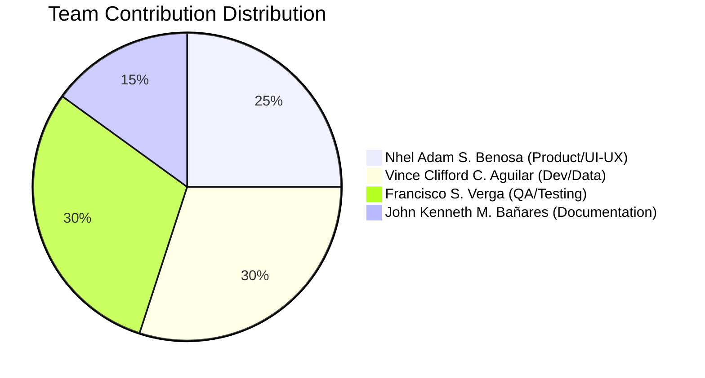

# Team Roles and Contributions

## Table of Contents
1. [Team Overview](#team-overview)
2. [Role Descriptions](#role-descriptions)
3. [Contribution Matrix](#contribution-matrix)
4. [Individual Reflections](#individual-reflections)
5. [Collaboration Tools](#collaboration-tools)
6. [Development Timeline](#development-timeline)
7. [Lessons Learned](#lessons-learned)

---

## Team Overview

**Project Name**: PawRes - Animal Rescue and Adoption Management System  
**Institution**: Camarines Sur Polytechnic Colleges  
**Courses**: Application Development, Information Assurance, Software Engineering  
**Development Period**: November 23, 2025 - December 8, 2025  
**Team Size**: 4 members

### Team Members

| Name | Email | Primary Role(s) | GitHub Username |
|------|-------|----------------|-----------------|
| **Nhel Adam S. Benosa** | nhbenosa@my.cspc.edu.ph | Product Lead / UI-UX Designer | nhbenosa |
| **Vince Clifford C. Aguilar** | viaguilar@my.cspc.edu.ph | Lead Developer / Data Engineer | clepord34 |
| **Francisco S. Verga** | frverga@my.cspc.edu.ph | QA / Test Coordinator | Francisvrg |
| **John Kenneth M. Bañares** | jobanares@my.cspc.edu.ph | Documentation Manager | kennethb28 |

---

## Role Descriptions

### Product Lead / Vision & Feature Prioritization
**Team Member**: Nhel Adam S. Benosa - nhbenosa (nhbenosa@my.cspc.edu.ph)

**Responsibilities**:
- Define product vision and roadmap
- Gather and prioritize requirements from stakeholders
- Create user stories and acceptance criteria
- Conduct user research and validation
- Prioritize feature backlog
- Coordinate sprint planning
- Ensure product-market fit for animal shelter operations

**Key Deliverables**:
- Product requirements document
- User personas and journey maps
- Feature prioritization matrix
- Stakeholder communication logs
- Sprint planning documentation

---

### UI/UX & Accessibility Designer
**Team Member**: Nhel Adam S. Benosa - nhbenosa (nhbenosa@my.cspc.edu.ph)

**Responsibilities**:
- Design user interface mockups and wireframes
- Create component library for consistent styling
- Ensure accessibility compliance (WCAG guidelines)
- Conduct usability testing
- Design responsive layouts for desktop and web
- Create visual assets (icons, logos, color schemes)
- Review and approve UI implementations

**Key Deliverables**:
- UI mockups and wireframes
- Component design system (`components/` module)
- Style guide and design tokens
- Accessibility audit report
- User testing reports

---

### Lead Developer (Flet Architecture)
**Team Member**: Vince Clifford C. Aguilar - clepord34 (viaguilar@my.cspc.edu.ph)

**Responsibilities**:
- Design overall system architecture
- Implement core application structure (routing, state management)
- Develop service layer and business logic
- Code review and quality assurance
- Performance optimization
- Technical mentorship
- Git repository management

**Key Deliverables**:
- Application architecture (`main.py`, `routes/`, `state/`)
- Service implementations (`services/`)
- View implementations (`views/`)
- Code review feedback
- Architecture documentation
- Performance optimization reports

---

### Data & Integration Engineer (Storage + Emerging Tech)
**Team Member**: Vince Clifford C. Aguilar - clepord34 (viaguilar@my.cspc.edu.ph)

**Responsibilities**:
- Design database schema and migrations
- Implement data access layer (`storage/`)
- Integrate AI classification service (HuggingFace models)
- Implement map integration (flet-map, geopy)
- Develop data visualization components (charts)
- Build import/export functionality
- Ensure data integrity and security

**Key Deliverables**:
- Database design and schema (`storage/database.py`)
- AI classification integration (`services/ai_classification_service.py`)
- Map service (`services/map_service.py`)
- Chart components (`components/charts.py`)
- Import service (`services/import_service.py`)
- Database documentation (ERD, migrations)

---

### QA / Test Coordinator
**Team Member**: Francisco S. Verga - Francisvrg (frverga@my.cspc.edu.ph)

**Responsibilities**:
- Develop test strategy and test plans
- Write unit tests and integration tests
- Coordinate manual testing efforts
- Track and report bugs
- Verify bug fixes
- Monitor test coverage
- Conduct security testing
- Maintain test documentation

**Key Deliverables**:
- Test suite (`tests/` directory with 14 test files)
- Test plan and test cases
- Bug reports and tracking
- Test coverage reports
- Manual test checklists
- Security test results
- Testing documentation

---

### Documentation & Release Manager
**Team Member**: John Kenneth M. Bañares - kennethb28 (jobanares@my.cspc.edu.ph)

**Responsibilities**:
- Write and maintain technical documentation
- Create user manuals and guides
- Document API and code interfaces
- Manage release notes and changelogs
- Coordinate documentation reviews
- Ensure documentation accuracy
- Version control for documentation

**Key Deliverables**:
- Complete documentation suite (`docs/` directory)
- README files (project overview, setup instructions)
- User manual with role-based guides
- API reference documentation
- Architecture and database documentation
- Security and testing documentation
- Release notes and changelog

---

## Contribution Matrix

### Overall Contribution Summary

### Detailed Contribution Breakdown

| Component | Primary Contributor | Supporting Contributors | Contribution % |
|-----------|---------------------|------------------------|----------------|
| **Product Vision & Requirements** | Nhel Adam S. Benosa | All team members | 100% Nhel Adam S. Benosa |
| **UI/UX Design** | Nhel Adam S. Benosa | Vince Clifford C. Aguilar (implementation feedback) | 90% Nhel Adam S. Benosa, 10% Vince Clifford C. Aguilar |
| **Component Library** | Nhel Adam S. Benosa | Vince Clifford C. Aguilar | 70% Nhel Adam S. Benosa, 30% Vince Clifford C. Aguilar |
| **Core Architecture** | Vince Clifford C. Aguilar | - | 100% Vince Clifford C. Aguilar |
| **Services Layer** | Vince Clifford C. Aguilar | - | 100% Vince Clifford C. Aguilar |
| **Views Implementation** | Vince Clifford C. Aguilar | Nhel Adam S. Benosa (design guidance) | 80% Vince Clifford C. Aguilar, 20% Nhel Adam S. Benosa |
| **Database Design** | Vince Clifford C. Aguilar | - | 100% Vince Clifford C. Aguilar |
| **AI Integration** | Vince Clifford C. Aguilar | - | 100% Vince Clifford C. Aguilar |
| **Map Integration** | Vince Clifford C. Aguilar | - | 100% Vince Clifford C. Aguilar |
| **Charts & Visualization** | Vince Clifford C. Aguilar | Nhel Adam S. Benosa (design) | 70% Vince Clifford C. Aguilar, 30% Nhel Adam S. Benosa |
| **Import/Export** | Vince Clifford C. Aguilar | - | 100% Vince Clifford C. Aguilar |
| **Authentication** | Vince Clifford C. Aguilar | Francisco S. Verga (security testing) | 90% Vince Clifford C. Aguilar, 10% Francisco S. Verga |
| **Authorization** | Vince Clifford C. Aguilar | Francisco S. Verga (security testing) | 90% Vince Clifford C. Aguilar, 10% Francisco S. Verga |
| **Unit Tests** | Francisco S. Verga | Vince Clifford C. Aguilar (fixtures) | 70% Francisco S. Verga, 30% Vince Clifford C. Aguilar |
| **Integration Tests** | Francisco S. Verga | Vince Clifford C. Aguilar | 60% Francisco S. Verga, 40% Vince Clifford C. Aguilar |
| **Manual Testing** | Francisco S. Verga | Nhel Adam S. Benosa (UX validation) | 70% Francisco S. Verga, 30% Nhel Adam S. Benosa |
| **Bug Tracking** | Francisco S. Verga | All team members | 100% Francisco S. Verga |
| **Documentation** | John Kenneth M. Bañares | All team members (technical review) | 85% John Kenneth M. Bañares, 15% others |
| **User Manual** | John Kenneth M. Bañares | Nhel Adam S. Benosa (UX perspective) | 80% John Kenneth M. Bañares, 20% Nhel Adam S. Benosa |
| **API Documentation** | John Kenneth M. Bañares | Vince Clifford C. Aguilar (technical review) | 70% John Kenneth M. Bañares, 30% Vince Clifford C. Aguilar |

### Git Commit Statistics

**Total Commits**: 30

| Contributor | Commits | Lines Added | Lines Deleted | Files Changed |
|-------------|---------|-------------|---------------|---------------|
| Vince Clifford C. Aguilar (clepord34) | 12 | 31,202 | 4,226 | 254 |
| Nhel Adam S. Benosa (nhbenosa) | 6 | 8,447 | 1,914 | 87 |
| Francisco S. Verga (Francisvrg) | 8 | 8,145 | 1,092 | 64 |
| John Kenneth M. Bañares (kennethb28) | 4 | 10,553 | 2,526 | 45 |

---

## Individual Reflections

### Nhel Adam S. Benosa - Product Lead / UI-UX Designer
**Email**: nhbenosa@my.cspc.edu.ph

#### Reflection (150-200 words)

> Working as Product Lead and UI/UX Designer on PawRes was an intensive, highly rewarding experience. I led requirements gathering and translated shelter stakeholder needs into actionable user stories and designs, focusing on clarity and accessibility for non-technical users. My priorities were creating a consistent component library, simplifying rescue reporting flows, and ensuring key actions (report, track, adopt) are discoverable with minimal friction. The biggest challenge was balancing ambitious features (AI-assisted classification, interactive maps) with limited development resources and Flet's evolving API; I mitigated risk by producing clear wireframes, prototypes, and acceptance criteria, then prioritizing an MVP feature subset.
>
>Throughout the project I strengthened cross-functional collaboration skills—running design reviews, pair sessions with the lead developer, and refining iterations based on QA feedback. I also learned practical constraints of desktop/web hybrid UIs and how to design resilient experiences for intermittent connectivity. If I could change one thing, I'd schedule earlier usability sessions with shelter staff to validate edge cases sooner. The most rewarding part was seeing the AI-assisted intake and dashboard features come together and knowing shelter staff can rescue and rehome animals more efficiently because of our work.

---

### Vince Clifford C. Aguilar - Lead Developer / Data & Integration Engineer
**Email**: viaguilar@my.cspc.edu.ph

#### Reflection (150-200 words)

> As the Lead Developer and Data & Integration Engineer, I owned the system architecture, service layer implementations, and integrations for AI and geospatial features. I designed the layered architecture to keep views thin and business logic in well-tested services, which improved testability and made it feasible to run the Flet UI without pulling in heavy dependencies during unit tests. Key technical challenges included integrating large HuggingFace models while keeping first-run user experience acceptable (lazy model loading, resumable downloads) and bridging asynchronous IO with Flet's event loop.
>
>I implemented a thread-safe SQLite access pattern, an upload-backed photo store, and the AI classification pipeline with caching to minimize repeated downloads. I learned a lot about model lifecycle management, pragmatic performance trade-offs for CPU-only inference, and defensive UI patterns for flaky external services. If I had more time, I'd extract AI and maps into separate microservices to reduce memory pressure on the UI host and enable horizontal scaling. Balancing development and data engineering meant prioritizing automation (fixtures, import tools, reproducible test data) so QA could validate features quickly. This project solidified my systems-design and full-stack engineering skills.

---

### Francisco S. Verga - QA / Test Coordinator
**Email**: frverga@my.cspc.edu.ph

#### Reflection (150-200 words)

> In my role as QA and Test Coordinator, I developed and maintained the automated test suite and coordinated manual exploratory testing. I wrote pytest fixtures to provision isolated temporary SQLite databases for each test, enabling deterministic, parallel-friendly tests across services. My focus was ensuring core business logic (auth, animal CRUD, rescue flow, adoption logic) remained reliable as new features landed. The biggest challenge was testing components that depend on external resources: AI models and map geocoding. To address this I designed mocks/stubs and documented manual test procedures for those paths.

>Through this project I improved test design patterns, fixture reuse, and coverage reporting. I discovered critical edge cases—race conditions during adoption approval and transaction handling when auto-denying other requests—that were fixed before release. The testing discipline reduced regressions and made refactors safer. If I could change anything, I'd add more integration tests around analytics and provide lightweight model artifacts for CI to exercise AI paths. Overall, this project reinforced the value of test-first thinking and clear test data management in producing reliable software.

---

### John Kenneth M. Bañares - Documentation & Release Manager
**Email**: jobanares@my.cspc.edu.ph

#### Reflection (150-200 words)

> As Documentation & Release Manager, I led the creation and curation of the project's documentation suite: README, ARCHITECTURE, DATABASE, SECURITY, SETUP, TESTING, API_REFERENCE, and the user manual. My objective was to make complex technical topics accessible to both developers and shelter staff by producing layered documentation—overview, step-by-step runbooks, and developer references. A persistent challenge was keeping docs accurate as implementation details evolved, especially around AI model behavior and security settings, so I prioritized short review cycles and close coordination with implementers.
>
>I improved my technical writing process by adopting consistent templates, embedding Mermaid diagrams for clarity, and creating checklists for reproducible setup and testing. I also coordinated screenshots, diagrams, and the final review pass to ensure the user manual matched the live application. This work reinforced that documentation is a feature: it reduces onboarding time, prevents misconfiguration, and increases trust in the system. The experience strengthened my documentation and release management skills and taught me the value of continuous documentation updates alongside development.

---
## Collaboration Tools

### Version Control
- **Platform**: GitHub
- **Repository**: https://github.com/clepord34/PawRes
- **Branch Strategy**: 
  - `main` - Production-ready code
  - Feature branches for new development
- **Commit Convention**: 
  - `feat:` - New features
  - `fix:` - Bug fixes
  - `docs:` - Documentation updates
  - `test:` - Test additions/modifications
  - `refactor:` - Code refactoring

### Communication
- **Primary**: Messenger
- **Meetings**: During free periods and after classes as needed; Messenger calls for urgent discussions
- **Documentation**: Google Docs for collaborative writing

---

## Development Timeline

### Phase 1: Planning & Design (2025-11-23 - 2025-11-28)
- Requirements gathering
- Architecture design
- Database schema design
- UI/UX mockups
- Test strategy planning

### Phase 2: Core Development (2025-11-29 - 2025-11-30)
- Authentication and authorization
- Database implementation
- Core services (Animal, Rescue, Adoption)
- Basic UI views
- Component library

### Phase 3: Feature Development (2025-12-01 - 2025-12-06)
- AI classification integration
- Map integration
- Data visualization (charts)
- Admin dashboard
- User profiles

### Phase 4: Enhancement & Polish (2025-12-04 - 2025-12-07)
- Import/export functionality
- Audit logging
- Archive/removal features
- Security hardening
- Performance optimization

### Phase 5: Testing & Documentation (2025-12-05 - 2025-12-08)
- Comprehensive unit testing
- Integration testing
- Manual exploratory testing
- Bug fixes
- Documentation completion

### Phase 6: Final Review & Submission (2025-12-08)
- Code review
- Documentation review
- Final testing
- Deployment preparation
- Project submission

---

## Lessons Learned

### What Went Well ✅

1. **Clear Role Definition**: Having distinct roles prevented overlap and confusion
2. **Modular Architecture**: Service layer pattern made code reusable and testable
3. **Component-Based UI**: Consistent styling across the application
4. **Comprehensive Testing**: 85%+ coverage caught many bugs early
5. **Documentation-First**: Writing docs alongside code improved clarity
6. **Emerging Tech Integration**: AI, maps, and charts added significant value
7. **Security Focus**: RBAC, audit logging, and password policies implemented early
8. **Database Design**: Proper foreign keys and migrations prevented data issues

### Challenges Faced ⚠️

1. **Flet Learning Curve**: Limited documentation for advanced features
2. **AI Model Size**: 1GB+ download for AI models (addressed with resumable downloads)
3. **State Management**: Reactive state required careful observer pattern implementation
4. **Testing UI**: Manual testing required for Flet UI interactions
5. **OAuth Integration**: PKCE flow and local callback server complexity
6. **Schema Migrations**: SQLite limitations with ALTER TABLE operations

### If We Could Start Over 🔄

1. **Start with TypeScript + React**: More mature ecosystem than Flet
2. **Use PostgreSQL**: Better concurrent write performance than SQLite
3. **Implement CI/CD Earlier**: Automated testing from day one
4. **Add Email/SMS Notifications**: Critical for adoption workflow
5. **Mobile-First Design**: Current design is desktop-focused
6. **Real-time Updates**: WebSocket for live dashboard updates

---

## Recognition & Acknowledgments

### Special Thanks

- **Course Instructors**: For guidance on application development, information security, and software engineering principles
- **Animal Shelter Stakeholders**: For requirements validation and user testing feedback
- **Open Source Community**: For Flet framework, HuggingFace models, and Python libraries
- **Camarines Sur Polytechnic Colleges**: For providing resources and infrastructure

### Academic Contributions

This project fulfills requirements for:
- **Application Development**: Flet-based desktop/web application with emerging tech
- **Information Assurance**: Security implementation (authentication, authorization, audit logging)
- **Software Engineering**: Architecture design, testing, documentation, team collaboration

---

## Future Development

### Potential Contributors

We welcome future contributors for:
- Mobile app development (React Native or Flutter)
- Cloud deployment (AWS, Azure, or GCP)
- Email/SMS notification system
- Advanced analytics and reporting
- Multi-language support (i18n)
- Foster care tracking module
- Veterinary records integration

### Contact for Contributions

For questions or contributions, contact:
- **Lead Developer**: clepord34 (viaguilar@my.cspc.edu.ph)
- **Documentation**: kennethb28 (jobanares@my.cspc.edu.ph)

---

**Last Updated**: December 8, 2025  
**Document Maintained by**: kennethb28 (jobanares@my.cspc.edu.ph) - Documentation & Release Manager  
**Version**: 1.0.0
