# PawRes User Manual

## Table of Contents

1. [Getting Started](#getting-started)
2. [Role-Based Capabilities](#role-based-capabilities)
3. [User Workflows](#user-workflows)
4. [Admin Workflows](#admin-workflows)
5. [Feature Guides](#feature-guides)
6. [Common Tasks](#common-tasks)
7. [Troubleshooting](#troubleshooting)

---

## Getting Started

### First-Time Login

Welcome to **PawRes** - your animal rescue and adoption management system!

#### Accessing the Application

Run the application from the `app/` directory using Flet. For local development use PowerShell and your virtual environment (if present):

```powershell
# From the project root (activate venv if you created one)
cd app
.\venv\Scripts\Activate.ps1    # optional: activate virtualenv from project root
flet run                         # Launches a desktop window for the app

# Or run in web mode (accessible from a browser):
flet run --web --port 8080
```

When running in web mode, open the URL printed in the console (for example `http://localhost:8080`).

#### Default Admin Credentials

If you're setting up PawRes for the first time, use these credentials:

- **Email**: Value from `.env` file (`ADMIN_EMAIL`)
- **Password**: Value from `.env` file (`ADMIN_PASSWORD`)

⚠️ **Security Warning**: Change the default admin password immediately after first login!

#### Logging In

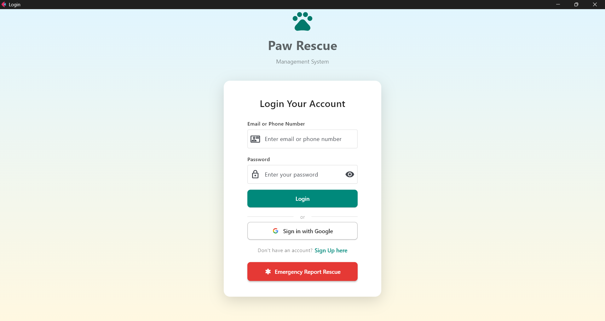

1. Enter your **email address**
2. Enter your **password**
3. Click **"Login"** button

**Alternative Login Method**:
- Click **"Sign in with Google"** to use your Google account (if OAuth is configured)

#### First-Time Setup Checklist (Admins)

After logging in as admin:

- [ ] Change default password (Profile → Change Password)
- [ ] Review system settings
- [ ] Create additional admin accounts (User Management → Add User)
- [ ] Import existing animal data (View Animal List → Add Animal → Bulk Import)

### Password Setting Guidelines

When creating or changing your password, ensure it meets the following criteria:

**Password Requirements**:
- Minimum 8 characters
- At least 1 uppercase letter (A-Z)
- At least 1 lowercase letter (a-z)
- At least 1 number (0-9)
- At least 1 special character (!@#$%^&*)

### Account Lockout

**Security Feature**: After 5 consecutive failed login attempts, your account will be locked for 15 minutes.

**If Locked**:
- Wait 15 minutes before trying again
- Contact an administrator to unlock your account immediately
- Ensure you're using the correct password

---

## Role-Based Capabilities

PawRes has two user roles with different permission levels:

### Capabilities Matrix

| Feature | User | Admin |
|---------|------|-------|
| **Dashboard** | Personal analytics (own submissions) | Full system analytics |
| **Animals** | View adoptable animals only | Full CRUD (Create, Read, Update, Delete) + Archive |
| **Rescue Missions** | Submit + view own missions | View all + change status + add admin messages |
| **Adoption Requests** | Submit + view own applications | Approve/deny all + view user details |
| **User Management** | View/edit own profile only | View/edit all users + enable/disable + reset passwords |
| **Audit Logs** | No access | Full access with filtering |
| **Import/Export** | Export personal data only | Import CSV/Excel + export data |
| **AI Features** | Use breed detection on rescue form | Use breed detection on animal management |
| **Hidden Items** | No access | View archived/hidden animals, missions, adoptions |

### Navigation Differences

**User Sidebar**:
- User Dashboard
- Apply for Adoption
- Report Rescue Mission
- Check Application Status
- View Animal List
- Your Analytics
- Profile (click profile section at bottom)

**Admin Sidebar**:
- Admin Dashboard
- View Animal List
- Manage Records (includes Rescue Missions, Adoption Requests, Hidden Items)
- View Data Charts
- User Management
- Audit Logs
- Profile (click profile section at bottom)

---

## User Workflows

### Submit Rescue Mission

Report an animal in need of rescue through our emergency rescue system.

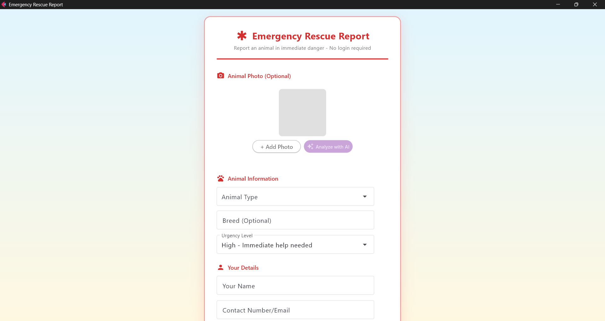

#### Step-by-Step Instructions

1. **Navigate to Rescue Form**
   - Click **"Report Rescue Mission"** in sidebar
   - Or access emergency form (no login required): `/emergency_rescue` route

2. **Fill Animal Information**
   - **Animal Type**: Select from dropdown (Dog, Cat, and, Others)
   - **Breed**: Enter breed if known (AI can help detect this from photo)

3. **Upload Photo** (Highly Recommended)
   - Click **"Upload Photo"** or drag-and-drop image
   - Accepted formats: JPG, PNG, GIF, WEBP
   - Maximum size: 5 MB
   - Photo preview displays after upload

4. **Use AI Breed Detection** (Optional)
   - After uploading photo, click **"Analyze with AI"** button
   - Wait for analysis (5-10 seconds)
   - Review AI suggestions with confidence scores
   - Click suggested breed to auto-fill breed field

   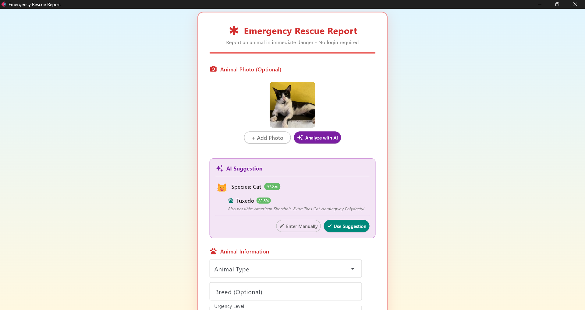

5. **Set Location**
   - **Option A**: Type address in "Location" field and submit (address will be geocoded automatically)
   - **Option B**: Click the GPS button (📍) to use your current location (requires location permission)

   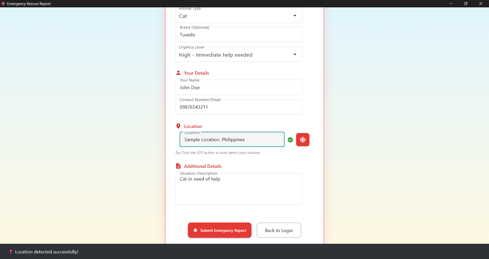
      - If there's no internet connection, the app can still record your current location using your device's GPS which will be saved as latitude and longitude coordinates. (Note: GPS does not need internet, but geocoding does.)
      - When connection is restored, the app will attempt to geocode the coordinates to a human-readable address then send the rescue request to admin.
      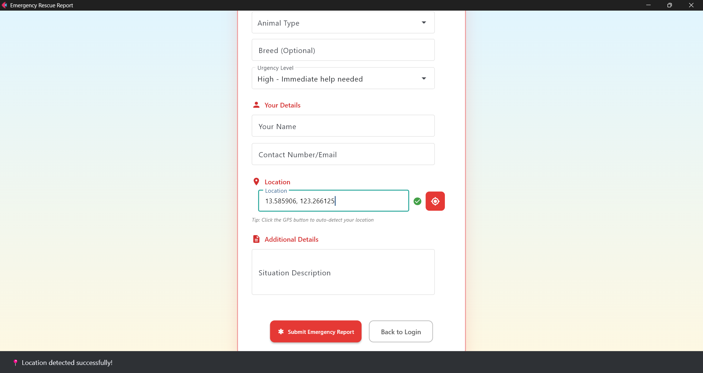

6. **Enter Contact Information**
   - **Contact**: Your phone or email (pre-filled if logged in)
   - Ensure you can be reached for updates

7. **Set Urgency Level**
   - **Low - Animal appears safe**: Animal is stable but needs eventual rescue
   - **Medium - Needs attention soon**: Animal needs rescue within 24-48 hours
   - **High - Immediate help needed**: Animal is injured or in immediate danger

8. **Add Details**
   - Describe the situation (injuries, behavior, surroundings)
   - Include landmarks or specific directions
   - Mention any immediate dangers

9. **Submit Request**
   - Click **"Submit Rescue Request"** button
   - Confirmation message displays
   - You'll receive a tracking ID

10. **Track Your Request**
    - Navigate to **"Check Application Status"** in sidebar (logged-in users)
    - Or use status checking with your tracking ID

#### Status Progression

Your rescue mission will move through these statuses:

1. **Pending** - Waiting for admin review
2. **On-Going** - Rescue team is en route or actively rescuing
3. **Rescued** - Animal has been safely rescued (creates animal record)
4. **Failed** - Rescue attempt unsuccessful
5. **Cancelled** - You cancelled the request before processing

You'll see status updates and admin messages in the mission detail view.

---

### Browse Adoptable Animals

Explore animals available for adoption and find your perfect companion.

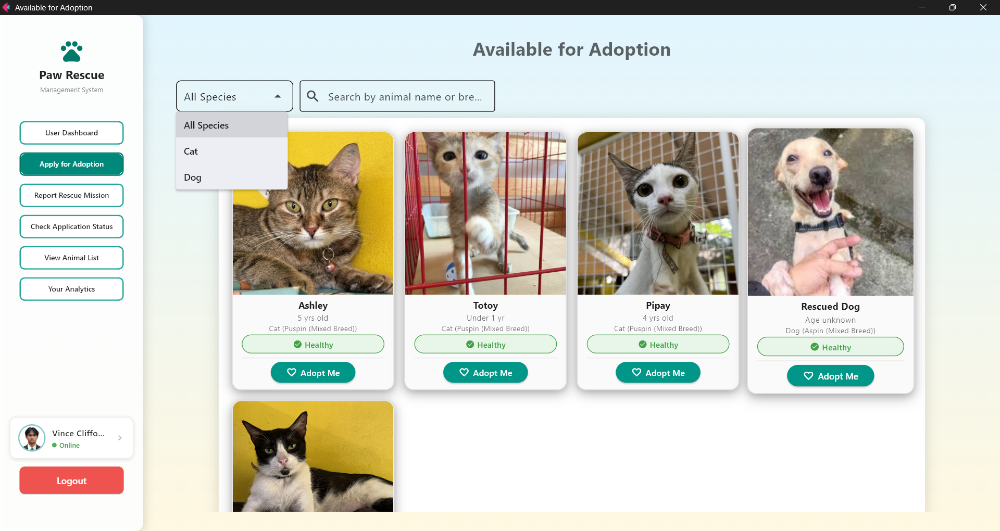

#### Step-by-Step Instructions

1. **Navigate to Animals**
   - Click **"View Animal List"** in sidebar (available for both users and admins)
   - For admins: Can also access via `/animals_list?admin=1` for management view

2. **Browse Animal Cards**
   - Each card shows:
     - Photo
     - Name
     - Species and breed
     - Age

3. **Use Filters**
   - **Species**: Dog, Cat, Others

4. **Search by Name and Breed**
   - Use search box at top: "Search by animal name or breed..."
   - Type animal name or breed
   - Results update in real-time

5. **Apply for Adoption**
   - Click **"Apply for Adoption"** button
   - Fill adoption application form

---

### Submit Adoption Application

Apply to adopt an animal through our adoption management system.

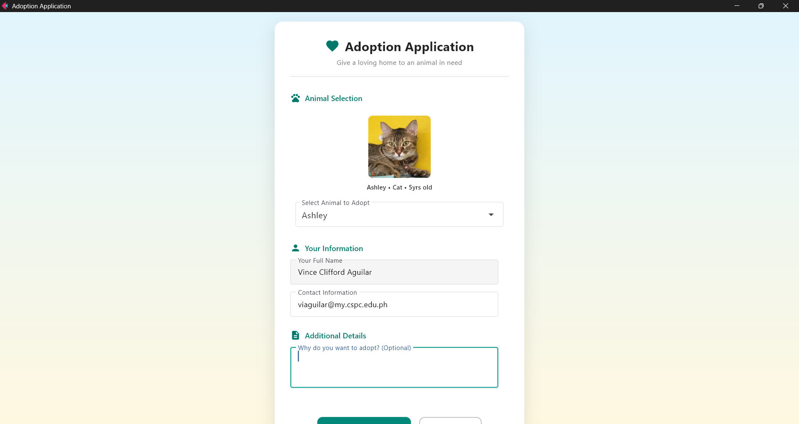

#### Step-by-Step Instructions

1. **Select Animal**
   - Navigate to **"Apply for Adoption"** from sidebar
   - Animal information auto-populates

2. **Review Animal Details**
   - Verify you're applying for the correct animal
   - Review adoption requirements

3. **Enter Contact Information**
   - **Contact**: Pre-filled from profile (email or phone)

4. **Write Your Reason (Optional)**
   - **Why do you want to adopt this animal?**
   - This field is optional but recommended
   - Include information about:
     - Your living situation (house, apartment, yard size)
     - Experience with pets
     - Other pets in household
     - Family members and ages
     - Work schedule and time commitment

5. **Submit Application**
   - Click **"Submit Application"** button

6. **Track Your Application**
   - Navigate to **"Check Application Status"** in sidebar

#### Application Status Progression

1. **Pending** - Waiting for admin review
2. **Approved** - Congratulations! Contact shelter to arrange pickup
3. **Denied** - Application was not approved (reason provided)
4. **Cancelled** - You cancelled the application

---

### Check Status

Track your rescue missions and adoption applications in one place.

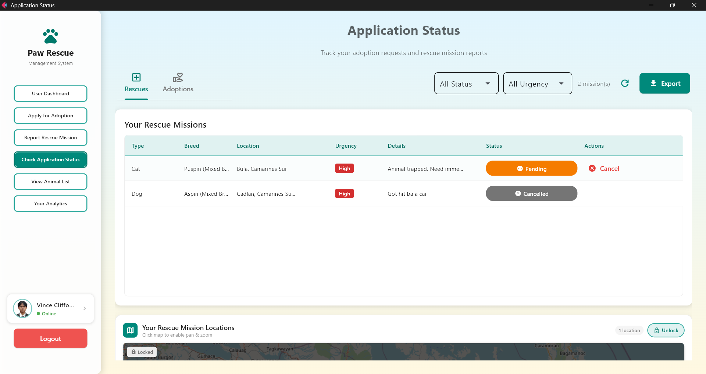


#### Step-by-Step Instructions

1. **Navigate to Status Page**
   - Click **"Check Application Status"** in sidebar

2. **View Rescue Missions Tab**
   - Lists all your submitted rescue missions
   - Shows current status with colored badges

3. **View Adoption Requests Tab**
   - Lists all your adoption applications
   - Shows current status
   - Displays denial messages

4. **Filter by Status**
   - Use dropdown filters to show:
     - All statuses
     - Active only (pending, on-going)
     - Completed (rescued, approved, failed, denied)

5. **Search**
   - Use search box to find specific animal name or mission

6. **Action Buttons**
   - **Cancel**: Cancel pending request (confirmation required)

---

### Update Profile

Manage your personal information and account settings.

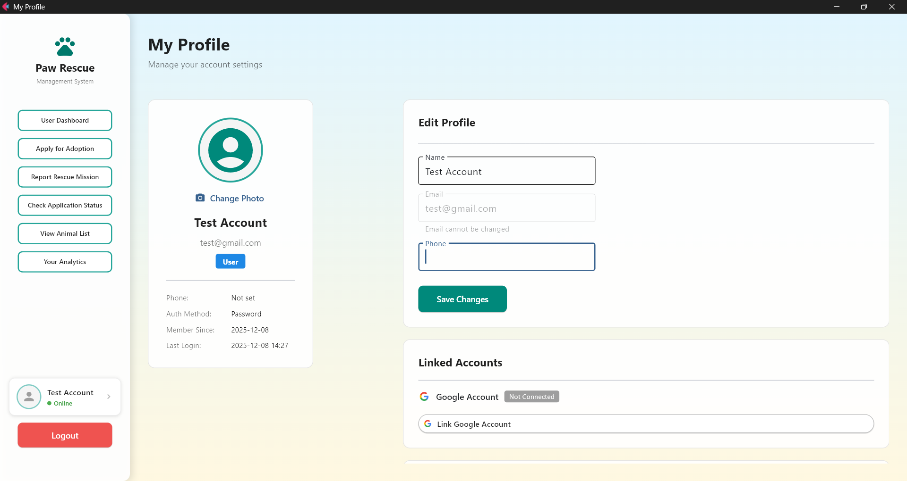


#### Step-by-Step Instructions

1. **Navigate to Profile**
   - Click **"Profile"** in sidebar

2. **Update Personal Information**
   - **Name**: Click textfield → Change name → Save
   - **Phone**: Click textfield → Change phone → Save (must be unique)
   - **Email (One-time if logged in using Phone)**: Click textfield → Change email → Save (must be unique)

3. **Change Password**
   - Enter **current password**
   - Enter **new password** (must meet requirements)
   - Enter **confirm new password**
   - Click **"Update Password"**

4. **Upload Profile Photo**
   - Click **"Change Photo"** button below your photo
   - Select image file (JPG, JPEG, PNG, GIF)
   - Photo preview updates immediately
   - Click **"Save Changes"** to save the new photo**

5. **Link Google Account**
   - Click **"Link Google Account"** button
   - Authorize PawRes to access Google profile
   - Once linked, you can login with Google

6. **Unlink Google Account**
   - Click **"Unlink Google Account"** button (requires password to be set first)
   - After unlinking, you'll need to use email/password login

---

## Admin Workflows

### Review Rescue Missions

Manage incoming rescue missions and coordinate rescue operations.

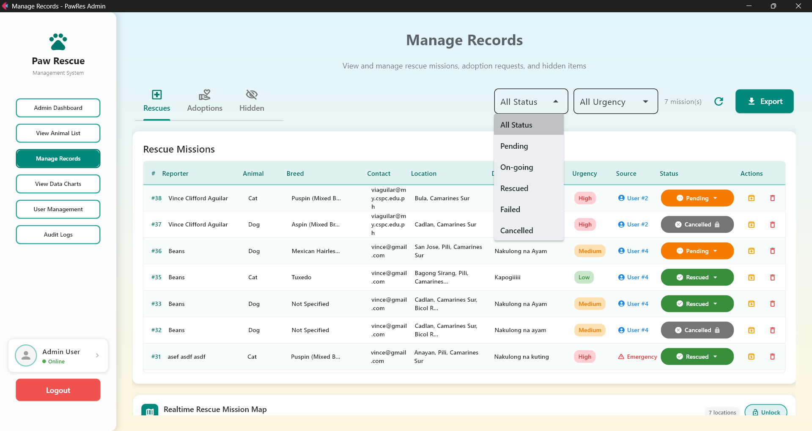

#### Step-by-Step Instructions

1. **Navigate to Rescue Missions**
   - Click **"Manage Records"** in sidebar
   - Then select **"Rescue Missions"** tab or section

2. **View Pending Approvals**
   - Unreviewed missions appear with **"!" symbol in the map**
   - Filter or search for pending missions

   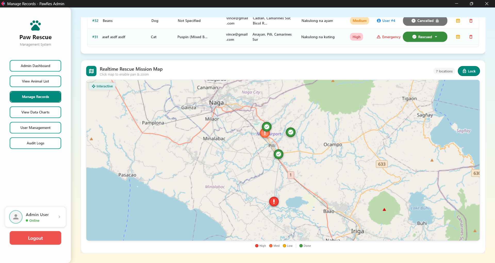

3. **Update Mission Status**
   - Click the status badge dropdown
   - Select new status:
     - **On-Going**: Rescue team dispatched
     - **Rescued**: Animal successfully rescued
     - **Failed**: Rescue attempt unsuccessful

4. **Rescued Status Special Behavior**
   - When you mark mission as **"Rescued"**:
     - System automatically creates an animal record
     - Animal inherits details from rescue mission (species, breed, photo, etc.)
     - Animal status set to "Needs Setup"
     - Mission links to new animal record
   - You can then edit animal details in **Animals → Animals List**

5. **Archive or Remove Mission**
   - **Archive**: Hides completed missions from the active list
   - **Remove**: Marks invalid/spam reports as removed
   - Use action buttons (archive/delete icons) in the Actions column

6. **Filter and Search**
   - Use status filter: All, Pending, On-Going, Rescued, Failed, Cancelled
   - Use urgency filter: All, Low, Medium, High

---

### Manage Animals

Create, edit, and organize animal records in the system.

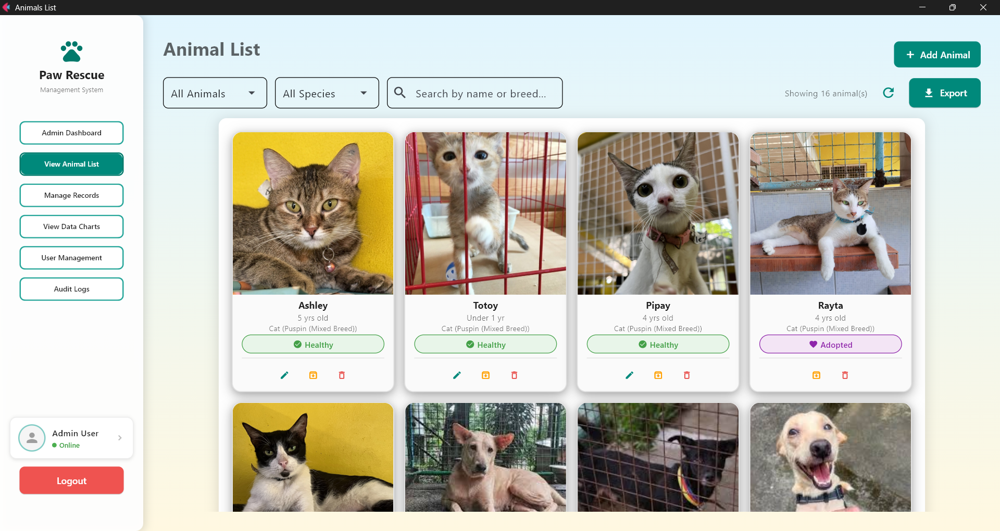

#### Add New Animal

1. **Navigate to Add Animal**
   - Click **"View Animal List"** in sidebar
   - Then click **"Add Animal"** button on the animal list page

2. **Upload Photo**
   - Click **"Upload Photo"** or drag-and-drop
   - Photo preview displays

3. **Use AI Breed Detection** (Optional)
   - Click **"Analyze with AI"** button
   - Review suggestions
   - Click suggestion to auto-fill breed

   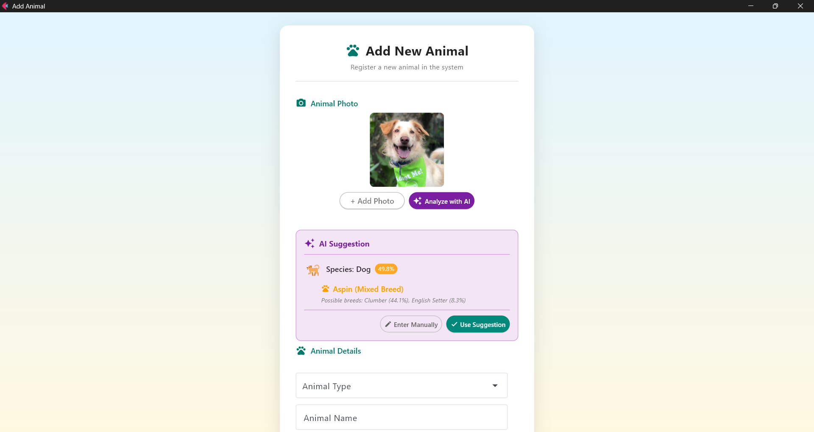

4. **Fill Required Fields**
   - **Name**: Give animal a unique name
   - **Species**: Select from dropdown (Dog, Cat, etc.)
   - **Breed**: Enter specific breed (or "Mixed")
   - **Age**: Select age range

5. **Submit**
   - Click **"Add Animal"** button
   - Success message displays
   - Animal appears in Animals List

#### Edit Existing Animal

1. **Navigate to Animals List**
   - Click **"View Animal List"** in sidebar

2. **Find Animal**
   - Use filters or search box
   - Click **"Edit"** button on animal card

3. **Update Fields**
   - Modify any field as needed
   - Change photo if desired
   - Update health status as animal receives care

4. **Save Changes**
   - Click **"Update Animal"** button

#### Archive Animal

**When to Archive**:
- Animal has been adopted
- Animal has been transferred to another facility
- Animal is deceased (record keeping)

**How to Archive**:
1. Open animal detail page
2. Click **"Archive"** button
3. Confirm action
4. Animal removed from public "Available Animals" list
5. Still viewable by admins in **"Hidden Items"** page

**Restore from Archive**:
1. Navigate to **"Manage Records"** → **"Hidden Items"** section or tab
2. Select **"Animals"** tab
3. Find archived animal
4. Click **"Restore"** button

---

### Approve Adoption Requests

Review and process adoption applications from users.

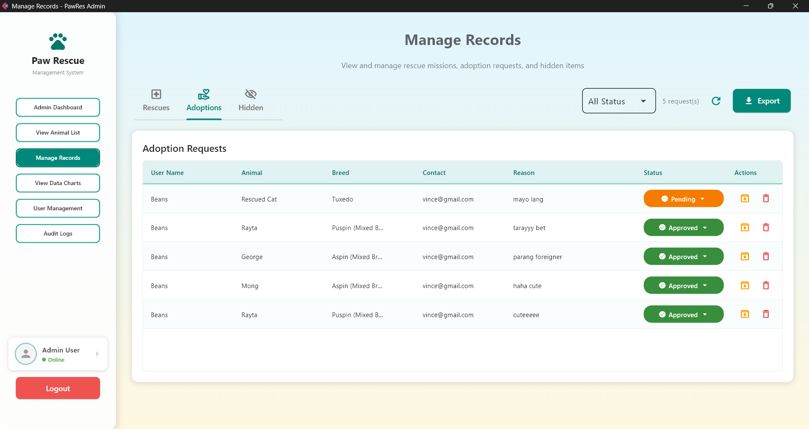

#### Step-by-Step Instructions

1. **Navigate to Adoption Requests**
   - Click **"Manage Records"** in sidebar
   - Then select **"Adoption Requests"** tab or section

2. **Change Application Status**
   - Click the status badge dropdown on the request row
   - Select new status:
     - **Pending**: Mark as pending (waiting for review)
     - **Approved**: Approve the adoption
     - **Denied**: Deny the application
   - Status updates immediately
   - When approved, animal status changes to "Adopted"
   - User can check updated status in **"Check Application Status"** page

3. **Archive or Remove Request**
   - **Archive**: Use archive button (clock icon) to hide completed requests (can viewed after in the Hidden tab)
   - **Remove**: Use remove button (trash icon) to mark invalid requests

4. **Filter Requests**
   - Filter by status: All, Pending, Approved, Denied, Cancelled

---

### Manage Users

Administer user accounts and permissions.

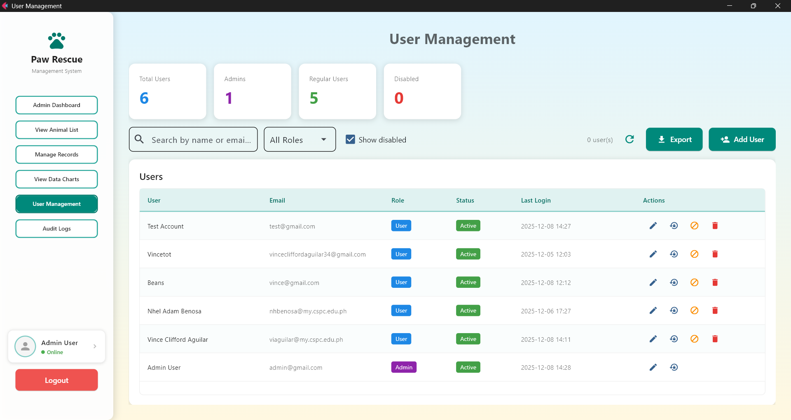

#### Step-by-Step Instructions

1. **Navigate to User Management**
   - Click **"User Management"** in sidebar

2. **View All Users**
   - Table displays:
     - Name
     - Email
     - Role (User, Admin)
     - Status (Enabled, Disabled)
     - Last login

3. **Search Users**
   - Use search box: "Search by name or email..."
   - Results filter in real-time

4. **Filter by Role**
   - Click **"All Roles"** dropdown
   - Select: All, Admin, User

5. **Disable User Account**
   - Click **"Disable"** button next to user
   - User immediately locked out
   - User receives "Account disabled" message on login attempt

6. **Enable User Account**
   - Find disabled user
   - Click **"Enable"** button
   - User can login again

7. **Reset User Password**
   - Click **"Reset Password"** button (lock icon)
   - Enter new password in dialog
   - Confirm new password
   - Click **"Reset Password"** to save
   - Share new password with user via secure channel (email, phone)

8. **Delete User** (Use with Caution)
   - Click **"Delete"** button (trash icon)
   - Confirmation dialog appears with warning
   - Click **"Delete"** to confirm
   - User account removed
   - Consider disabling users instead of deleting them

9. **Edit User Details**
    - Click **"Edit"** button to view and edit user information
    - Can edit:
      - Name
      - Email
      - Phone No.
      - Role (User, Admin)

---

### View Audit Logs

Monitor important system events and security activity. This page helps admins see what happened and export a copy of the logs.

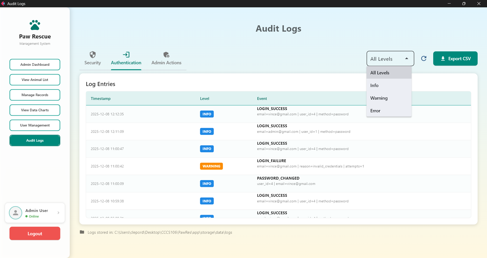

#### Step-by-step instructions

1. **Open Audit Logs**
   - Click **"Audit Logs"** in the left sidebar (Admin only).

2. **Read the list of events**
   - The newest events are shown first (top of the list).
   - The table shows three main things for each event:
     - **Timestamp** — When the event happened (date and time).
     - **Level** — How important the event is: *Info*, *Warning*, or *Error*.
     - **Event** — A short title and extra details. (Example: "LOGIN_SUCCESS — email=you@example.com")
   - Note: You may also see the user or IP address inside the **Event** details if the system included them. They are not shown as separate columns.

    - **Choose which log type to view (Tabs)**
       - At the top of the page there are three tabs: **Security**, **Authentication**, and **Admin Actions**.
       - Click a tab to switch the log type. The table and filters show entries for the selected tab only.
       - When you click **Export CSV**, the exported file will contain the entries shown for the currently selected tab.

3. **Show only important events (filter)**
   - Use the **Level** dropdown to choose:
     - **All Levels** — everything
     - **Info** — normal informational messages
     - **Warning** — things to watch
     - **Error** — problems that need attention

4. **Save the logs to a CSV file**
   - Click the **"Export CSV"** button.
   - A CSV file is created in the exports folder. The file contains three columns: `timestamp`, `level`, and `message`.
   - The export folder location (inside the app) is:

```
app/storage/data/exports/
```

   - To open that folder on Windows (from your project root), open File Explorer and navigate to the `app` folder, then `storage → data → exports`.
   - Or run these commands in PowerShell from the project root to open the folder directly:

```powershell
cd app
explorer.exe .\storage\data\exports
```

   - To open the CSV file: double-click the file to open it in Excel (or another spreadsheet program) or right-click and choose *Open with → Notepad*.

#### What the columns mean

- **Timestamp**: When the event happened.
- **Level**: How serious the event is (Info, Warning, Error).
- **Message**: A short description that usually contains a simple event name (like "LOGIN_SUCCESS") followed by more details (who, what, or where). If a user or IP address is available it will be shown here in the message.

#### Examples you might see

- Authentication: "LOGIN_SUCCESS — email=jane@example.com"
- Admin action: "USER_DISABLED — admin_id=2 | user_id=12 | email=user@example.com"
- Security: "UNAUTHORIZED_ACCESS — route=/admin | user_id=None"

If you do not see a user name or IP address for an event, that's normal — the system only records that information when it is available.

#### Event Types (simple)

| Event Type | Easy description |
|------------|------------------|
| **Authentication** | Logins, logouts, failed logins, account lockouts |
| **Admin Actions** | Changes made by admins (example: change status, disable user) |
| **Security** | Password changes, blocked attempts, permission problems |
| **Data Changes** | Items created, updated, or deleted (animals, users) |
| **System** | App start, configuration loaded, backups |


---

### Import Animals from CSV/Excel

Easily add many animals at once by importing a simple spreadsheet. The import tool accepts CSV and Excel files and helps copy any photos referenced by the file.

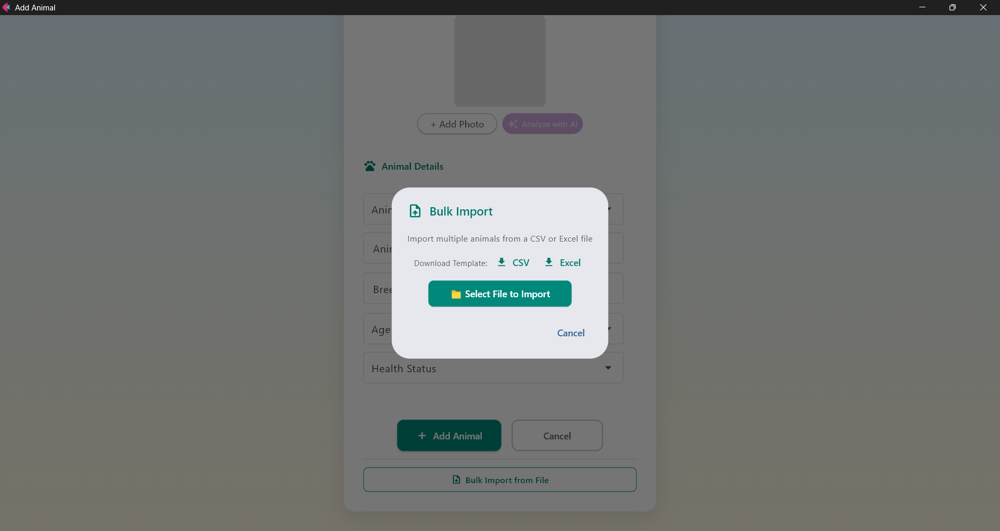

#### Bulk Import Overview

- You can upload a CSV or Excel file containing one animal per row.
- The app reads the column names (headers) at the top of your file. Column order does not matter, but headers must be present and spelled as shown below.
- When you choose a file, the app starts the import automatically and shows results when finished.

#### Step-by-Step Instructions

1. Click **"View Animal List"** in the sidebar.
2. Click the **"Add Animal"** button, then choose **"Bulk Import"**.
3. In the dialog, you can download a sample template (CSV or Excel) to see the correct headers.
4. Click **"Select File to Import"** and choose your CSV or Excel file.
5. The import starts automatically. A small message appears while the app is working.
6. When finished, a results dialog shows how many rows were imported and any errors.

#### Required Columns (exact header names)

Include these column headers in your file:

- `name` — The animal's name (required)
- `animal_type` — Animal type: Dog, Cat, or Other (required)
- `breed` — Breed name (optional)
- `age` — Number from 0 to 21 where 0 = under 1 year, 21 = 20+ years (required)
- `health_status` — One of: Healthy, Recovering, Injured (case-insensitive) (required)
- `photo` — Optional: a photo file name (relative to the import file), a web link (URL), or path to an image file

Notes:

- The file does not need to use a specific column order — headers are matched by name.
- If any required column is missing or a row has invalid values, that row will be skipped and listed in the import report.

#### What the Results Mean

- **Imported**: Number of animals successfully added.
- **Skipped / Failed**: Rows that had missing or invalid information. The dialog shows example errors and you can view the import log for details.
- **Duplicates**: If a row matches an existing animal name in the system it may be skipped; check the import log for details.

Always review the import log and spot-check a few records in **Animals → Animals List** after importing.

#### Photo Files

- If your `photo` column contains a file name (for example `rex.jpg`), place that photo file in the same folder as the CSV/Excel file before importing. The import will copy the file automatically.
- You may also put a full web link (URL) in the `photo` column; the app will download the image for you.
- Relative paths (file names) are relative to the location of your CSV/Excel file.
- Absolute paths (full paths starting with `/` or a drive letter like `C:\`) are also supported.
- You do not need to manually place photos in `storage/uploads/` — using files alongside your spreadsheet, copying image path, or URLs is simplest.

#### Templates & Excel Support

- Use the **Download Template** buttons in the Bulk Import dialog to get a sample CSV or Excel file with the correct headers and helpful comments.
- Excel file import requires the `openpyxl` package to be available in the application environment. If Excel import is not available, use CSV instead.

#### Helpful Tips

- Save your CSV as UTF-8 to avoid problems with special characters.
- For very large imports, split the data into smaller files to keep the import quick and reliable.
- If you see unexpected skips, open the import log for the exact row numbers and messages to fix the data and try again.

---

## Feature Guides

### AI Breed Detection

PawRes includes AI-powered breed classification to assist with animal identification.

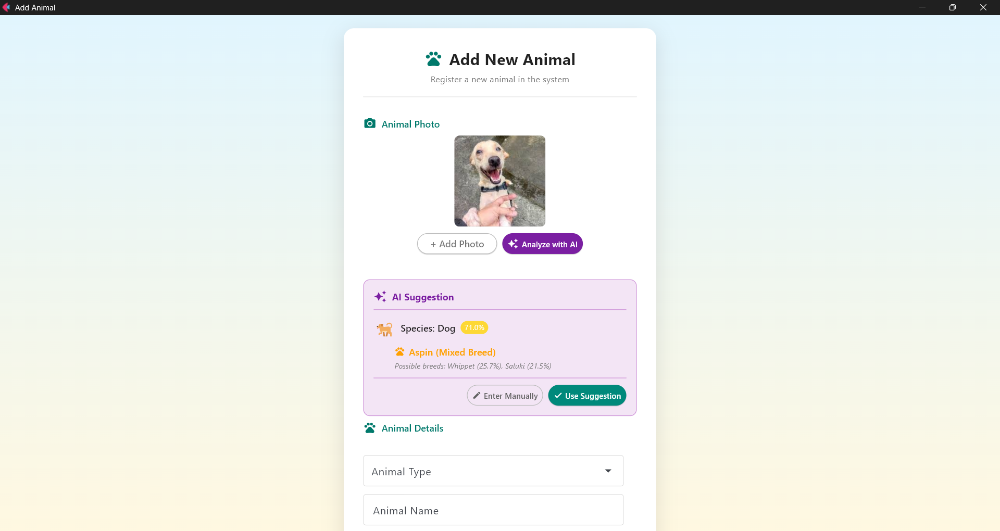

#### How It Works

1. **Model Requirements**
- When you use the AI feature for the first time, the app needs to download the AI model files (this may be large — about 1 GB total). Please make sure you have a stable internet connection and enough disk space.
- Click **"Download Models"** when prompted to start the one-time download.
- A progress bar shows the download status; you can minimize the dialog and let it continue in the background.
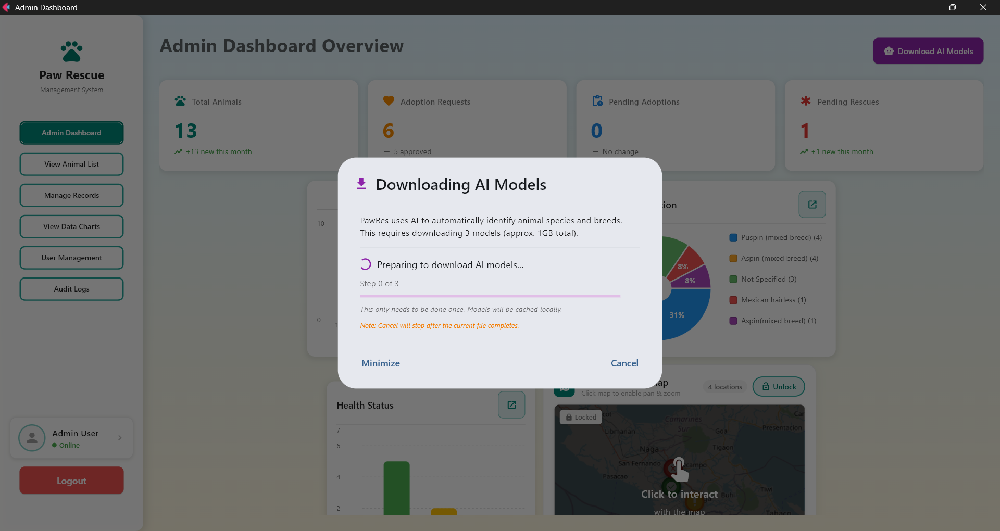
   - When connection is lost during download, the app will pause and retry automatically when the connection is restored.
   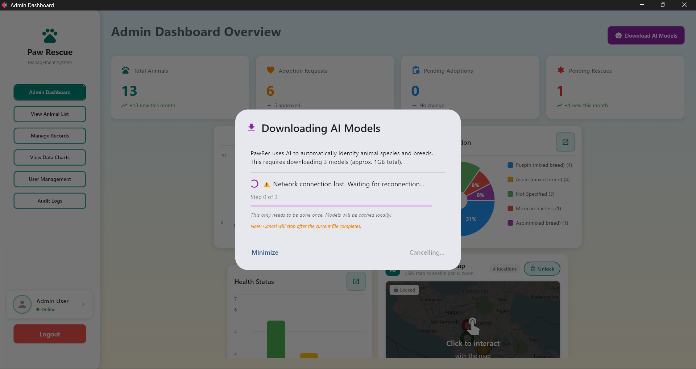
   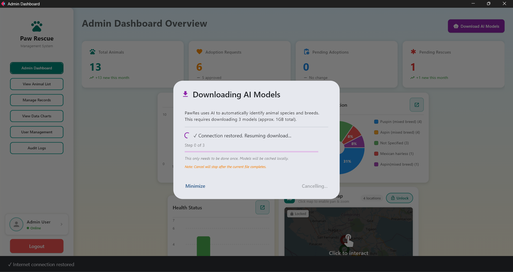
- Once downloaded, the models are saved on your computer so AI works offline afterward.
2. **Upload Photo for Analysis**
 - Upload a clear photo of the animal you want to classify.
 - Click the **"Analyze with AI"** button to start the analysis.
2. **Classify Animal Photo**
 - Upload a clear, well-lit photo of the animal (close-up of face or body works best).
 - Click the **"Analyze with AI"** button.
 - If this is the first time and the models still need to download, the process can take several minutes. After the models are downloaded, most analyses typically finish in a few seconds.

3. **Review Results**
   - AI returns top 3 breed predictions with confidence scores
   - Example:
     - **Labrador Retriever** - 87% confidence
     - **Golden Retriever** - 8% confidence
     - **Mixed Breed** - 5% confidence

4. **Apply Suggestion**
   - Click any suggestion to auto-fill the breed field
   - You can manually edit the breed after selection

5. **Interpretation**
5. **Interpretation**
 - **High confidence (about 75% or higher)**: The suggestion is likely correct, but you can still verify if you wish.
 - **Medium confidence (about 50%–74%)**: The suggestion may be correct — consider it, but check the photo and other details.
 - **Low confidence (below about 50%)**: The AI is unsure — manual identification is recommended.
 - If the AI does not have a strong single breed match, it may suggest a general "mixed" label instead of a single breed.

#### Limitations

- **Accuracy**: AI is trained on common breeds; rare breeds may not be recognized
- **Photo Quality**: Blurry, dark, or distant photos reduce accuracy
- **Mixed Breeds**: AI may struggle with mixed breeds
- **Species**: Currently supports dogs and cats only

#### Limitations

- **Accuracy**: The AI is trained on many common breeds but may not always recognize rare or unusual ones.
- **Photo Quality**: Blurry, dark, or distant photos make identification harder — clearer photos improve results.
- **Mixed Breeds**: The AI may not be able to pick a single breed for mixed animals and may show a "mixed" suggestion.
- **Species**: The AI only supports dogs and cats at this time.

#### Best Practices

✅ **Do**:
- Use clear, well-lit photos
- Capture animal from multiple angles
- Re-run analysis if first result seems incorrect

❌ **Don't**:
- Rely solely on AI for critical decisions
- Use AI for species identification (human verification required)
- Expect 100% accuracy for mixed breeds

---

### Map Usage

Interactive maps help you see where rescue reports come from and where shelters or teams are located.

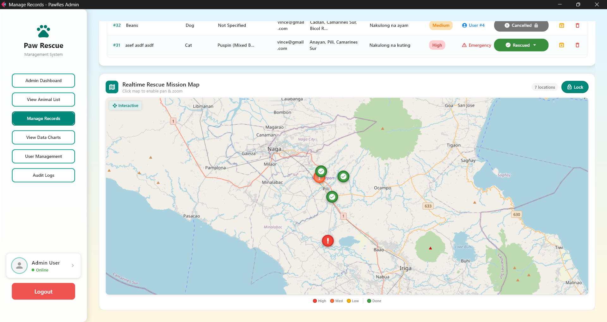

#### Map Features

1. **Where you see a map**
   - Map panels appear in the Rescue Mission lists, the Analytics/Dashboard pages, and in mission detail views.
   - The Rescue form itself shows a location input and a GPS button (see "Set Location") — the full, interactive map is shown on the pages listed above.
   - Default view: centered on the shelter area configured for the app.

2. **Set Location (Rescue Form)**
   - **Method 1 — Type the address**
     - Enter the address into the "Location" field and submit the report.
     - The app will look up the address and attach coordinates automatically.
   - **Method 2 — Use your current location (GPS)**
     - Click the GPS button (📍) next to the location field.
     - If your device asks for permission, allow it so the app can capture your location.
     - On some computers or setups, the app may use an approximate location (based on your network) if precise GPS is not available.

3. **Markers and details**
   - Each report shown on the map uses a colored marker. The color shows urgency or outcome (for example, high urgency is shown as red; rescued missions are green).
   - Hover over a marker to see a tooltip with informations like animal type, urgency, and status. Users can only see details that are non-sensitive (e.g. contact info, reporter, source(emergency or user)).

4. **Map controls (how to interact)**
   - Zoom: Use your mouse wheel, pinch gestures (on touch screens/trackpads), or any +/– buttons provided by your browser or map control.
   - Pan: Click and drag (or touch and drag) to move the map.
   - Lock/Unlock: Maps may start locked to prevent accidental scrolling; click the on-map "Unlock" control to enable full pan and zoom.

5. **Offline Map Handling**
   - If your internet connection is lost, the map may not load or show tiles properly.
   - The map shows a table of marked rescue missions if the map tiles cannot load.
   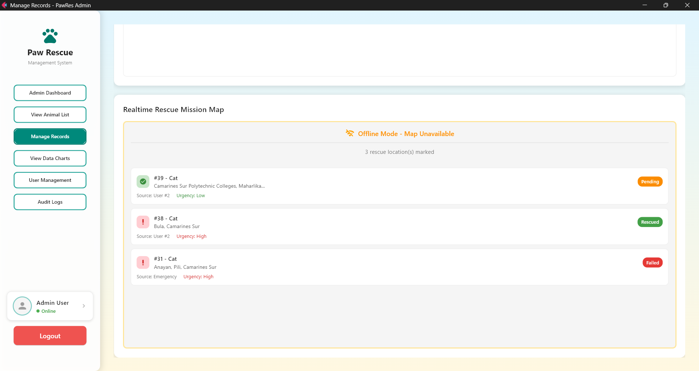
   - If the map doess not have data to show (for example, no rescue missions reported yet), a message will show the placeholder instead.

#### Troubleshooting (Map & Location)

**Map Not Showing or Tiles Missing**
- Check your internet connection and try refreshing the page.
- If the problem continues, wait a moment and try again — map tiles come from an online service.

**GPS / "Use My Current Location" Not Working**
- Allow location permission if your browser or device asks for it.
- On desktop computers without GPS, the app may use a nearby location based on your network — this is normal and may be less precise.
- If you cannot share location, type the address manually in the Location field.

**Address Could Not Be Found**
- Check spelling and include a nearby landmark, city, or neighborhood.
- Try a simpler version of the address (street + city).
- If still not found, use the GPS button to capture coordinates if possible.

---

### Charts & Analytics

Charts show helpful summaries of rescue and adoption activity so you can see trends at a glance.

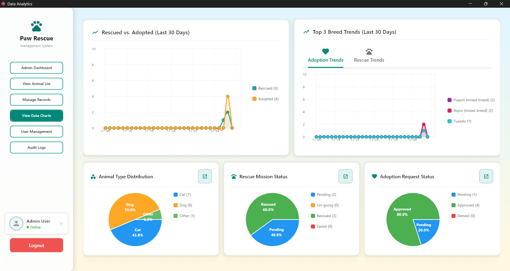

#### Chart Types

1. **Bar charts** — Good for comparing counts (for example, how many animals are in each health category).
2. **Pie charts** — Show how a whole is divided (for example, the share of adoption statuses).
3. **Line charts** — Show trends over time (for example, rescues or adoptions this month).
4. **Stat cards** — Large number tiles that give quick facts (for example, total rescues). Click a stat card to go to more details.

#### How to use charts

1. **See more detail**
   - Click the expand or details icon on a chart card to open a dialog with the full breakdown and values.

2. **Refresh the data**
   - Charts update when you return to the page or navigate in the app. If something looks wrong, refresh the page.

3. **Time range**
   - Most dashboard charts show recent data (for example, the last 30 days). The exact range may be shown on the chart header.

#### Common charts you will see

**Admin Dashboard**
- Rescued vs. Adopted (short-term trend): A line chart showing recent rescue and adoption counts.
- Breed Distribution: A pie chart of the most common breeds in the system.

**User Dashboard**
- Your Impact Overview: A summary of your overall contributions and activities.
- My Rescues: A pie chart showing the status breakdown of your reported rescues (pending, on-going, rescued, failed).
- My Adoptions: A pie chart showing the status breakdown of your adoption applications (pending, approved, denied).
- Popular Breeds Adopted: A bar chart of the most adopted breeds among applications.
- Adoptable Breeds Distribution: A pie chart showing the breed distribution of animals currently available for adoption.

**Your Analytics Page (Users)**
- Stat Cards:
  - Total Rescue Missions Submitted
  - Total Animals Adopted
  - Successfully Rescued Animals
  - Pending Adoption Requests
- Your Activity Over Time (line): Monthly trend of your rescue missions and adoption applications.
- My Animals by Status (bar): Counts of your animals by status (needs setup, available, adopted).
- My Urgency Summary (bar): Counts of your reported rescues by urgency (low, medium, high).

**Charts Page (full analytics)**
- Rescued vs. Adopted (monthly trend)
- Animals by Species (pie)
- Health Status (bar): healthy, recovering, injured
- Rescue Status (pie): pending, on-going, rescued, failed
- Adoption Status (pie): pending, approved, denied
- Urgency Distribution (bar): low, medium, high
- Species Ranking (bar): most-adopted species
- Breed Distribution (pie): distribution across known breeds
- Rescue Mission Map: interactive map showing areported locations

---

## Common Tasks

### Change Your Password

1. Click **"Profile"** in the sidebar.
2. Scroll to the **Change Password** section.
3. Type your current password.
4. Type a new password that follows the rules shown on the page.
5. Re-type the new password to confirm.
6. Click **"Change Password"**.
7. A confirmation message will appear when the change is successful.

---

### Upload Photo

#### For Animal Records (Admin)

1. Open the animal Add or Edit form.
2. Click **"Upload Photo"** or drag and drop an image into the photo area.
3. Choose the image file on your device.
4. A preview of the photo appears before you save.
5. Click **"Save"** or **"Update"** to store the photo with the record.

#### For Rescue Missions (User)

1. Open the Rescue form.
2. Click **"Upload Photo"** in the photo section.
3. Choose the image file on your device.
4. A preview of the photo appears.
5. (Optional) Click **"Analyze with AI"** to get suggested breeds.
6. Submit the form when ready.

#### Photo Requirements

- Formats accepted: **JPG, JPEG, PNG, GIF, WEBP**
- Maximum file size: **5 MB**
- Tip: Use a clear, well-lit, close-up photo for best results.

If your device does not show the WEBP option, use JPG or PNG instead — the app accepts those formats.

---

### Cancel Pending Request

#### Cancel Rescue Mission

1. Go to **Check Application Status** from the sidebar.
2. Locate the mission that is still **Pending**.
3. Click the **Cancel** button for that mission.
4. Confirm the cancellation in the dialog that appears.
5. The mission will be marked **Cancelled**.

#### Cancel Adoption Application

1. Go to **Check Application Status** from the sidebar.
2. Find your pending adoption application.
3. Click the **Cancel** button.
4. Confirm the cancellation when asked.
5. The application will be marked **Cancelled**.

Note: You can only cancel items that have not yet started being processed (for example, items labeled **Pending**). Requests already in progress or completed cannot be cancelled.

---

### Archive Completed Items

#### Archive Rescue Mission (User)

1. Open **Check Application Status** in the sidebar.
2. Find a mission that is finished (for example, **Rescued** or **Cancelled**).
3. Click **Archive** for that item.
4. The item will be removed from the main active list and placed in archived items.

#### Archive Animal (Admin)

1. Open **View Animal List** from the sidebar.
2. Find the animal you want to archive.
3. Click the **Archive** button and confirm.
4. The animal will no longer appear in public lists but remains available to admins under **Manage Records → Hidden Items**.
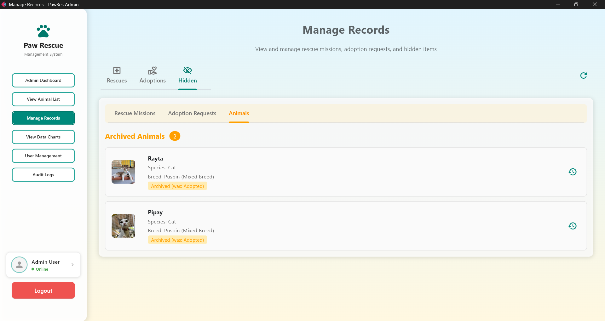

---

### Export Data (Admin Only)

#### Export Animals to CSV

1. Open **View Animal List** (admin view).
2. Click the **Export** button (top-right).
3. A CSV file is created and saved on the server.
4. A message will show the filename when the export finishes.

#### Export Adoption Records

1. Open **Manage Records** and choose the **Adoptions** tab.
2. Click **Export**.
3. A CSV file is created and saved on the server.

#### Export Rescue Missions

1. Open **Manage Records** and choose the **Rescues** tab.
2. Click **Export**.
3. A CSV file is created and saved on the server.

Where exported files are saved on the server: `app/storage/data/exports/` — ask your administrator if you need help accessing this folder.

---

## Troubleshooting

---

### Account Locked

**Cause**: 5 consecutive failed login attempts

**Solution 1 - Wait**:
- Wait 15 minutes
- Account automatically unlocks
- Try logging in again

**Solution 2 - Contact Admin**:
- Email your admin team
- Provide your registered email
- Admin can manually unlock account

**Prevention**:
- Use password manager to avoid typos
- Write down your password securely if needed
- Reset password if you've forgotten it

---

### Session Expired

**Cause**: Inactivity for 30+ minutes (default timeout, configurable via SESSION_TIMEOUT_MINUTES)

**What to do**:
1. You'll be automatically redirected to login page
2. Message displays: "Your session has expired. Please login again."
3. Enter credentials
4. You'll return to your previous page

**Prevention**:
- Save work frequently
- Keep the application active if working on long tasks
- Adjust session timeout (admin setting)

---

### Photo Upload Failed

**Common Causes & Solutions**:

1. **File Too Large**
   - Error: "File size exceeds 5 MB limit"
   - Solution: Resize image using image editor or online tool

2. **Invalid File Type**
   - Error: "Unsupported file format"
   - Solution: Convert to JPG or PNG

3. **Network Error**
   - Error: "Upload failed. Please try again."
   - Solution: Check internet connection, retry upload

4. **Storage Full (Admin)**
   - Error: "Server storage full"
   - Solution: Contact system administrator to expand storage

**Tips**:
- Compress images before upload (use online tools like TinyPNG)
- Use JPG for photos, PNG for graphics
- Ensure stable internet connection

---

### AI Model Download Stuck

**Symptoms**:
- Download progress bar frozen
- "Downloading models..." message for >5 minutes

**Solutions**:

1. **Refresh Page**
   - Close AI dialog
   - Refresh browser (F5)
   - Try download again

2. **Check Disk Space**
   - Models require ~100 MB free space
   - Free up space if needed

3. **Check Internet Connection**
   - Ensure stable, fast connection
   - Avoid mobile data (large download)

4. **Manual Download (Admin)**
   - Contact admin to manually place model files in `storage/ai_models/`

5. **Skip AI Detection**
   - You can manually enter breed without AI
   - AI is a helper, not required

---

### Can't Find Animal in List

**Possible Reasons**:

1. **Animal is Archived**
   - Solution: Admin can check **"Hidden Items"** → **"Animals"** tab

2. **Filters Applied**
   - Solution: Reset all filters (click "Clear Filters")

3. **Wrong Species Selected**
   - Solution: Change species filter to "All"

4. **Search Typo**
   - Solution: Clear search box or try different keywords

5. **Animal Not Yet Created**
   - Solution: Check if rescue mission is marked "Rescued" (triggers animal creation)

---

### Charts Not Loading

**Solutions**:

1. **Refresh Page**
   - Click browser refresh (F5)

2. **Clear Cache**
   - Ctrl+Shift+Delete (Chrome/Edge)
   - Clear cached images and files
   - Refresh page

3. **Check Permissions**
   - Ensure you have admin access (if admin-only charts)

4. **Check Data**
   - Charts require data to display
   - If no animals/rescues exist, charts show "No data available"

---

### Lost Data After Editing

**Prevention**:
- Always click **"Save"** or **"Update"** button
- Don't navigate away without saving
- Look for unsaved changes warning

**Recovery**:
- Unfortunately, unsaved changes are lost
- Re-enter data and save again
- Use browser "Back" button only if you haven't navigated to another page

---

### Admin Can't Approve Adoption

**Possible Causes**:

1. **Animal Already Adopted**
   - Check if another admin already approved a different application
   - View animal details to confirm status

2. **Application Already Processed**
   - Check if you already denied this application
   - View adoption request history

3. **Database Lock**
   - Rare concurrency issue
   - Wait 30 seconds and try again

---

### Google Login Not Working

**Common Issues**:

1. **OAuth Not Configured**
   - Contact admin to configure Google OAuth
   - Check if Google credentials are set in `.env` file

2. **Browser Blocking Popup**
   - Allow popups for PawRes domain
   - Try again after allowing popups

3. **Google Account Not Linked**
   - First-time users must register with email/password
   - Then link Google account from Profile page

4. **Google Account Mismatch**
   - Ensure you're using the same Google account linked to your PawRes profile

---

## Need More Help?

### Contact Information

- **Technical Support**: [Contact your system administrator]
- **User Guides**: Check this manual first
- **Bug Reports**: [Link to issue tracker if available]

### Additional Resources

- **[Architecture Documentation](ARCHITECTURE.md)** - System design details
- **[Database Schema](DATABASE.md)** - Data structure reference
- **[Security Policies](SECURITY.md)** - Security best practices
- **[Setup Guide](SETUP.md)** - Installation instructions

---

## Document Version

**Version**: 1.0  
**Last Updated**: December 8, 2025  
**Maintained By**: PawRes Development Team

---

*Thank you for using PawRes to help rescue and rehome animals! Together, we make a difference.* 🐾
